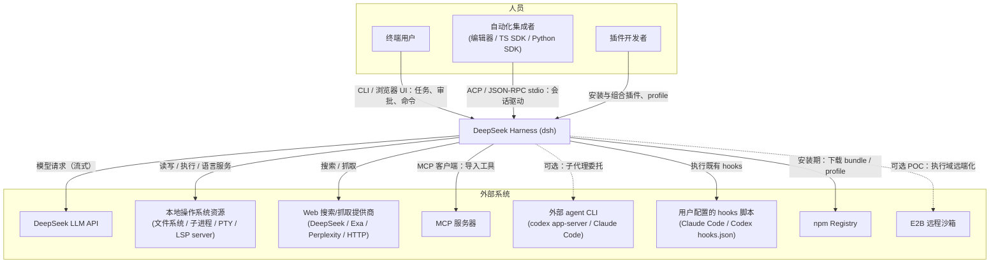

# C1 — System Context（系统上下文）

DeepSeek Harness（`dsh`）：DeepSeek AI 出品的插件化 Agent Harness，基于 vendored Cordis 框架，"everything is a plugin"。核心能力：agent loop、工具注册表、会话日志、LLM 适配、shell/terminal/fs/subprocess/LSP/web/sandbox 等能力 seam。

## 系统上下文图

## 人员及其与 dsh 的关系

| 人员 | 谁驱动谁 | 应用场景 |
|---|---|---|
| 终端用户 | 用户 → dsh | 在浏览器 UI（`web` profile，默认绑定 `127.0.0.1:3080`；CLI 硬拒 `--host 0.0.0.0`）或 headless 一次性任务中让 agent 完成 coding/自动化任务：提交任务与跟进、遇到敏感工具调用时批准或拒绝、回答 agent 的提问（ask-user）、用斜杠命令（如 `/compact`）直接控制会话；权限预设（`workspace-write`+ask / `danger-full-access`+never）在会话创建时钉住，fail-closed |
| 自动化集成者 | 集成者程序 → dsh | 把 dsh 嵌入编辑器或自有程序做无人值守的 agent 流水线：经 ACP / TS SDK / Python SDK 之一创建与恢复会话、提交 prompt、消费流式 `session.event`/`session.status` 取结果、取消；无 UI 依赖，审批走自动化通道或直接拒绝 |
| 插件开发者 | 开发者 → dsh | 为 dsh 增加新能力或裁剪组合：写 out-of-tree Cordis 插件/bundle（如换一个搜索提供商、加自定义工具），`dsh plugin --profile <name> add <pkg>` 从 npm 安装，用 `cordis.yml` + patch overlay 调整 profile 行；与内置插件同一套扩展点，无特权分支 |

## 外部系统及其与 dsh 的关系

| 外部系统 | 谁调用谁 | 必选/可选 | 应用场景 |
|---|---|---|---|
| DeepSeek LLM API | dsh → LLM | 必选 | agent 每个思考步都要经过它：loop 经 `ctx.llm` Provider（`llm-deepseek` 直连；`llm-pi-ai` 多提供商）发起流式模型请求并接收 chunk 流；没有它 agent loop 不产出 |
| 本地操作系统资源 | dsh → OS | 必选 | agent 在本机干活时的执行域：读写/编辑代码文件、跑 shell 命令与进程树、持有 PTY 终端、连接语言服务器补全诊断；敏感执行（受控会话）经 `ctx.sandbox` 包装后再 spawn —— Linux 后端链 bwrap（首选）→ Landlock（后备，native landlock-run），macOS Seatbelt，Windows ACL |
| Web 搜索/抓取提供商 | dsh → Web | 可选 | agent 需要外部信息时：模型经 `tool-web` 调 DeepSearch/Exa/Perplexity 搜索或 HTTP 抓取网页，结果进入模型上下文（SSRF 防护暂缓，转述自包 README） |
| MCP 服务器 | dsh → MCP | 可选 | 复用既有 MCP 工具生态：`mcp-client` 连接外部 server，把其工具以 `mcp__<server>__<name>` 注册进 `ctx.tools`，模型像原生工具一样调用 |
| 外部 agent CLI（codex / Claude Code） | dsh → CLI | 可选 | 主 agent 把自包含子任务委托给外部 agent：spawn `codex app-server --stdio` 等进程，提交任务、取回最终答案（经共享 subagent 结果契约） |
| 用户配置的 hooks 脚本 | dsh → 脚本 | 可选 | 迁移既有 hook 生态：团队已有 Claude Code/Codex 的 `hooks.json` 时，dsh 在生命周期事件上按原约定执行这些外部 shell hooks，无需重写 |
| npm Registry | dsh → npm | 安装期 | 扩展或安装 dsh 时：`dsh plugin --profile <name> add <pkg>` 经 pnpm 从 npm 拉 bundle/profile；dsh 家族自身也经 npm 发行（`@deepseek-ai/dsh-*`）；运行期不访问 |
| E2B 远程沙箱 | dsh → E2B | 可选（POC） | 需要隔离/远程执行环境时：把 fs/进程执行域迁到 E2B Linux 沙箱里跑命令与文件操作；harness 进程、模型调用、session 状态与持久化留在本地不迁移 |
