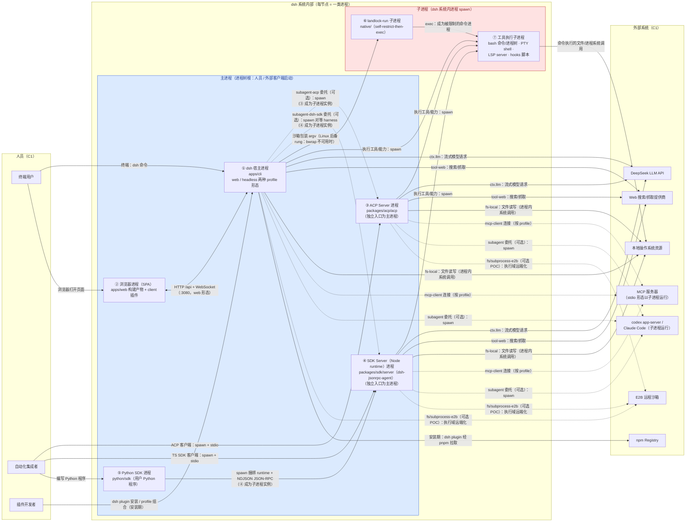

# 进程图

一个容器 = **一类运行时 OS 进程**，分两类：**主进程**（dsh 进程树的根，由人员或 dsh 系统外的客户端启动）与**子进程**（由 dsh 系统内进程 spawn）。③④ 双重身份：作为独立入口时是主进程，被 ① 委托（subagent）或 ⑤（Python SDK）spawn 时是子进程。实线 = 固定关系，虚线 = 可选（按 profile 组合 / 平台 / 委托）。⑦ 是 harness 进程为执行工具 spawn 的短生命周期子进程（bash/进程树、PTY shell、LSP server、hooks 脚本）；外部软件以子进程形态运行的（codex/Claude Code、stdio 形态 MCP server）节点留在外部系统，以 spawn 边表达。

# 进程说明

库、配置组合层（dsh-base、profile patch）、worker 线程（workflow / code-runtime）、磁盘持久化等非进程单元由 C3 组件文档承载。③④ 是完整 harness（自有插件组合），因此与 ① 一样能调用外部系统并 spawn ⑦；⑤ 只经 ④ 间接获得全部能力。

| # | 类别 | 进程容器 | 代码来源 | 启动者 | 职责 | 对外通信 |
|---|---|---|---|---|---|---|
| ① | 主 | dsh 宿主进程 | `apps/cli`（`@deepseek-ai/dsh`） | 用户终端 | Cordis 插件树的宿主。**web 形态**：HTTP 服务器 + API gateway + 静态 SPA + agent 运行时；**headless 形态**：单次任务（stdout 打印最终 assistant 文本，0/1 退出，无监听端口）。两种形态是同一 bin 的不同 profile 组合，进程种类相同；`dsh web` 是 `--profile web` 的硬编码别名，无默认 profile（省略 `--profile` 报错） | web：HTTP `/api` + WebSocket；headless：无。源码启动经 tsx ESM-only hook |
| ② | 主 | 浏览器进程（SPA） | `apps/web` 构建产物（Vite/React，由 web profile 静态服务） | 用户浏览器 | client 侧 Cordis 运行时与 ui-\* 插件族 | HTTP `/api` + WebSocket ↔ ① |
| ③ | 主/子 | ACP Server 进程 | `packages/acp/acp`（`@deepseek-ai/dsh-acp`；`examples/acp-agent` 是其实例） | 外部 ACP 客户端 spawn（主）；或 ① 经 `subagent-acp` 作为子代理 spawn（子） | automation-only agent 服务：`initialize`、`session/new`、`session/prompt`、`session/cancel`、权限请求；transport adapter 驱动 `ctx.agents` | ACP JSON-RPC over stdio（stdout 仅协议帧） |
| ④ | 主/子 | SDK Server（Node runtime）进程 | `packages/sdk/server`（协议 `sdk/protocol`；`dsh-jsonrpc-agent` bin；`examples/jsonrpc-agent` 是其实例） | SDK 客户端 spawn（主）；或 ① 经 `subagent-dsh-sdk` spawn（子）；或 ⑤ spawn 捆绑载体（子）：生产默认是单文件可执行 `dsh-jsonrpc-agent-pkg-<platform>-<arch>`（内嵌 Node，无需系统 Node），dev 模式才用系统 Node。被 ① spawn 时是**完整对等 harness**：自有 cordis.yml 组合、session 持久化、模型路由、工具 | 进程外 SDK 运行时：`session/prompt`、流式 `session.event`/`session.status`、`shutdown` | NDJSON JSON-RPC over stdio |
| ⑤ | 主 | Python SDK 进程 | `python/sdk`（`deepseek-harness-sdk`） | 用户的 Python 程序（进程本身即用户程序） | 高层 turns API + 低层 JSON-RPC 客户端 | spawn ④（生产默认单文件可执行，内嵌 Node）并经其 stdio 通信 |
| ⑥ | 子 | landlock-run 子进程 | `native/landlock-run`（+ `linux-x64`/`linux-arm64` 平台包） | ①③④ 的 `ctx.sandbox` 消费方（Linux 后端链 bwrap → landlock 的**后备** rung：bwrap 不可用时启用） | self-restrict-then-exec 限制启动器，fail-closed；exec 后即成为被限制的 ⑦ 目标进程 | 子进程 exec，无自有协议 |
| ⑦ | 子 | 工具执行子进程 | 各 harness 进程 spawn 的目标程序 | ①③④（执行工具/能力时） | bash 命令与进程树、PTY shell、LSP server 子进程、用户 hooks 脚本；被沙箱包装的目标也在此（经 ⑥ exec） | 由所属 harness 进程的 pipe/PTY 驱动 |

# 人员与进程关系

| 人员 | 谁驱动谁 | 应用场景 |
|---|---|---|
| 终端用户 | 用户 → ①（终端命令）、②（打开页面） | 在终端用 `dsh` 起 web 或 headless 形态：浏览器 UI（②↔①，默认 `127.0.0.1:3080`）对话，或一次性任务从 ① 的 stdout 取最终回复；任务执行中的审批、ask-user 回答、斜杠命令都发生在 ① 的会话内 |
| 自动化集成者 | 集成者程序 → ③（ACP 客户端）、④（TS SDK 客户端）、⑤（编写 Python 程序，经 ⑤→④） | 无人值守的 agent 流水线：编辑器经 ACP 驱动 ③，自有程序经 SDK 驱动 ④，Python 程序驱动 ⑤ 再由 ⑤ spawn ④；程序化创建/恢复会话、提交 prompt、消费流式 `session.event`/`session.status`、取消 |
| 插件开发者 | 开发者 → ①（`dsh plugin` 命令） | 安装期扩展与裁剪：在 ① 内执行 `dsh plugin --profile <name> add <pkg>` 从 npm 拉 bundle，用 `cordis.yml` + patch overlay 调整 profile 行；插件代码随后被加载进 ①③④ 的插件树 |

# 外部系统与进程关系

| 外部系统 | 谁调用谁 | 应用场景 |
|---|---|---|
| DeepSeek LLM API | ①③④ → LLM | agent 每个思考步：三个完整 harness 进程经 `ctx.llm` Provider（`llm-deepseek` 直连；`llm-pi-ai` 多提供商）发起流式模型请求；⑤② 不直接触达（经 ④ / ① 中转） |
| 本地操作系统资源 | ①③④ → OS（fs 系统调用）；⑦ → OS（命令执行） | 本地执行域：harness 进程内直接读写/编辑文件；命令类工具 spawn 为 ⑦ 后在 OS 上跑 shell、进程树、PTY 终端、语言服务器；受控会话中敏感命令先经 `ctx.sandbox` 包装再 exec —— Linux 后端链 bwrap（首选）→ ⑥ Landlock（后备），macOS Seatbelt，Windows ACL |
| Web 搜索/抓取提供商 | ①③④ → Web | agent 需要外部信息时：模型经 `tool-web` 调 DeepSearch/Exa/Perplexity 搜索或 HTTP 抓取，结果进入模型上下文（按 profile 组合；SSRF 防护暂缓，转述自包 README） |
| MCP 服务器 | ①③④ → MCP（可选，按 profile） | 复用既有 MCP 工具生态：`mcp-client` 连接外部 server，把其工具以 `mcp__<server>__<name>` 注册进 `ctx.tools`；stdio 形态下 MCP server 被 spawn 为本地子进程运行 |
| codex app-server / Claude Code | ①③④ → CLI（可选，spawn 为子进程） | 主 agent 把自包含子任务委托给外部 agent：`subagent-codex`/`subagent-claude-code` Provider spawn 外部 CLI 进程，提交任务、取回最终答案（经共享 subagent 结果契约） |
| 用户配置的 hooks 脚本 | ①③④ → 脚本（spawn 为 ⑦） | 迁移既有 hook 生态：团队已有 Claude Code/Codex 的 `hooks.json` 时，harness 进程在生命周期事件上按原约定 spawn 执行这些外部脚本，无需重写 |
| npm Registry | ① → npm（仅安装期） | 扩展或安装 dsh 时：① 内的 `dsh plugin` 经 pnpm 从 npm 拉 bundle/profile；dsh 家族自身也经 npm 发行（`@deepseek-ai/dsh-*`）；运行期不访问 |
| E2B 远程沙箱 | ①③④ → E2B（可选 POC） | 需要隔离/远程执行环境时：`fs-e2b`/`subprocess-e2b` Provider 把 fs/进程执行域迁到 E2B Linux 沙箱跑命令与文件操作；harness 进程、模型调用、session 状态与持久化留在本地不迁移 |
