# 组件 ③ ACP Server 进程（主/子）

模块 = `examples/acp-agent/cordis.yml` 组合行**及其第一层直接依赖**：`dsh-acp-demo` 组合胶水拉入 ACP 协议桥 `dsh-acp` 与 agent 脊柱；LLM/沙箱/bash/fs/subagent/workflow/hooks 行各自带入 Provider。按依赖类型分三张图；边 A --> B 表示 A 依赖 B；只画一层。

## dependencies（运行时依赖）（28 模块 / 19 依赖边）

```mermaid
flowchart LR
  m_dsh-acp-demo["dsh-acp-demo"]
  m_dsh-bash-sandbox["dsh-bash-sandbox"]
  m_dsh-compaction-basic["dsh-compaction-basic"]
  m_dsh-fs-observation-policy["dsh-fs-observation-policy"]
  m_dsh-fs-sandbox["dsh-fs-sandbox"]
  m_dsh-hooks-claude-code["dsh-hooks-claude-code"]
  m_dsh-hooks-codex["dsh-hooks-codex"]
  m_dsh-llm-deepseek["dsh-llm-deepseek"]
  m_dsh-repeat-tool-reminder["dsh-repeat-tool-reminder"]
  m_dsh-sandbox-local["dsh-sandbox-local"]
  m_dsh-sandbox-policy["dsh-sandbox-policy"]
  m_dsh-sandbox-windows-acl["dsh-sandbox-windows-acl"]
  m_dsh-session-projection["dsh-session-projection"]
  m_dsh-subagent["dsh-subagent"]
  m_dsh-subagent-fork-in-process["dsh-subagent-fork-in-process"]
  m_dsh-subagent-spawn-in-process["dsh-subagent-spawn-in-process"]
  m_dsh-subprocess-local["dsh-subprocess-local"]
  m_dsh-token-meter["dsh-token-meter"]
  m_dsh-tool-fs["dsh-tool-fs"]
  m_dsh-tool-ralph["dsh-tool-ralph"]
  m_dsh-tool-subagent["dsh-tool-subagent"]
  m_dsh-tool-subagent-control["dsh-tool-subagent-control"]
  m_dsh-tool-subagent-report["dsh-tool-subagent-report"]
  m_dsh-tool-todo["dsh-tool-todo"]
  m_dsh-tool-workflow["dsh-tool-workflow"]
  m_dsh-user-approval["dsh-user-approval"]
  m_dsh-workflow-worker-thread["dsh-workflow-worker-thread"]
  m_schemastery["schemastery"]
  m_dsh-llm-deepseek --> m_schemastery
  m_dsh-sandbox-local --> m_dsh-sandbox-windows-acl
  m_dsh-sandbox-local --> m_schemastery
  m_dsh-sandbox-policy --> m_schemastery
  m_dsh-user-approval --> m_schemastery
  m_dsh-token-meter --> m_schemastery
  m_dsh-compaction-basic --> m_schemastery
  m_dsh-subagent-spawn-in-process --> m_schemastery
  m_dsh-subagent-fork-in-process --> m_schemastery
  m_dsh-tool-subagent-report --> m_schemastery
  m_dsh-tool-subagent --> m_schemastery
  m_dsh-workflow-worker-thread --> m_schemastery
  m_dsh-tool-workflow --> m_schemastery
  m_dsh-tool-ralph --> m_schemastery
  m_dsh-tool-todo --> m_schemastery
  m_dsh-repeat-tool-reminder --> m_schemastery
  m_dsh-tool-fs --> m_schemastery
  m_dsh-hooks-claude-code --> m_schemastery
  m_dsh-hooks-codex --> m_schemastery
```

## peerDependencies（同进程服务契约）（68 模块 / 187 依赖边）

```mermaid
flowchart LR
  m_cordis["cordis"]
  m_cordis-plugin-include["cordis-plugin-include"]
  m_cordis-plugin-loader["cordis-plugin-loader"]
  m_dsh-acp["dsh-acp"]
  m_dsh-acp-demo["dsh-acp-demo"]
  m_dsh-agent["dsh-agent"]
  m_dsh-agent-instructions["dsh-agent-instructions"]
  m_dsh-agent-presets["dsh-agent-presets"]
  m_dsh-agent-spine-demo["dsh-agent-spine-demo"]
  m_dsh-anonymous-user-id["dsh-anonymous-user-id"]
  m_dsh-app-boot["dsh-app-boot"]
  m_dsh-attachment["dsh-attachment"]
  m_dsh-bash-local["dsh-bash-local"]
  m_dsh-bash-sandbox["dsh-bash-sandbox"]
  m_dsh-brand["dsh-brand"]
  m_dsh-commands["dsh-commands"]
  m_dsh-compaction["dsh-compaction"]
  m_dsh-compaction-basic["dsh-compaction-basic"]
  m_dsh-compaction-tool-result-pruner["dsh-compaction-tool-result-pruner"]
  m_dsh-credentials["dsh-credentials"]
  m_dsh-fs["dsh-fs"]
  m_dsh-fs-local["dsh-fs-local"]
  m_dsh-fs-observation-policy["dsh-fs-observation-policy"]
  m_dsh-fs-sandbox["dsh-fs-sandbox"]
  m_dsh-hook-protocol["dsh-hook-protocol"]
  m_dsh-hooks-claude-code["dsh-hooks-claude-code"]
  m_dsh-hooks-codex["dsh-hooks-codex"]
  m_dsh-invariants["dsh-invariants"]
  m_dsh-jobs["dsh-jobs"]
  m_dsh-launch-environment["dsh-launch-environment"]
  m_dsh-llm["dsh-llm"]
  m_dsh-llm-deepseek["dsh-llm-deepseek"]
  m_dsh-repeat-tool-reminder["dsh-repeat-tool-reminder"]
  m_dsh-sandbox["dsh-sandbox"]
  m_dsh-sandbox-local["dsh-sandbox-local"]
  m_dsh-sandbox-policy["dsh-sandbox-policy"]
  m_dsh-scope["dsh-scope"]
  m_dsh-session["dsh-session"]
  m_dsh-session-checkpoint-policy["dsh-session-checkpoint-policy"]
  m_dsh-session-persistence["dsh-session-persistence"]
  m_dsh-session-persistence-jsonl["dsh-session-persistence-jsonl"]
  m_dsh-session-projection["dsh-session-projection"]
  m_dsh-session-projection-cache["dsh-session-projection-cache"]
  m_dsh-session-query["dsh-session-query"]
  m_dsh-session-query-sqlite["dsh-session-query-sqlite"]
  m_dsh-settings["dsh-settings"]
  m_dsh-shell["dsh-shell"]
  m_dsh-subagent["dsh-subagent"]
  m_dsh-subagent-fork-in-process["dsh-subagent-fork-in-process"]
  m_dsh-subagent-in-process-driver["dsh-subagent-in-process-driver"]
  m_dsh-subagent-spawn-in-process["dsh-subagent-spawn-in-process"]
  m_dsh-subprocess["dsh-subprocess"]
  m_dsh-subprocess-local["dsh-subprocess-local"]
  m_dsh-system-prompt["dsh-system-prompt"]
  m_dsh-timeout["dsh-timeout"]
  m_dsh-token-meter["dsh-token-meter"]
  m_dsh-tool-fs["dsh-tool-fs"]
  m_dsh-tool-ralph["dsh-tool-ralph"]
  m_dsh-tool-subagent["dsh-tool-subagent"]
  m_dsh-tool-subagent-control["dsh-tool-subagent-control"]
  m_dsh-tool-subagent-report["dsh-tool-subagent-report"]
  m_dsh-tool-todo["dsh-tool-todo"]
  m_dsh-tool-workflow["dsh-tool-workflow"]
  m_dsh-tools["dsh-tools"]
  m_dsh-user-approval["dsh-user-approval"]
  m_dsh-workflow["dsh-workflow"]
  m_dsh-workflow-worker-thread["dsh-workflow-worker-thread"]
  m_schemastery["schemastery"]
  m_dsh-llm-deepseek --> m_dsh-credentials
  m_dsh-llm-deepseek --> m_dsh-launch-environment
  m_dsh-llm-deepseek --> m_dsh-invariants
  m_dsh-llm-deepseek --> m_dsh-llm
  m_dsh-llm-deepseek --> m_dsh-settings
  m_dsh-llm-deepseek --> m_dsh-timeout
  m_dsh-llm-deepseek --> m_dsh-anonymous-user-id
  m_dsh-llm-deepseek --> m_cordis
  m_dsh-sandbox-local --> m_dsh-invariants
  m_dsh-sandbox-local --> m_dsh-llm
  m_dsh-sandbox-local --> m_dsh-sandbox
  m_dsh-sandbox-local --> m_dsh-session
  m_dsh-sandbox-local --> m_cordis
  m_dsh-sandbox-policy --> m_dsh-agent
  m_dsh-sandbox-policy --> m_dsh-invariants
  m_dsh-sandbox-policy --> m_dsh-sandbox
  m_dsh-sandbox-policy --> m_dsh-session
  m_dsh-sandbox-policy --> m_dsh-system-prompt
  m_dsh-sandbox-policy --> m_cordis
  m_dsh-subprocess-local --> m_dsh-invariants
  m_dsh-subprocess-local --> m_dsh-subprocess
  m_dsh-subprocess-local --> m_dsh-timeout
  m_dsh-subprocess-local --> m_cordis
  m_dsh-bash-sandbox --> m_dsh-shell
  m_dsh-bash-sandbox --> m_dsh-bash-local
  m_dsh-bash-sandbox --> m_dsh-invariants
  m_dsh-bash-sandbox --> m_dsh-sandbox
  m_dsh-bash-sandbox --> m_dsh-sandbox-policy
  m_dsh-bash-sandbox --> m_cordis
  m_dsh-user-approval --> m_dsh-agent
  m_dsh-user-approval --> m_dsh-brand
  m_dsh-user-approval --> m_dsh-invariants
  m_dsh-user-approval --> m_dsh-llm
  m_dsh-user-approval --> m_dsh-scope
  m_dsh-user-approval --> m_dsh-session
  m_dsh-user-approval --> m_dsh-system-prompt
  m_dsh-user-approval --> m_cordis
  m_dsh-acp-demo --> m_cordis-plugin-include
  m_dsh-acp-demo --> m_cordis-plugin-loader
  m_dsh-acp-demo --> m_dsh-acp
  m_dsh-acp-demo --> m_dsh-agent-spine-demo
  m_dsh-acp-demo --> m_dsh-app-boot
  m_dsh-acp-demo --> m_dsh-invariants
  m_dsh-acp-demo --> m_dsh-session-checkpoint-policy
  m_dsh-acp-demo --> m_dsh-session-persistence-jsonl
  m_dsh-acp-demo --> m_dsh-session-query
  m_dsh-acp-demo --> m_dsh-session-query-sqlite
  m_dsh-acp-demo --> m_dsh-tools
  m_dsh-acp-demo --> m_dsh-agent-instructions
  m_dsh-acp-demo --> m_cordis
  m_dsh-acp-demo --> m_schemastery
  m_dsh-token-meter --> m_dsh-compaction
  m_dsh-token-meter --> m_dsh-invariants
  m_dsh-token-meter --> m_dsh-llm
  m_dsh-token-meter --> m_dsh-session
  m_dsh-token-meter --> m_dsh-session-projection
  m_dsh-token-meter --> m_cordis
  m_dsh-compaction-basic --> m_dsh-agent
  m_dsh-compaction-basic --> m_dsh-compaction
  m_dsh-compaction-basic --> m_dsh-commands
  m_dsh-compaction-basic --> m_dsh-invariants
  m_dsh-compaction-basic --> m_dsh-llm
  m_dsh-compaction-basic --> m_dsh-session
  m_dsh-compaction-basic --> m_dsh-token-meter
  m_dsh-compaction-basic --> m_dsh-compaction-tool-result-pruner
  m_dsh-compaction-basic --> m_cordis
  m_dsh-session-projection --> m_dsh-invariants
  m_dsh-session-projection --> m_dsh-session
  m_dsh-session-projection --> m_cordis
  m_dsh-subagent --> m_dsh-agent
  m_dsh-subagent --> m_dsh-agent-presets
  m_dsh-subagent --> m_dsh-brand
  m_dsh-subagent --> m_dsh-invariants
  m_dsh-subagent --> m_dsh-llm
  m_dsh-subagent --> m_dsh-sandbox
  m_dsh-subagent --> m_dsh-sandbox-policy
  m_dsh-subagent --> m_dsh-scope
  m_dsh-subagent --> m_dsh-session
  m_dsh-subagent --> m_dsh-session-persistence
  m_dsh-subagent --> m_dsh-session-projection
  m_dsh-subagent --> m_dsh-session-projection-cache
  m_dsh-subagent --> m_dsh-jobs
  m_dsh-subagent --> m_dsh-tools
  m_dsh-subagent --> m_dsh-user-approval
  m_dsh-subagent --> m_cordis
  m_dsh-subagent-spawn-in-process --> m_dsh-invariants
  m_dsh-subagent-spawn-in-process --> m_dsh-subagent
  m_dsh-subagent-spawn-in-process --> m_dsh-subagent-in-process-driver
  m_dsh-subagent-spawn-in-process --> m_cordis
  m_dsh-subagent-fork-in-process --> m_dsh-agent
  m_dsh-subagent-fork-in-process --> m_dsh-invariants
  m_dsh-subagent-fork-in-process --> m_dsh-session
  m_dsh-subagent-fork-in-process --> m_dsh-subagent
  m_dsh-subagent-fork-in-process --> m_dsh-subagent-in-process-driver
  m_dsh-subagent-fork-in-process --> m_cordis
  m_dsh-tool-subagent-control --> m_dsh-invariants
  m_dsh-tool-subagent-control --> m_dsh-llm
  m_dsh-tool-subagent-control --> m_dsh-session
  m_dsh-tool-subagent-control --> m_dsh-subagent
  m_dsh-tool-subagent-control --> m_dsh-tools
  m_dsh-tool-subagent-control --> m_cordis
  m_dsh-tool-subagent-report --> m_dsh-invariants
  m_dsh-tool-subagent-report --> m_dsh-llm
  m_dsh-tool-subagent-report --> m_dsh-subagent
  m_dsh-tool-subagent-report --> m_dsh-system-prompt
  m_dsh-tool-subagent-report --> m_dsh-tools
  m_dsh-tool-subagent-report --> m_cordis
  m_dsh-tool-subagent --> m_dsh-agent
  m_dsh-tool-subagent --> m_dsh-invariants
  m_dsh-tool-subagent --> m_dsh-llm
  m_dsh-tool-subagent --> m_dsh-subagent
  m_dsh-tool-subagent --> m_dsh-system-prompt
  m_dsh-tool-subagent --> m_dsh-jobs
  m_dsh-tool-subagent --> m_dsh-tools
  m_dsh-tool-subagent --> m_cordis
  m_dsh-workflow-worker-thread --> m_dsh-agent
  m_dsh-workflow-worker-thread --> m_dsh-brand
  m_dsh-workflow-worker-thread --> m_dsh-invariants
  m_dsh-workflow-worker-thread --> m_dsh-llm
  m_dsh-workflow-worker-thread --> m_dsh-session
  m_dsh-workflow-worker-thread --> m_dsh-subagent
  m_dsh-workflow-worker-thread --> m_dsh-tools
  m_dsh-workflow-worker-thread --> m_dsh-workflow
  m_dsh-workflow-worker-thread --> m_cordis
  m_dsh-tool-workflow --> m_dsh-agent
  m_dsh-tool-workflow --> m_dsh-invariants
  m_dsh-tool-workflow --> m_dsh-llm
  m_dsh-tool-workflow --> m_dsh-session
  m_dsh-tool-workflow --> m_dsh-system-prompt
  m_dsh-tool-workflow --> m_dsh-tools
  m_dsh-tool-workflow --> m_dsh-workflow
  m_dsh-tool-workflow --> m_cordis
  m_dsh-tool-ralph --> m_dsh-agent
  m_dsh-tool-ralph --> m_dsh-invariants
  m_dsh-tool-ralph --> m_dsh-llm
  m_dsh-tool-ralph --> m_dsh-subagent
  m_dsh-tool-ralph --> m_dsh-system-prompt
  m_dsh-tool-ralph --> m_dsh-tools
  m_dsh-tool-ralph --> m_dsh-workflow
  m_dsh-tool-ralph --> m_cordis
  m_dsh-tool-todo --> m_dsh-agent
  m_dsh-tool-todo --> m_dsh-invariants
  m_dsh-tool-todo --> m_dsh-session
  m_dsh-tool-todo --> m_dsh-session-projection
  m_dsh-tool-todo --> m_dsh-tools
  m_dsh-tool-todo --> m_cordis
  m_dsh-repeat-tool-reminder --> m_dsh-agent
  m_dsh-repeat-tool-reminder --> m_dsh-invariants
  m_dsh-repeat-tool-reminder --> m_dsh-tools
  m_dsh-repeat-tool-reminder --> m_cordis
  m_dsh-fs-sandbox --> m_dsh-fs
  m_dsh-fs-sandbox --> m_dsh-fs-local
  m_dsh-fs-sandbox --> m_dsh-invariants
  m_dsh-fs-sandbox --> m_dsh-sandbox
  m_dsh-fs-sandbox --> m_dsh-sandbox-policy
  m_dsh-fs-sandbox --> m_cordis
  m_dsh-fs-observation-policy --> m_dsh-fs
  m_dsh-fs-observation-policy --> m_dsh-invariants
  m_dsh-fs-observation-policy --> m_cordis
  m_dsh-tool-fs --> m_dsh-attachment
  m_dsh-tool-fs --> m_dsh-fs
  m_dsh-tool-fs --> m_dsh-invariants
  m_dsh-tool-fs --> m_dsh-llm
  m_dsh-tool-fs --> m_dsh-sandbox
  m_dsh-tool-fs --> m_dsh-sandbox-policy
  m_dsh-tool-fs --> m_dsh-session
  m_dsh-tool-fs --> m_dsh-system-prompt
  m_dsh-tool-fs --> m_dsh-tools
  m_dsh-tool-fs --> m_dsh-user-approval
  m_dsh-tool-fs --> m_cordis
  m_dsh-hooks-claude-code --> m_dsh-agent
  m_dsh-hooks-claude-code --> m_dsh-hook-protocol
  m_dsh-hooks-claude-code --> m_dsh-invariants
  m_dsh-hooks-claude-code --> m_dsh-llm
  m_dsh-hooks-claude-code --> m_dsh-session
  m_dsh-hooks-claude-code --> m_dsh-session-persistence
  m_dsh-hooks-claude-code --> m_dsh-subagent
  m_dsh-hooks-claude-code --> m_dsh-tools
  m_dsh-hooks-claude-code --> m_cordis
  m_dsh-hooks-codex --> m_dsh-agent
  m_dsh-hooks-codex --> m_dsh-hook-protocol
  m_dsh-hooks-codex --> m_dsh-invariants
  m_dsh-hooks-codex --> m_dsh-llm
  m_dsh-hooks-codex --> m_dsh-session
  m_dsh-hooks-codex --> m_dsh-session-persistence
  m_dsh-hooks-codex --> m_dsh-tools
  m_dsh-hooks-codex --> m_cordis
```

## devDependencies（开发期依赖；全员开发期框架依赖 cordis / dsh-invariants / cordis-plugin-loader / cordis-plugin-include 为省略项）（74 模块 / 219 依赖边）

```mermaid
flowchart LR
  m_dsh-acp["dsh-acp"]
  m_dsh-acp-demo["dsh-acp-demo"]
  m_dsh-agent["dsh-agent"]
  m_dsh-agent-instructions["dsh-agent-instructions"]
  m_dsh-agent-loop["dsh-agent-loop"]
  m_dsh-agent-loop-testkit["dsh-agent-loop-testkit"]
  m_dsh-agent-presets["dsh-agent-presets"]
  m_dsh-agent-spine-demo["dsh-agent-spine-demo"]
  m_dsh-anonymous-user-id["dsh-anonymous-user-id"]
  m_dsh-app-boot["dsh-app-boot"]
  m_dsh-attachment["dsh-attachment"]
  m_dsh-bash-local["dsh-bash-local"]
  m_dsh-bash-sandbox["dsh-bash-sandbox"]
  m_dsh-brand["dsh-brand"]
  m_dsh-commands["dsh-commands"]
  m_dsh-compaction["dsh-compaction"]
  m_dsh-compaction-basic["dsh-compaction-basic"]
  m_dsh-compaction-tool-result-pruner["dsh-compaction-tool-result-pruner"]
  m_dsh-credentials["dsh-credentials"]
  m_dsh-fs["dsh-fs"]
  m_dsh-fs-local["dsh-fs-local"]
  m_dsh-fs-observation-policy["dsh-fs-observation-policy"]
  m_dsh-fs-sandbox["dsh-fs-sandbox"]
  m_dsh-hook-protocol["dsh-hook-protocol"]
  m_dsh-hooks-claude-code["dsh-hooks-claude-code"]
  m_dsh-hooks-codex["dsh-hooks-codex"]
  m_dsh-jobs["dsh-jobs"]
  m_dsh-jobs-local["dsh-jobs-local"]
  m_dsh-launch-environment["dsh-launch-environment"]
  m_dsh-llm["dsh-llm"]
  m_dsh-llm-deepseek["dsh-llm-deepseek"]
  m_dsh-llm-retry["dsh-llm-retry"]
  m_dsh-loader-smoke["dsh-loader-smoke"]
  m_dsh-repeat-tool-reminder["dsh-repeat-tool-reminder"]
  m_dsh-sandbox["dsh-sandbox"]
  m_dsh-sandbox-local["dsh-sandbox-local"]
  m_dsh-sandbox-policy["dsh-sandbox-policy"]
  m_dsh-scope["dsh-scope"]
  m_dsh-session["dsh-session"]
  m_dsh-session-checkpoint-policy["dsh-session-checkpoint-policy"]
  m_dsh-session-persistence["dsh-session-persistence"]
  m_dsh-session-persistence-jsonl["dsh-session-persistence-jsonl"]
  m_dsh-session-projection["dsh-session-projection"]
  m_dsh-session-projection-cache["dsh-session-projection-cache"]
  m_dsh-session-query["dsh-session-query"]
  m_dsh-session-query-sqlite["dsh-session-query-sqlite"]
  m_dsh-settings["dsh-settings"]
  m_dsh-shell["dsh-shell"]
  m_dsh-storage["dsh-storage"]
  m_dsh-storage-domain["dsh-storage-domain"]
  m_dsh-subagent["dsh-subagent"]
  m_dsh-subagent-fork-in-process["dsh-subagent-fork-in-process"]
  m_dsh-subagent-in-process-driver["dsh-subagent-in-process-driver"]
  m_dsh-subagent-spawn-in-process["dsh-subagent-spawn-in-process"]
  m_dsh-subprocess["dsh-subprocess"]
  m_dsh-subprocess-local["dsh-subprocess-local"]
  m_dsh-system-prompt["dsh-system-prompt"]
  m_dsh-timeout["dsh-timeout"]
  m_dsh-token-meter["dsh-token-meter"]
  m_dsh-tool-bash["dsh-tool-bash"]
  m_dsh-tool-fs["dsh-tool-fs"]
  m_dsh-tool-jobs["dsh-tool-jobs"]
  m_dsh-tool-ralph["dsh-tool-ralph"]
  m_dsh-tool-subagent["dsh-tool-subagent"]
  m_dsh-tool-subagent-control["dsh-tool-subagent-control"]
  m_dsh-tool-subagent-report["dsh-tool-subagent-report"]
  m_dsh-tool-todo["dsh-tool-todo"]
  m_dsh-tool-workflow["dsh-tool-workflow"]
  m_dsh-tools["dsh-tools"]
  m_dsh-user-approval["dsh-user-approval"]
  m_dsh-user-questions["dsh-user-questions"]
  m_dsh-workflow["dsh-workflow"]
  m_dsh-workflow-worker-thread["dsh-workflow-worker-thread"]
  m_schemastery["schemastery"]
  m_dsh-llm-deepseek --> m_dsh-credentials
  m_dsh-llm-deepseek --> m_dsh-launch-environment
  m_dsh-llm-deepseek --> m_dsh-llm
  m_dsh-llm-deepseek --> m_dsh-settings
  m_dsh-llm-deepseek --> m_dsh-timeout
  m_dsh-llm-deepseek --> m_dsh-anonymous-user-id
  m_dsh-sandbox-local --> m_dsh-llm
  m_dsh-sandbox-local --> m_dsh-sandbox
  m_dsh-sandbox-local --> m_dsh-session
  m_dsh-sandbox-policy --> m_dsh-agent
  m_dsh-sandbox-policy --> m_dsh-sandbox
  m_dsh-sandbox-policy --> m_dsh-session
  m_dsh-sandbox-policy --> m_dsh-system-prompt
  m_dsh-subprocess-local --> m_dsh-loader-smoke
  m_dsh-subprocess-local --> m_dsh-subprocess
  m_dsh-subprocess-local --> m_dsh-timeout
  m_dsh-bash-sandbox --> m_dsh-shell
  m_dsh-bash-sandbox --> m_dsh-bash-local
  m_dsh-bash-sandbox --> m_dsh-subprocess-local
  m_dsh-bash-sandbox --> m_dsh-sandbox
  m_dsh-bash-sandbox --> m_dsh-sandbox-local
  m_dsh-bash-sandbox --> m_dsh-sandbox-policy
  m_dsh-user-approval --> m_dsh-agent
  m_dsh-user-approval --> m_dsh-brand
  m_dsh-user-approval --> m_dsh-llm
  m_dsh-user-approval --> m_dsh-scope
  m_dsh-user-approval --> m_dsh-session
  m_dsh-user-approval --> m_dsh-system-prompt
  m_dsh-acp-demo --> m_dsh-acp
  m_dsh-acp-demo --> m_dsh-agent
  m_dsh-acp-demo --> m_dsh-agent-spine-demo
  m_dsh-acp-demo --> m_dsh-app-boot
  m_dsh-acp-demo --> m_dsh-session-checkpoint-policy
  m_dsh-acp-demo --> m_dsh-session-persistence-jsonl
  m_dsh-acp-demo --> m_dsh-session-query
  m_dsh-acp-demo --> m_dsh-session-query-sqlite
  m_dsh-acp-demo --> m_dsh-system-prompt
  m_dsh-acp-demo --> m_dsh-tools
  m_dsh-acp-demo --> m_dsh-agent-instructions
  m_dsh-acp-demo --> m_schemastery
  m_dsh-token-meter --> m_dsh-compaction
  m_dsh-token-meter --> m_dsh-llm
  m_dsh-token-meter --> m_dsh-session
  m_dsh-token-meter --> m_dsh-session-projection
  m_dsh-compaction-basic --> m_dsh-agent
  m_dsh-compaction-basic --> m_dsh-agent-loop
  m_dsh-compaction-basic --> m_dsh-agent-loop-testkit
  m_dsh-compaction-basic --> m_dsh-compaction
  m_dsh-compaction-basic --> m_dsh-commands
  m_dsh-compaction-basic --> m_dsh-llm
  m_dsh-compaction-basic --> m_dsh-llm-retry
  m_dsh-compaction-basic --> m_dsh-session
  m_dsh-compaction-basic --> m_dsh-token-meter
  m_dsh-compaction-basic --> m_dsh-compaction-tool-result-pruner
  m_dsh-compaction-basic --> m_dsh-tools
  m_dsh-session-projection --> m_dsh-session
  m_dsh-subagent --> m_dsh-agent
  m_dsh-subagent --> m_dsh-agent-presets
  m_dsh-subagent --> m_dsh-brand
  m_dsh-subagent --> m_dsh-llm
  m_dsh-subagent --> m_dsh-sandbox
  m_dsh-subagent --> m_dsh-sandbox-policy
  m_dsh-subagent --> m_dsh-scope
  m_dsh-subagent --> m_dsh-session
  m_dsh-subagent --> m_dsh-session-persistence
  m_dsh-subagent --> m_dsh-session-projection
  m_dsh-subagent --> m_dsh-session-projection-cache
  m_dsh-subagent --> m_dsh-storage
  m_dsh-subagent --> m_dsh-storage-domain
  m_dsh-subagent --> m_dsh-jobs
  m_dsh-subagent --> m_dsh-tools
  m_dsh-subagent --> m_dsh-user-approval
  m_dsh-subagent-spawn-in-process --> m_dsh-agent
  m_dsh-subagent-spawn-in-process --> m_dsh-agent-loop
  m_dsh-subagent-spawn-in-process --> m_dsh-agent-loop-testkit
  m_dsh-subagent-spawn-in-process --> m_dsh-bash-local
  m_dsh-subagent-spawn-in-process --> m_dsh-subprocess-local
  m_dsh-subagent-spawn-in-process --> m_dsh-llm
  m_dsh-subagent-spawn-in-process --> m_dsh-llm-deepseek
  m_dsh-subagent-spawn-in-process --> m_dsh-session
  m_dsh-subagent-spawn-in-process --> m_dsh-subagent
  m_dsh-subagent-spawn-in-process --> m_dsh-subagent-in-process-driver
  m_dsh-subagent-spawn-in-process --> m_dsh-tool-bash
  m_dsh-subagent-spawn-in-process --> m_dsh-tool-subagent
  m_dsh-subagent-fork-in-process --> m_dsh-agent
  m_dsh-subagent-fork-in-process --> m_dsh-agent-loop
  m_dsh-subagent-fork-in-process --> m_dsh-agent-loop-testkit
  m_dsh-subagent-fork-in-process --> m_dsh-llm
  m_dsh-subagent-fork-in-process --> m_dsh-session
  m_dsh-subagent-fork-in-process --> m_dsh-subagent
  m_dsh-subagent-fork-in-process --> m_dsh-subagent-in-process-driver
  m_dsh-subagent-fork-in-process --> m_dsh-subagent-spawn-in-process
  m_dsh-tool-subagent-control --> m_dsh-agent
  m_dsh-tool-subagent-control --> m_dsh-agent-loop
  m_dsh-tool-subagent-control --> m_dsh-agent-loop-testkit
  m_dsh-tool-subagent-control --> m_dsh-llm
  m_dsh-tool-subagent-control --> m_dsh-session
  m_dsh-tool-subagent-control --> m_dsh-session-persistence
  m_dsh-tool-subagent-control --> m_dsh-session-persistence-jsonl
  m_dsh-tool-subagent-control --> m_dsh-session-projection
  m_dsh-tool-subagent-control --> m_dsh-subagent
  m_dsh-tool-subagent-control --> m_dsh-subagent-spawn-in-process
  m_dsh-tool-subagent-control --> m_dsh-tools
  m_dsh-tool-subagent-report --> m_dsh-agent
  m_dsh-tool-subagent-report --> m_dsh-agent-loop
  m_dsh-tool-subagent-report --> m_dsh-agent-loop-testkit
  m_dsh-tool-subagent-report --> m_dsh-llm
  m_dsh-tool-subagent-report --> m_dsh-session
  m_dsh-tool-subagent-report --> m_dsh-session-persistence
  m_dsh-tool-subagent-report --> m_dsh-session-persistence-jsonl
  m_dsh-tool-subagent-report --> m_dsh-subagent
  m_dsh-tool-subagent-report --> m_dsh-subagent-spawn-in-process
  m_dsh-tool-subagent-report --> m_dsh-system-prompt
  m_dsh-tool-subagent-report --> m_dsh-tool-subagent-control
  m_dsh-tool-subagent-report --> m_dsh-tools
  m_dsh-tool-subagent --> m_dsh-agent
  m_dsh-tool-subagent --> m_dsh-llm
  m_dsh-tool-subagent --> m_dsh-session
  m_dsh-tool-subagent --> m_dsh-session-persistence
  m_dsh-tool-subagent --> m_dsh-session-persistence-jsonl
  m_dsh-tool-subagent --> m_dsh-subagent
  m_dsh-tool-subagent --> m_dsh-subagent-spawn-in-process
  m_dsh-tool-subagent --> m_dsh-system-prompt
  m_dsh-tool-subagent --> m_dsh-jobs
  m_dsh-tool-subagent --> m_dsh-jobs-local
  m_dsh-tool-subagent --> m_dsh-tool-jobs
  m_dsh-tool-subagent --> m_dsh-tools
  m_dsh-workflow-worker-thread --> m_dsh-agent
  m_dsh-workflow-worker-thread --> m_dsh-agent-loop
  m_dsh-workflow-worker-thread --> m_dsh-agent-loop-testkit
  m_dsh-workflow-worker-thread --> m_dsh-brand
  m_dsh-workflow-worker-thread --> m_dsh-llm
  m_dsh-workflow-worker-thread --> m_dsh-session
  m_dsh-workflow-worker-thread --> m_dsh-subagent
  m_dsh-workflow-worker-thread --> m_dsh-subagent-spawn-in-process
  m_dsh-workflow-worker-thread --> m_dsh-system-prompt
  m_dsh-workflow-worker-thread --> m_dsh-tools
  m_dsh-workflow-worker-thread --> m_dsh-workflow
  m_dsh-tool-workflow --> m_dsh-agent
  m_dsh-tool-workflow --> m_dsh-llm
  m_dsh-tool-workflow --> m_dsh-session
  m_dsh-tool-workflow --> m_dsh-subagent
  m_dsh-tool-workflow --> m_dsh-system-prompt
  m_dsh-tool-workflow --> m_dsh-tools
  m_dsh-tool-workflow --> m_dsh-workflow
  m_dsh-tool-workflow --> m_dsh-workflow-worker-thread
  m_dsh-tool-ralph --> m_dsh-agent
  m_dsh-tool-ralph --> m_dsh-agent-loop
  m_dsh-tool-ralph --> m_dsh-agent-loop-testkit
  m_dsh-tool-ralph --> m_dsh-llm
  m_dsh-tool-ralph --> m_dsh-session
  m_dsh-tool-ralph --> m_dsh-subagent
  m_dsh-tool-ralph --> m_dsh-subagent-in-process-driver
  m_dsh-tool-ralph --> m_dsh-subagent-spawn-in-process
  m_dsh-tool-ralph --> m_dsh-system-prompt
  m_dsh-tool-ralph --> m_dsh-tools
  m_dsh-tool-ralph --> m_dsh-workflow
  m_dsh-tool-ralph --> m_dsh-workflow-worker-thread
  m_dsh-tool-todo --> m_dsh-agent
  m_dsh-tool-todo --> m_dsh-agent-loop
  m_dsh-tool-todo --> m_dsh-agent-loop-testkit
  m_dsh-tool-todo --> m_dsh-llm
  m_dsh-tool-todo --> m_dsh-session
  m_dsh-tool-todo --> m_dsh-session-projection
  m_dsh-tool-todo --> m_dsh-system-prompt
  m_dsh-tool-todo --> m_dsh-tools
  m_dsh-tool-todo --> m_dsh-user-questions
  m_dsh-repeat-tool-reminder --> m_dsh-agent
  m_dsh-repeat-tool-reminder --> m_dsh-agent-loop
  m_dsh-repeat-tool-reminder --> m_dsh-agent-loop-testkit
  m_dsh-repeat-tool-reminder --> m_dsh-llm
  m_dsh-repeat-tool-reminder --> m_dsh-session
  m_dsh-repeat-tool-reminder --> m_dsh-tools
  m_dsh-fs-sandbox --> m_dsh-fs
  m_dsh-fs-sandbox --> m_dsh-fs-local
  m_dsh-fs-sandbox --> m_dsh-sandbox
  m_dsh-fs-sandbox --> m_dsh-sandbox-policy
  m_dsh-fs-observation-policy --> m_dsh-fs
  m_dsh-fs-observation-policy --> m_dsh-llm
  m_dsh-tool-fs --> m_dsh-agent
  m_dsh-tool-fs --> m_dsh-agent-loop
  m_dsh-tool-fs --> m_dsh-agent-loop-testkit
  m_dsh-tool-fs --> m_dsh-attachment
  m_dsh-tool-fs --> m_dsh-fs
  m_dsh-tool-fs --> m_dsh-fs-local
  m_dsh-tool-fs --> m_dsh-fs-observation-policy
  m_dsh-tool-fs --> m_dsh-llm
  m_dsh-tool-fs --> m_dsh-llm-deepseek
  m_dsh-tool-fs --> m_dsh-sandbox
  m_dsh-tool-fs --> m_dsh-sandbox-policy
  m_dsh-tool-fs --> m_dsh-session
  m_dsh-tool-fs --> m_dsh-system-prompt
  m_dsh-tool-fs --> m_dsh-tools
  m_dsh-tool-fs --> m_dsh-user-approval
  m_dsh-hooks-claude-code --> m_dsh-agent
  m_dsh-hooks-claude-code --> m_dsh-agent-loop
  m_dsh-hooks-claude-code --> m_dsh-agent-loop-testkit
  m_dsh-hooks-claude-code --> m_dsh-shell
  m_dsh-hooks-claude-code --> m_dsh-bash-local
  m_dsh-hooks-claude-code --> m_dsh-subprocess-local
  m_dsh-hooks-claude-code --> m_dsh-hook-protocol
  m_dsh-hooks-claude-code --> m_dsh-llm
  m_dsh-hooks-claude-code --> m_dsh-session
  m_dsh-hooks-claude-code --> m_dsh-session-persistence
  m_dsh-hooks-claude-code --> m_dsh-session-persistence-jsonl
  m_dsh-hooks-claude-code --> m_dsh-subagent
  m_dsh-hooks-claude-code --> m_dsh-tools
  m_dsh-hooks-codex --> m_dsh-agent
  m_dsh-hooks-codex --> m_dsh-agent-loop
  m_dsh-hooks-codex --> m_dsh-agent-loop-testkit
  m_dsh-hooks-codex --> m_dsh-shell
  m_dsh-hooks-codex --> m_dsh-bash-local
  m_dsh-hooks-codex --> m_dsh-subprocess-local
  m_dsh-hooks-codex --> m_dsh-hook-protocol
  m_dsh-hooks-codex --> m_dsh-llm
  m_dsh-hooks-codex --> m_dsh-session
  m_dsh-hooks-codex --> m_dsh-session-persistence
  m_dsh-hooks-codex --> m_dsh-session-persistence-jsonl
  m_dsh-hooks-codex --> m_dsh-tools
```

