# 组件 ② 浏览器进程（SPA，主进程）

模块 = web profile 的 client 组合行（`dsh-client-*`、`dsh-cordis-client-runner`、`dsh-api-remotes` client 侧）+ 前端外壳 `dsh-web-frontend`（apps/web 构建产物）**及其第一层直接依赖**；按依赖类型分三张图。边 A --> B 表示 A 依赖 B；只画一层，第一层依赖节点不再向下展开。

## dependencies（运行时依赖）（50 模块 / 33 依赖边）

```mermaid
flowchart LR
  m_dsh-agent["dsh-agent"]
  m_dsh-api-remotes["dsh-api-remotes"]
  m_dsh-attachment["dsh-attachment"]
  m_dsh-client-connection["dsh-client-connection"]
  m_dsh-client-hmr["dsh-client-hmr"]
  m_dsh-client-locale["dsh-client-locale"]
  m_dsh-client-modules["dsh-client-modules"]
  m_dsh-client-runtime["dsh-client-runtime"]
  m_dsh-client-ui-agent-preset["dsh-client-ui-agent-preset"]
  m_dsh-client-ui-commands["dsh-client-ui-commands"]
  m_dsh-client-ui-conversation["dsh-client-ui-conversation"]
  m_dsh-client-ui-cordis["dsh-client-ui-cordis"]
  m_dsh-client-ui-deliverables["dsh-client-ui-deliverables"]
  m_dsh-client-ui-goal["dsh-client-ui-goal"]
  m_dsh-client-ui-input-trigger["dsh-client-ui-input-trigger"]
  m_dsh-client-ui-jobs["dsh-client-ui-jobs"]
  m_dsh-client-ui-layout["dsh-client-ui-layout"]
  m_dsh-client-ui-message-feedback["dsh-client-ui-message-feedback"]
  m_dsh-client-ui-model-selection["dsh-client-ui-model-selection"]
  m_dsh-client-ui-permission-presets["dsh-client-ui-permission-presets"]
  m_dsh-client-ui-plan["dsh-client-ui-plan"]
  m_dsh-client-ui-primitives["dsh-client-ui-primitives"]
  m_dsh-client-ui-settings["dsh-client-ui-settings"]
  m_dsh-client-ui-settings-general["dsh-client-ui-settings-general"]
  m_dsh-client-ui-settings-models["dsh-client-ui-settings-models"]
  m_dsh-client-ui-settings-plugin-inventory["dsh-client-ui-settings-plugin-inventory"]
  m_dsh-client-ui-settings-plugins["dsh-client-ui-settings-plugins"]
  m_dsh-client-ui-sidebar["dsh-client-ui-sidebar"]
  m_dsh-client-ui-skill["dsh-client-ui-skill"]
  m_dsh-client-ui-slots["dsh-client-ui-slots"]
  m_dsh-client-ui-subagent["dsh-client-ui-subagent"]
  m_dsh-client-ui-theme["dsh-client-ui-theme"]
  m_dsh-client-ui-tool["dsh-client-ui-tool"]
  m_dsh-client-ui-trajectory["dsh-client-ui-trajectory"]
  m_dsh-client-ui-user-questions["dsh-client-ui-user-questions"]
  m_dsh-client-ui-workflow-run["dsh-client-ui-workflow-run"]
  m_dsh-client-ui-workspace["dsh-client-ui-workspace"]
  m_dsh-client-web["dsh-client-web"]
  m_dsh-commands["dsh-commands"]
  m_dsh-cordis-client-runner["dsh-cordis-client-runner"]
  m_dsh-llm["dsh-llm"]
  m_dsh-llm-retry["dsh-llm-retry"]
  m_dsh-session["dsh-session"]
  m_dsh-session-projection["dsh-session-projection"]
  m_dsh-session-title["dsh-session-title"]
  m_dsh-settings["dsh-settings"]
  m_dsh-tools["dsh-tools"]
  m_dsh-typert-protocol["dsh-typert-protocol"]
  m_dsh-web-frontend["dsh-web-frontend"]
  m_schemastery["schemastery"]
  m_dsh-client-hmr --> m_schemastery
  m_dsh-client-connection --> m_dsh-attachment
  m_dsh-client-connection --> m_dsh-commands
  m_dsh-client-connection --> m_dsh-llm
  m_dsh-client-connection --> m_dsh-session
  m_dsh-client-connection --> m_dsh-tools
  m_dsh-client-connection --> m_schemastery
  m_dsh-client-runtime --> m_dsh-agent
  m_dsh-client-runtime --> m_dsh-attachment
  m_dsh-client-runtime --> m_dsh-client-connection
  m_dsh-client-runtime --> m_dsh-commands
  m_dsh-client-runtime --> m_dsh-client-ui-slots
  m_dsh-client-runtime --> m_dsh-llm
  m_dsh-client-runtime --> m_dsh-llm-retry
  m_dsh-client-runtime --> m_dsh-session
  m_dsh-client-runtime --> m_dsh-session-projection
  m_dsh-client-runtime --> m_dsh-session-title
  m_dsh-client-runtime --> m_dsh-tools
  m_dsh-client-ui-theme --> m_dsh-settings
  m_dsh-client-ui-theme --> m_schemastery
  m_dsh-client-locale --> m_dsh-settings
  m_dsh-client-locale --> m_schemastery
  m_dsh-client-ui-settings-general --> m_dsh-settings
  m_dsh-client-ui-settings-general --> m_schemastery
  m_dsh-client-ui-conversation --> m_dsh-settings
  m_dsh-client-ui-conversation --> m_schemastery
  m_dsh-client-ui-user-questions --> m_dsh-client-connection
  m_dsh-client-ui-user-questions --> m_dsh-client-runtime
  m_dsh-client-ui-user-questions --> m_dsh-client-ui-conversation
  m_dsh-client-ui-user-questions --> m_dsh-client-ui-primitives
  m_dsh-client-ui-user-questions --> m_dsh-client-ui-slots
  m_dsh-api-remotes --> m_dsh-typert-protocol
  m_dsh-web-frontend --> m_dsh-client-web
```



## peerDependencies（同进程服务契约）（70 模块 / 295 依赖边）

```mermaid
flowchart LR
  m_cordis["cordis"]
  m_cordis-plugin-loader["cordis-plugin-loader"]
  m_dsh-agent["dsh-agent"]
  m_dsh-agent-presets["dsh-agent-presets"]
  m_dsh-api-gateway["dsh-api-gateway"]
  m_dsh-api-remotes["dsh-api-remotes"]
  m_dsh-attachment["dsh-attachment"]
  m_dsh-brand["dsh-brand"]
  m_dsh-client-connection["dsh-client-connection"]
  m_dsh-client-hmr["dsh-client-hmr"]
  m_dsh-client-locale["dsh-client-locale"]
  m_dsh-client-modules["dsh-client-modules"]
  m_dsh-client-runtime["dsh-client-runtime"]
  m_dsh-client-schema-form["dsh-client-schema-form"]
  m_dsh-client-ui-agent-preset["dsh-client-ui-agent-preset"]
  m_dsh-client-ui-attachment["dsh-client-ui-attachment"]
  m_dsh-client-ui-commands["dsh-client-ui-commands"]
  m_dsh-client-ui-conversation["dsh-client-ui-conversation"]
  m_dsh-client-ui-cordis["dsh-client-ui-cordis"]
  m_dsh-client-ui-deliverables["dsh-client-ui-deliverables"]
  m_dsh-client-ui-goal["dsh-client-ui-goal"]
  m_dsh-client-ui-input-trigger["dsh-client-ui-input-trigger"]
  m_dsh-client-ui-jobs["dsh-client-ui-jobs"]
  m_dsh-client-ui-layout["dsh-client-ui-layout"]
  m_dsh-client-ui-message-feedback["dsh-client-ui-message-feedback"]
  m_dsh-client-ui-model-selection["dsh-client-ui-model-selection"]
  m_dsh-client-ui-permission-presets["dsh-client-ui-permission-presets"]
  m_dsh-client-ui-plan["dsh-client-ui-plan"]
  m_dsh-client-ui-primitives["dsh-client-ui-primitives"]
  m_dsh-client-ui-settings["dsh-client-ui-settings"]
  m_dsh-client-ui-settings-general["dsh-client-ui-settings-general"]
  m_dsh-client-ui-settings-models["dsh-client-ui-settings-models"]
  m_dsh-client-ui-settings-plugin-inventory["dsh-client-ui-settings-plugin-inventory"]
  m_dsh-client-ui-settings-plugins["dsh-client-ui-settings-plugins"]
  m_dsh-client-ui-sidebar["dsh-client-ui-sidebar"]
  m_dsh-client-ui-skill["dsh-client-ui-skill"]
  m_dsh-client-ui-slots["dsh-client-ui-slots"]
  m_dsh-client-ui-subagent["dsh-client-ui-subagent"]
  m_dsh-client-ui-theme["dsh-client-ui-theme"]
  m_dsh-client-ui-tool["dsh-client-ui-tool"]
  m_dsh-client-ui-trajectory["dsh-client-ui-trajectory"]
  m_dsh-client-ui-user-questions["dsh-client-ui-user-questions"]
  m_dsh-client-ui-workflow-run["dsh-client-ui-workflow-run"]
  m_dsh-client-ui-workspace["dsh-client-ui-workspace"]
  m_dsh-client-web-react["dsh-client-web-react"]
  m_dsh-commands["dsh-commands"]
  m_dsh-compaction["dsh-compaction"]
  m_dsh-cordis-client-runner["dsh-cordis-client-runner"]
  m_dsh-cordis-host-runner["dsh-cordis-host-runner"]
  m_dsh-credentials["dsh-credentials"]
  m_dsh-goal["dsh-goal"]
  m_dsh-invariants["dsh-invariants"]
  m_dsh-llm["dsh-llm"]
  m_dsh-llm-retry["dsh-llm-retry"]
  m_dsh-message-feedback["dsh-message-feedback"]
  m_dsh-permission-presets["dsh-permission-presets"]
  m_dsh-plan-mode["dsh-plan-mode"]
  m_dsh-session["dsh-session"]
  m_dsh-session-persistence["dsh-session-persistence"]
  m_dsh-session-stats["dsh-session-stats"]
  m_dsh-settings["dsh-settings"]
  m_dsh-subagent["dsh-subagent"]
  m_dsh-system-prompt["dsh-system-prompt"]
  m_dsh-token-meter["dsh-token-meter"]
  m_dsh-tool-workflow["dsh-tool-workflow"]
  m_dsh-tools["dsh-tools"]
  m_dsh-typert-protocol["dsh-typert-protocol"]
  m_dsh-typert-registry["dsh-typert-registry"]
  m_dsh-web-frontend["dsh-web-frontend"]
  m_dsh-workflow["dsh-workflow"]
  m_dsh-client-hmr --> m_cordis-plugin-loader
  m_dsh-client-hmr --> m_dsh-client-modules
  m_dsh-client-hmr --> m_dsh-invariants
  m_dsh-client-hmr --> m_cordis
  m_dsh-client-modules --> m_dsh-invariants
  m_dsh-client-modules --> m_cordis
  m_dsh-client-connection --> m_dsh-invariants
  m_dsh-client-connection --> m_cordis
  m_dsh-client-runtime --> m_cordis
  m_dsh-client-runtime --> m_dsh-api-remotes
  m_dsh-client-runtime --> m_dsh-invariants
  m_dsh-client-runtime --> m_dsh-typert-protocol
  m_dsh-client-runtime --> m_dsh-typert-registry
  m_dsh-cordis-client-runner --> m_cordis-plugin-loader
  m_dsh-cordis-client-runner --> m_dsh-api-remotes
  m_dsh-cordis-client-runner --> m_dsh-client-connection
  m_dsh-cordis-client-runner --> m_dsh-client-modules
  m_dsh-cordis-client-runner --> m_dsh-client-runtime
  m_dsh-cordis-client-runner --> m_dsh-client-ui-slots
  m_dsh-cordis-client-runner --> m_dsh-client-ui-theme
  m_dsh-cordis-client-runner --> m_dsh-invariants
  m_dsh-cordis-client-runner --> m_cordis
  m_dsh-client-ui-theme --> m_cordis
  m_dsh-client-ui-theme --> m_dsh-api-remotes
  m_dsh-client-ui-theme --> m_dsh-client-connection
  m_dsh-client-ui-theme --> m_dsh-client-locale
  m_dsh-client-ui-theme --> m_dsh-client-runtime
  m_dsh-client-ui-theme --> m_dsh-client-ui-primitives
  m_dsh-client-ui-theme --> m_dsh-client-ui-settings
  m_dsh-client-ui-theme --> m_dsh-client-ui-slots
  m_dsh-client-ui-theme --> m_dsh-invariants
  m_dsh-client-locale --> m_cordis
  m_dsh-client-locale --> m_dsh-api-remotes
  m_dsh-client-locale --> m_dsh-client-connection
  m_dsh-client-locale --> m_dsh-client-runtime
  m_dsh-client-locale --> m_dsh-client-ui-primitives
  m_dsh-client-locale --> m_dsh-client-ui-settings
  m_dsh-client-locale --> m_dsh-client-ui-slots
  m_dsh-client-locale --> m_dsh-invariants
  m_dsh-client-ui-layout --> m_dsh-client-runtime
  m_dsh-client-ui-layout --> m_dsh-client-ui-slots
  m_dsh-client-ui-layout --> m_dsh-client-ui-theme
  m_dsh-client-ui-layout --> m_dsh-invariants
  m_dsh-client-ui-layout --> m_cordis
  m_dsh-client-ui-sidebar --> m_dsh-client-locale
  m_dsh-client-ui-sidebar --> m_dsh-client-runtime
  m_dsh-client-ui-sidebar --> m_dsh-client-ui-primitives
  m_dsh-client-ui-sidebar --> m_dsh-client-ui-slots
  m_dsh-client-ui-sidebar --> m_dsh-invariants
  m_dsh-client-ui-sidebar --> m_cordis
  m_dsh-client-ui-settings --> m_cordis
  m_dsh-client-ui-settings --> m_dsh-api-remotes
  m_dsh-client-ui-settings --> m_dsh-client-connection
  m_dsh-client-ui-settings --> m_dsh-client-runtime
  m_dsh-client-ui-settings --> m_dsh-client-schema-form
  m_dsh-client-ui-settings --> m_dsh-client-ui-slots
  m_dsh-client-ui-settings --> m_dsh-invariants
  m_dsh-client-ui-settings --> m_dsh-settings
  m_dsh-client-ui-settings-general --> m_dsh-api-remotes
  m_dsh-client-ui-settings-general --> m_dsh-client-connection
  m_dsh-client-ui-settings-general --> m_dsh-client-locale
  m_dsh-client-ui-settings-general --> m_dsh-client-runtime
  m_dsh-client-ui-settings-general --> m_dsh-client-ui-primitives
  m_dsh-client-ui-settings-general --> m_dsh-client-ui-settings
  m_dsh-client-ui-settings-general --> m_dsh-client-ui-sidebar
  m_dsh-client-ui-settings-general --> m_dsh-client-ui-slots
  m_dsh-client-ui-settings-general --> m_dsh-client-web-react
  m_dsh-client-ui-settings-general --> m_dsh-invariants
  m_dsh-client-ui-settings-general --> m_cordis
  m_dsh-client-ui-settings-models --> m_cordis
  m_dsh-client-ui-settings-models --> m_dsh-api-remotes
  m_dsh-client-ui-settings-models --> m_dsh-client-connection
  m_dsh-client-ui-settings-models --> m_dsh-client-runtime
  m_dsh-client-ui-settings-models --> m_dsh-client-schema-form
  m_dsh-client-ui-settings-models --> m_dsh-client-ui-primitives
  m_dsh-client-ui-settings-models --> m_dsh-client-ui-slots
  m_dsh-client-ui-settings-models --> m_dsh-client-web-react
  m_dsh-client-ui-settings-models --> m_dsh-invariants
  m_dsh-client-ui-settings-plugin-inventory --> m_dsh-api-remotes
  m_dsh-client-ui-settings-plugin-inventory --> m_dsh-client-locale
  m_dsh-client-ui-settings-plugin-inventory --> m_dsh-client-runtime
  m_dsh-client-ui-settings-plugin-inventory --> m_dsh-client-ui-primitives
  m_dsh-client-ui-settings-plugin-inventory --> m_dsh-client-ui-settings
  m_dsh-client-ui-settings-plugin-inventory --> m_dsh-client-ui-slots
  m_dsh-client-ui-settings-plugin-inventory --> m_dsh-invariants
  m_dsh-client-ui-settings-plugin-inventory --> m_cordis
  m_dsh-client-ui-conversation --> m_cordis
  m_dsh-client-ui-conversation --> m_dsh-agent
  m_dsh-client-ui-conversation --> m_dsh-api-remotes
  m_dsh-client-ui-conversation --> m_dsh-attachment
  m_dsh-client-ui-conversation --> m_dsh-brand
  m_dsh-client-ui-conversation --> m_dsh-client-connection
  m_dsh-client-ui-conversation --> m_dsh-client-locale
  m_dsh-client-ui-conversation --> m_dsh-client-runtime
  m_dsh-client-ui-conversation --> m_dsh-client-ui-attachment
  m_dsh-client-ui-conversation --> m_dsh-client-ui-primitives
  m_dsh-client-ui-conversation --> m_dsh-client-ui-settings
  m_dsh-client-ui-conversation --> m_dsh-client-ui-input-trigger
  m_dsh-client-ui-conversation --> m_dsh-client-ui-slots
  m_dsh-client-ui-conversation --> m_dsh-commands
  m_dsh-client-ui-conversation --> m_dsh-compaction
  m_dsh-client-ui-conversation --> m_dsh-invariants
  m_dsh-client-ui-conversation --> m_dsh-llm-retry
  m_dsh-client-ui-conversation --> m_dsh-session-stats
  m_dsh-client-ui-conversation --> m_dsh-token-meter
  m_dsh-client-ui-conversation --> m_dsh-tools
  m_dsh-client-ui-tool --> m_cordis
  m_dsh-client-ui-tool --> m_dsh-api-remotes
  m_dsh-client-ui-tool --> m_dsh-client-locale
  m_dsh-client-ui-tool --> m_dsh-client-runtime
  m_dsh-client-ui-tool --> m_dsh-client-ui-conversation
  m_dsh-client-ui-tool --> m_dsh-client-ui-primitives
  m_dsh-client-ui-tool --> m_dsh-client-ui-slots
  m_dsh-client-ui-tool --> m_dsh-invariants
  m_dsh-client-ui-cordis --> m_dsh-api-remotes
  m_dsh-client-ui-cordis --> m_dsh-client-connection
  m_dsh-client-ui-cordis --> m_dsh-cordis-client-runner
  m_dsh-client-ui-cordis --> m_dsh-client-locale
  m_dsh-client-ui-cordis --> m_dsh-client-runtime
  m_dsh-client-ui-cordis --> m_dsh-client-ui-primitives
  m_dsh-client-ui-cordis --> m_dsh-client-ui-sidebar
  m_dsh-client-ui-cordis --> m_dsh-client-ui-input-trigger
  m_dsh-client-ui-cordis --> m_dsh-client-ui-slots
  m_dsh-client-ui-cordis --> m_dsh-client-ui-tool
  m_dsh-client-ui-cordis --> m_dsh-invariants
  m_dsh-client-ui-cordis --> m_cordis
  m_dsh-client-ui-workflow-run --> m_dsh-client-locale
  m_dsh-client-ui-workflow-run --> m_dsh-client-runtime
  m_dsh-client-ui-workflow-run --> m_dsh-client-ui-conversation
  m_dsh-client-ui-workflow-run --> m_dsh-client-ui-primitives
  m_dsh-client-ui-workflow-run --> m_dsh-client-ui-slots
  m_dsh-client-ui-workflow-run --> m_dsh-invariants
  m_dsh-client-ui-workflow-run --> m_dsh-session
  m_dsh-client-ui-workflow-run --> m_dsh-tool-workflow
  m_dsh-client-ui-workflow-run --> m_dsh-workflow
  m_dsh-client-ui-workflow-run --> m_cordis
  m_dsh-client-ui-deliverables --> m_dsh-client-connection
  m_dsh-client-ui-deliverables --> m_dsh-client-locale
  m_dsh-client-ui-deliverables --> m_dsh-client-runtime
  m_dsh-client-ui-deliverables --> m_dsh-client-ui-conversation
  m_dsh-client-ui-deliverables --> m_dsh-client-ui-slots
  m_dsh-client-ui-deliverables --> m_dsh-invariants
  m_dsh-client-ui-deliverables --> m_dsh-system-prompt
  m_dsh-client-ui-deliverables --> m_cordis
  m_dsh-client-ui-workspace --> m_dsh-client-locale
  m_dsh-client-ui-workspace --> m_dsh-client-runtime
  m_dsh-client-ui-workspace --> m_dsh-client-ui-primitives
  m_dsh-client-ui-workspace --> m_dsh-client-ui-slots
  m_dsh-client-ui-workspace --> m_dsh-invariants
  m_dsh-client-ui-workspace --> m_cordis
  m_dsh-client-ui-input-trigger --> m_dsh-client-locale
  m_dsh-client-ui-input-trigger --> m_dsh-client-runtime
  m_dsh-client-ui-input-trigger --> m_dsh-client-ui-primitives
  m_dsh-client-ui-input-trigger --> m_dsh-client-ui-slots
  m_dsh-client-ui-input-trigger --> m_dsh-invariants
  m_dsh-client-ui-input-trigger --> m_cordis
  m_dsh-client-ui-commands --> m_dsh-api-remotes
  m_dsh-client-ui-commands --> m_dsh-client-locale
  m_dsh-client-ui-commands --> m_dsh-client-runtime
  m_dsh-client-ui-commands --> m_dsh-client-ui-conversation
  m_dsh-client-ui-commands --> m_dsh-client-ui-primitives
  m_dsh-client-ui-commands --> m_dsh-client-ui-input-trigger
  m_dsh-client-ui-commands --> m_dsh-client-ui-slots
  m_dsh-client-ui-commands --> m_dsh-commands
  m_dsh-client-ui-commands --> m_dsh-invariants
  m_dsh-client-ui-commands --> m_cordis
  m_dsh-client-ui-skill --> m_dsh-api-remotes
  m_dsh-client-ui-skill --> m_dsh-client-connection
  m_dsh-client-ui-skill --> m_dsh-client-locale
  m_dsh-client-ui-skill --> m_dsh-client-runtime
  m_dsh-client-ui-skill --> m_dsh-client-ui-primitives
  m_dsh-client-ui-skill --> m_dsh-client-ui-input-trigger
  m_dsh-client-ui-skill --> m_dsh-client-ui-slots
  m_dsh-client-ui-skill --> m_dsh-client-ui-tool
  m_dsh-client-ui-skill --> m_dsh-invariants
  m_dsh-client-ui-skill --> m_cordis
  m_dsh-client-ui-subagent --> m_dsh-client-locale
  m_dsh-client-ui-subagent --> m_dsh-client-runtime
  m_dsh-client-ui-subagent --> m_dsh-client-ui-conversation
  m_dsh-client-ui-subagent --> m_dsh-client-ui-primitives
  m_dsh-client-ui-subagent --> m_dsh-client-ui-input-trigger
  m_dsh-client-ui-subagent --> m_dsh-client-ui-slots
  m_dsh-client-ui-subagent --> m_dsh-invariants
  m_dsh-client-ui-subagent --> m_dsh-subagent
  m_dsh-client-ui-subagent --> m_dsh-token-meter
  m_dsh-client-ui-subagent --> m_cordis
  m_dsh-client-ui-jobs --> m_dsh-client-locale
  m_dsh-client-ui-jobs --> m_dsh-client-runtime
  m_dsh-client-ui-jobs --> m_dsh-client-ui-conversation
  m_dsh-client-ui-jobs --> m_dsh-client-ui-primitives
  m_dsh-client-ui-jobs --> m_dsh-client-ui-slots
  m_dsh-client-ui-jobs --> m_dsh-invariants
  m_dsh-client-ui-jobs --> m_cordis
  m_dsh-client-ui-goal --> m_dsh-client-locale
  m_dsh-client-ui-goal --> m_dsh-api-remotes
  m_dsh-client-ui-goal --> m_dsh-client-runtime
  m_dsh-client-ui-goal --> m_dsh-client-ui-conversation
  m_dsh-client-ui-goal --> m_dsh-client-ui-primitives
  m_dsh-client-ui-goal --> m_dsh-client-ui-slots
  m_dsh-client-ui-goal --> m_dsh-commands
  m_dsh-client-ui-goal --> m_dsh-goal
  m_dsh-client-ui-goal --> m_dsh-invariants
  m_dsh-client-ui-goal --> m_cordis
  m_dsh-client-ui-message-feedback --> m_dsh-api-remotes
  m_dsh-client-ui-message-feedback --> m_dsh-client-connection
  m_dsh-client-ui-message-feedback --> m_dsh-client-locale
  m_dsh-client-ui-message-feedback --> m_dsh-client-runtime
  m_dsh-client-ui-message-feedback --> m_dsh-client-ui-conversation
  m_dsh-client-ui-message-feedback --> m_dsh-client-ui-primitives
  m_dsh-client-ui-message-feedback --> m_dsh-client-ui-slots
  m_dsh-client-ui-message-feedback --> m_dsh-invariants
  m_dsh-client-ui-message-feedback --> m_dsh-message-feedback
  m_dsh-client-ui-message-feedback --> m_dsh-typert-protocol
  m_dsh-client-ui-message-feedback --> m_cordis
  m_dsh-client-ui-model-selection --> m_dsh-api-remotes
  m_dsh-client-ui-model-selection --> m_dsh-client-connection
  m_dsh-client-ui-model-selection --> m_dsh-client-locale
  m_dsh-client-ui-model-selection --> m_dsh-client-runtime
  m_dsh-client-ui-model-selection --> m_dsh-client-ui-commands
  m_dsh-client-ui-model-selection --> m_dsh-client-ui-conversation
  m_dsh-client-ui-model-selection --> m_dsh-client-ui-primitives
  m_dsh-client-ui-model-selection --> m_dsh-client-ui-input-trigger
  m_dsh-client-ui-model-selection --> m_dsh-client-ui-slots
  m_dsh-client-ui-model-selection --> m_dsh-invariants
  m_dsh-client-ui-model-selection --> m_cordis
  m_dsh-client-ui-permission-presets --> m_cordis
  m_dsh-client-ui-permission-presets --> m_dsh-api-remotes
  m_dsh-client-ui-permission-presets --> m_dsh-client-connection
  m_dsh-client-ui-permission-presets --> m_dsh-client-locale
  m_dsh-client-ui-permission-presets --> m_dsh-client-runtime
  m_dsh-client-ui-permission-presets --> m_dsh-client-schema-form
  m_dsh-client-ui-permission-presets --> m_dsh-client-ui-commands
  m_dsh-client-ui-permission-presets --> m_dsh-client-ui-primitives
  m_dsh-client-ui-permission-presets --> m_dsh-client-ui-settings
  m_dsh-client-ui-permission-presets --> m_dsh-client-ui-input-trigger
  m_dsh-client-ui-permission-presets --> m_dsh-client-ui-slots
  m_dsh-client-ui-permission-presets --> m_dsh-invariants
  m_dsh-client-ui-permission-presets --> m_dsh-permission-presets
  m_dsh-client-ui-agent-preset --> m_cordis
  m_dsh-client-ui-agent-preset --> m_dsh-api-remotes
  m_dsh-client-ui-agent-preset --> m_dsh-client-connection
  m_dsh-client-ui-agent-preset --> m_dsh-client-locale
  m_dsh-client-ui-agent-preset --> m_dsh-client-runtime
  m_dsh-client-ui-agent-preset --> m_dsh-client-ui-conversation
  m_dsh-client-ui-agent-preset --> m_dsh-client-ui-primitives
  m_dsh-client-ui-agent-preset --> m_dsh-client-ui-settings
  m_dsh-client-ui-agent-preset --> m_dsh-client-ui-slots
  m_dsh-client-ui-agent-preset --> m_dsh-client-web-react
  m_dsh-client-ui-agent-preset --> m_dsh-invariants
  m_dsh-client-ui-settings-plugins --> m_cordis
  m_dsh-client-ui-settings-plugins --> m_dsh-api-remotes
  m_dsh-client-ui-settings-plugins --> m_dsh-client-connection
  m_dsh-client-ui-settings-plugins --> m_dsh-client-locale
  m_dsh-client-ui-settings-plugins --> m_dsh-client-runtime
  m_dsh-client-ui-settings-plugins --> m_dsh-client-ui-primitives
  m_dsh-client-ui-settings-plugins --> m_dsh-client-ui-settings
  m_dsh-client-ui-settings-plugins --> m_dsh-client-ui-slots
  m_dsh-client-ui-settings-plugins --> m_dsh-client-web-react
  m_dsh-client-ui-settings-plugins --> m_dsh-invariants
  m_dsh-client-ui-plan --> m_dsh-api-remotes
  m_dsh-client-ui-plan --> m_dsh-client-locale
  m_dsh-client-ui-plan --> m_dsh-client-runtime
  m_dsh-client-ui-plan --> m_dsh-client-ui-conversation
  m_dsh-client-ui-plan --> m_dsh-client-ui-primitives
  m_dsh-client-ui-plan --> m_dsh-client-ui-slots
  m_dsh-client-ui-plan --> m_dsh-invariants
  m_dsh-client-ui-plan --> m_dsh-plan-mode
  m_dsh-client-ui-plan --> m_cordis
  m_dsh-client-ui-user-questions --> m_cordis
  m_dsh-client-ui-user-questions --> m_dsh-api-remotes
  m_dsh-client-ui-user-questions --> m_dsh-client-locale
  m_dsh-client-ui-user-questions --> m_dsh-invariants
  m_dsh-client-ui-trajectory --> m_dsh-agent
  m_dsh-client-ui-trajectory --> m_dsh-client-locale
  m_dsh-client-ui-trajectory --> m_dsh-client-runtime
  m_dsh-client-ui-trajectory --> m_dsh-invariants
  m_dsh-client-ui-trajectory --> m_dsh-client-ui-primitives
  m_dsh-client-ui-trajectory --> m_cordis
  m_dsh-client-ui-trajectory --> m_dsh-compaction
  m_dsh-client-ui-trajectory --> m_dsh-tools
  m_dsh-api-remotes --> m_cordis
  m_dsh-api-remotes --> m_dsh-agent
  m_dsh-api-remotes --> m_dsh-api-gateway
  m_dsh-api-remotes --> m_dsh-commands
  m_dsh-api-remotes --> m_dsh-credentials
  m_dsh-api-remotes --> m_dsh-goal
  m_dsh-api-remotes --> m_dsh-cordis-host-runner
  m_dsh-api-remotes --> m_dsh-invariants
  m_dsh-api-remotes --> m_dsh-agent-presets
  m_dsh-api-remotes --> m_dsh-llm
  m_dsh-api-remotes --> m_dsh-message-feedback
  m_dsh-api-remotes --> m_dsh-session
  m_dsh-api-remotes --> m_dsh-session-persistence
  m_dsh-api-remotes --> m_dsh-settings
  m_dsh-api-remotes --> m_dsh-typert-registry
```

## devDependencies（开发期依赖；全员开发期框架依赖 cordis / dsh-invariants / cordis-plugin-loader / cordis-plugin-include 为省略项）（75 模块 / 277 依赖边）

```mermaid
flowchart LR
  m_cordis-plugin-group["cordis-plugin-group"]
  m_dsh-agent["dsh-agent"]
  m_dsh-agent-presets["dsh-agent-presets"]
  m_dsh-api-gateway["dsh-api-gateway"]
  m_dsh-api-remotes["dsh-api-remotes"]
  m_dsh-attachment["dsh-attachment"]
  m_dsh-brand["dsh-brand"]
  m_dsh-client-connection["dsh-client-connection"]
  m_dsh-client-hmr["dsh-client-hmr"]
  m_dsh-client-locale["dsh-client-locale"]
  m_dsh-client-modules["dsh-client-modules"]
  m_dsh-client-runtime["dsh-client-runtime"]
  m_dsh-client-schema-form["dsh-client-schema-form"]
  m_dsh-client-test-runtime["dsh-client-test-runtime"]
  m_dsh-client-ui-agent-preset["dsh-client-ui-agent-preset"]
  m_dsh-client-ui-attachment["dsh-client-ui-attachment"]
  m_dsh-client-ui-commands["dsh-client-ui-commands"]
  m_dsh-client-ui-conversation["dsh-client-ui-conversation"]
  m_dsh-client-ui-cordis["dsh-client-ui-cordis"]
  m_dsh-client-ui-deliverables["dsh-client-ui-deliverables"]
  m_dsh-client-ui-goal["dsh-client-ui-goal"]
  m_dsh-client-ui-input-trigger["dsh-client-ui-input-trigger"]
  m_dsh-client-ui-jobs["dsh-client-ui-jobs"]
  m_dsh-client-ui-layout["dsh-client-ui-layout"]
  m_dsh-client-ui-message-feedback["dsh-client-ui-message-feedback"]
  m_dsh-client-ui-model-selection["dsh-client-ui-model-selection"]
  m_dsh-client-ui-permission-presets["dsh-client-ui-permission-presets"]
  m_dsh-client-ui-plan["dsh-client-ui-plan"]
  m_dsh-client-ui-primitives["dsh-client-ui-primitives"]
  m_dsh-client-ui-settings["dsh-client-ui-settings"]
  m_dsh-client-ui-settings-general["dsh-client-ui-settings-general"]
  m_dsh-client-ui-settings-models["dsh-client-ui-settings-models"]
  m_dsh-client-ui-settings-plugin-inventory["dsh-client-ui-settings-plugin-inventory"]
  m_dsh-client-ui-settings-plugins["dsh-client-ui-settings-plugins"]
  m_dsh-client-ui-sidebar["dsh-client-ui-sidebar"]
  m_dsh-client-ui-skill["dsh-client-ui-skill"]
  m_dsh-client-ui-slots["dsh-client-ui-slots"]
  m_dsh-client-ui-subagent["dsh-client-ui-subagent"]
  m_dsh-client-ui-theme["dsh-client-ui-theme"]
  m_dsh-client-ui-tool["dsh-client-ui-tool"]
  m_dsh-client-ui-trajectory["dsh-client-ui-trajectory"]
  m_dsh-client-ui-user-questions["dsh-client-ui-user-questions"]
  m_dsh-client-ui-workflow-run["dsh-client-ui-workflow-run"]
  m_dsh-client-ui-workspace["dsh-client-ui-workspace"]
  m_dsh-client-web-react["dsh-client-web-react"]
  m_dsh-cmdline["dsh-cmdline"]
  m_dsh-commands["dsh-commands"]
  m_dsh-compaction["dsh-compaction"]
  m_dsh-cordis-client-runner["dsh-cordis-client-runner"]
  m_dsh-cordis-host-runner["dsh-cordis-host-runner"]
  m_dsh-credentials["dsh-credentials"]
  m_dsh-goal["dsh-goal"]
  m_dsh-llm["dsh-llm"]
  m_dsh-llm-retry["dsh-llm-retry"]
  m_dsh-message-feedback["dsh-message-feedback"]
  m_dsh-permission-presets["dsh-permission-presets"]
  m_dsh-plan-mode["dsh-plan-mode"]
  m_dsh-pwsh-local["dsh-pwsh-local"]
  m_dsh-session["dsh-session"]
  m_dsh-session-persistence["dsh-session-persistence"]
  m_dsh-session-projection["dsh-session-projection"]
  m_dsh-session-stats["dsh-session-stats"]
  m_dsh-settings["dsh-settings"]
  m_dsh-subagent["dsh-subagent"]
  m_dsh-system-prompt["dsh-system-prompt"]
  m_dsh-timeout["dsh-timeout"]
  m_dsh-token-meter["dsh-token-meter"]
  m_dsh-tool-todo["dsh-tool-todo"]
  m_dsh-tool-workflow["dsh-tool-workflow"]
  m_dsh-tools["dsh-tools"]
  m_dsh-typert-protocol["dsh-typert-protocol"]
  m_dsh-typert-registry["dsh-typert-registry"]
  m_dsh-user-questions["dsh-user-questions"]
  m_dsh-web-frontend["dsh-web-frontend"]
  m_dsh-workflow["dsh-workflow"]
  m_dsh-client-hmr --> m_dsh-client-modules
  m_dsh-client-runtime --> m_dsh-api-remotes
  m_dsh-client-runtime --> m_dsh-timeout
  m_dsh-client-runtime --> m_dsh-typert-protocol
  m_dsh-client-runtime --> m_dsh-typert-registry
  m_dsh-cordis-client-runner --> m_dsh-api-remotes
  m_dsh-cordis-client-runner --> m_dsh-client-connection
  m_dsh-cordis-client-runner --> m_dsh-client-modules
  m_dsh-cordis-client-runner --> m_dsh-client-runtime
  m_dsh-cordis-client-runner --> m_dsh-client-ui-slots
  m_dsh-cordis-client-runner --> m_dsh-client-ui-theme
  m_dsh-client-ui-theme --> m_dsh-api-remotes
  m_dsh-client-ui-theme --> m_dsh-client-locale
  m_dsh-client-ui-theme --> m_dsh-client-runtime
  m_dsh-client-ui-theme --> m_dsh-client-test-runtime
  m_dsh-client-ui-theme --> m_dsh-client-ui-primitives
  m_dsh-client-ui-theme --> m_dsh-client-ui-settings
  m_dsh-client-ui-theme --> m_dsh-client-ui-slots
  m_dsh-client-locale --> m_dsh-api-remotes
  m_dsh-client-locale --> m_dsh-client-runtime
  m_dsh-client-locale --> m_dsh-client-ui-primitives
  m_dsh-client-locale --> m_dsh-client-ui-settings
  m_dsh-client-locale --> m_dsh-client-ui-slots
  m_dsh-client-ui-layout --> m_dsh-client-locale
  m_dsh-client-ui-layout --> m_dsh-client-runtime
  m_dsh-client-ui-layout --> m_dsh-client-ui-slots
  m_dsh-client-ui-layout --> m_dsh-client-ui-theme
  m_dsh-client-ui-sidebar --> m_dsh-client-locale
  m_dsh-client-ui-sidebar --> m_dsh-client-runtime
  m_dsh-client-ui-sidebar --> m_dsh-client-test-runtime
  m_dsh-client-ui-sidebar --> m_dsh-client-ui-layout
  m_dsh-client-ui-sidebar --> m_dsh-client-ui-primitives
  m_dsh-client-ui-sidebar --> m_dsh-client-ui-slots
  m_dsh-client-ui-settings --> m_dsh-api-remotes
  m_dsh-client-ui-settings --> m_dsh-client-runtime
  m_dsh-client-ui-settings --> m_dsh-client-schema-form
  m_dsh-client-ui-settings --> m_dsh-client-test-runtime
  m_dsh-client-ui-settings --> m_dsh-client-ui-slots
  m_dsh-client-ui-settings --> m_dsh-settings
  m_dsh-client-ui-settings-general --> m_dsh-api-remotes
  m_dsh-client-ui-settings-general --> m_dsh-client-connection
  m_dsh-client-ui-settings-general --> m_dsh-client-locale
  m_dsh-client-ui-settings-general --> m_dsh-client-runtime
  m_dsh-client-ui-settings-general --> m_dsh-client-test-runtime
  m_dsh-client-ui-settings-general --> m_dsh-client-ui-primitives
  m_dsh-client-ui-settings-general --> m_dsh-client-ui-settings
  m_dsh-client-ui-settings-general --> m_dsh-client-ui-sidebar
  m_dsh-client-ui-settings-general --> m_dsh-client-ui-slots
  m_dsh-client-ui-settings-general --> m_dsh-client-web-react
  m_dsh-client-ui-settings-models --> m_dsh-api-remotes
  m_dsh-client-ui-settings-models --> m_dsh-client-connection
  m_dsh-client-ui-settings-models --> m_dsh-client-locale
  m_dsh-client-ui-settings-models --> m_dsh-client-runtime
  m_dsh-client-ui-settings-models --> m_dsh-client-schema-form
  m_dsh-client-ui-settings-models --> m_dsh-client-test-runtime
  m_dsh-client-ui-settings-models --> m_dsh-client-ui-primitives
  m_dsh-client-ui-settings-models --> m_dsh-client-ui-settings
  m_dsh-client-ui-settings-models --> m_dsh-client-ui-slots
  m_dsh-client-ui-settings-models --> m_dsh-client-web-react
  m_dsh-client-ui-settings-plugin-inventory --> m_dsh-api-remotes
  m_dsh-client-ui-settings-plugin-inventory --> m_dsh-client-locale
  m_dsh-client-ui-settings-plugin-inventory --> m_dsh-client-runtime
  m_dsh-client-ui-settings-plugin-inventory --> m_dsh-client-test-runtime
  m_dsh-client-ui-settings-plugin-inventory --> m_dsh-client-ui-primitives
  m_dsh-client-ui-settings-plugin-inventory --> m_dsh-client-ui-settings
  m_dsh-client-ui-settings-plugin-inventory --> m_dsh-client-ui-slots
  m_dsh-client-ui-conversation --> m_dsh-agent
  m_dsh-client-ui-conversation --> m_dsh-api-remotes
  m_dsh-client-ui-conversation --> m_dsh-attachment
  m_dsh-client-ui-conversation --> m_dsh-brand
  m_dsh-client-ui-conversation --> m_dsh-client-connection
  m_dsh-client-ui-conversation --> m_dsh-client-locale
  m_dsh-client-ui-conversation --> m_dsh-client-runtime
  m_dsh-client-ui-conversation --> m_dsh-client-test-runtime
  m_dsh-client-ui-conversation --> m_dsh-client-ui-layout
  m_dsh-client-ui-conversation --> m_dsh-client-ui-attachment
  m_dsh-client-ui-conversation --> m_dsh-client-ui-primitives
  m_dsh-client-ui-conversation --> m_dsh-client-ui-settings
  m_dsh-client-ui-conversation --> m_dsh-client-ui-input-trigger
  m_dsh-client-ui-conversation --> m_dsh-client-ui-slots
  m_dsh-client-ui-conversation --> m_dsh-commands
  m_dsh-client-ui-conversation --> m_dsh-compaction
  m_dsh-client-ui-conversation --> m_dsh-goal
  m_dsh-client-ui-conversation --> m_dsh-llm-retry
  m_dsh-client-ui-conversation --> m_dsh-permission-presets
  m_dsh-client-ui-conversation --> m_dsh-plan-mode
  m_dsh-client-ui-conversation --> m_dsh-session-projection
  m_dsh-client-ui-conversation --> m_dsh-session-stats
  m_dsh-client-ui-conversation --> m_dsh-token-meter
  m_dsh-client-ui-conversation --> m_dsh-tool-todo
  m_dsh-client-ui-conversation --> m_dsh-tools
  m_dsh-client-ui-tool --> m_dsh-api-remotes
  m_dsh-client-ui-tool --> m_dsh-client-connection
  m_dsh-client-ui-tool --> m_dsh-client-locale
  m_dsh-client-ui-tool --> m_dsh-client-runtime
  m_dsh-client-ui-tool --> m_dsh-client-test-runtime
  m_dsh-client-ui-tool --> m_dsh-client-ui-conversation
  m_dsh-client-ui-tool --> m_dsh-client-ui-primitives
  m_dsh-client-ui-tool --> m_dsh-client-ui-slots
  m_dsh-client-ui-tool --> m_dsh-client-web-react
  m_dsh-client-ui-cordis --> m_dsh-api-remotes
  m_dsh-client-ui-cordis --> m_dsh-client-connection
  m_dsh-client-ui-cordis --> m_dsh-cordis-client-runner
  m_dsh-client-ui-cordis --> m_dsh-client-locale
  m_dsh-client-ui-cordis --> m_dsh-client-runtime
  m_dsh-client-ui-cordis --> m_dsh-client-ui-primitives
  m_dsh-client-ui-cordis --> m_dsh-client-ui-sidebar
  m_dsh-client-ui-cordis --> m_dsh-client-ui-input-trigger
  m_dsh-client-ui-cordis --> m_dsh-client-ui-slots
  m_dsh-client-ui-cordis --> m_dsh-client-ui-tool
  m_dsh-client-ui-workflow-run --> m_dsh-client-locale
  m_dsh-client-ui-workflow-run --> m_dsh-client-runtime
  m_dsh-client-ui-workflow-run --> m_dsh-client-test-runtime
  m_dsh-client-ui-workflow-run --> m_dsh-client-ui-conversation
  m_dsh-client-ui-workflow-run --> m_dsh-client-ui-primitives
  m_dsh-client-ui-workflow-run --> m_dsh-client-ui-slots
  m_dsh-client-ui-workflow-run --> m_dsh-session
  m_dsh-client-ui-workflow-run --> m_dsh-tool-workflow
  m_dsh-client-ui-workflow-run --> m_dsh-workflow
  m_dsh-client-ui-deliverables --> m_dsh-client-connection
  m_dsh-client-ui-deliverables --> m_dsh-client-locale
  m_dsh-client-ui-deliverables --> m_dsh-client-runtime
  m_dsh-client-ui-deliverables --> m_dsh-client-test-runtime
  m_dsh-client-ui-deliverables --> m_dsh-client-ui-conversation
  m_dsh-client-ui-deliverables --> m_dsh-client-ui-slots
  m_dsh-client-ui-deliverables --> m_dsh-system-prompt
  m_dsh-client-ui-workspace --> m_dsh-client-locale
  m_dsh-client-ui-workspace --> m_dsh-client-runtime
  m_dsh-client-ui-workspace --> m_dsh-client-test-runtime
  m_dsh-client-ui-workspace --> m_dsh-client-ui-conversation
  m_dsh-client-ui-workspace --> m_dsh-client-ui-primitives
  m_dsh-client-ui-workspace --> m_dsh-client-ui-sidebar
  m_dsh-client-ui-workspace --> m_dsh-client-ui-slots
  m_dsh-client-ui-input-trigger --> m_dsh-client-locale
  m_dsh-client-ui-input-trigger --> m_dsh-client-runtime
  m_dsh-client-ui-input-trigger --> m_dsh-client-test-runtime
  m_dsh-client-ui-input-trigger --> m_dsh-client-ui-primitives
  m_dsh-client-ui-input-trigger --> m_dsh-client-ui-slots
  m_dsh-client-ui-commands --> m_dsh-api-remotes
  m_dsh-client-ui-commands --> m_dsh-client-connection
  m_dsh-client-ui-commands --> m_dsh-client-locale
  m_dsh-client-ui-commands --> m_dsh-client-runtime
  m_dsh-client-ui-commands --> m_dsh-client-test-runtime
  m_dsh-client-ui-commands --> m_dsh-client-ui-conversation
  m_dsh-client-ui-commands --> m_dsh-client-ui-primitives
  m_dsh-client-ui-commands --> m_dsh-client-ui-input-trigger
  m_dsh-client-ui-commands --> m_dsh-client-ui-slots
  m_dsh-client-ui-commands --> m_dsh-commands
  m_dsh-client-ui-skill --> m_dsh-api-remotes
  m_dsh-client-ui-skill --> m_dsh-client-connection
  m_dsh-client-ui-skill --> m_dsh-client-locale
  m_dsh-client-ui-skill --> m_dsh-client-runtime
  m_dsh-client-ui-skill --> m_dsh-client-test-runtime
  m_dsh-client-ui-skill --> m_dsh-client-ui-primitives
  m_dsh-client-ui-skill --> m_dsh-client-ui-input-trigger
  m_dsh-client-ui-skill --> m_dsh-client-ui-slots
  m_dsh-client-ui-skill --> m_dsh-client-ui-tool
  m_dsh-client-ui-subagent --> m_dsh-client-locale
  m_dsh-client-ui-subagent --> m_dsh-client-runtime
  m_dsh-client-ui-subagent --> m_dsh-client-test-runtime
  m_dsh-client-ui-subagent --> m_dsh-client-ui-conversation
  m_dsh-client-ui-subagent --> m_dsh-client-ui-primitives
  m_dsh-client-ui-subagent --> m_dsh-client-ui-input-trigger
  m_dsh-client-ui-subagent --> m_dsh-client-ui-slots
  m_dsh-client-ui-subagent --> m_dsh-subagent
  m_dsh-client-ui-subagent --> m_dsh-token-meter
  m_dsh-client-ui-jobs --> m_dsh-client-locale
  m_dsh-client-ui-jobs --> m_dsh-client-runtime
  m_dsh-client-ui-jobs --> m_dsh-client-test-runtime
  m_dsh-client-ui-jobs --> m_dsh-client-ui-conversation
  m_dsh-client-ui-jobs --> m_dsh-client-ui-primitives
  m_dsh-client-ui-jobs --> m_dsh-client-ui-slots
  m_dsh-client-ui-goal --> m_dsh-client-locale
  m_dsh-client-ui-goal --> m_dsh-api-remotes
  m_dsh-client-ui-goal --> m_dsh-client-runtime
  m_dsh-client-ui-goal --> m_dsh-client-test-runtime
  m_dsh-client-ui-goal --> m_dsh-client-ui-conversation
  m_dsh-client-ui-goal --> m_dsh-client-ui-primitives
  m_dsh-client-ui-goal --> m_dsh-client-ui-slots
  m_dsh-client-ui-goal --> m_dsh-commands
  m_dsh-client-ui-goal --> m_dsh-goal
  m_dsh-client-ui-message-feedback --> m_dsh-api-remotes
  m_dsh-client-ui-message-feedback --> m_dsh-client-connection
  m_dsh-client-ui-message-feedback --> m_dsh-client-locale
  m_dsh-client-ui-message-feedback --> m_dsh-client-runtime
  m_dsh-client-ui-message-feedback --> m_dsh-client-test-runtime
  m_dsh-client-ui-message-feedback --> m_dsh-client-ui-conversation
  m_dsh-client-ui-message-feedback --> m_dsh-client-ui-primitives
  m_dsh-client-ui-message-feedback --> m_dsh-client-ui-slots
  m_dsh-client-ui-message-feedback --> m_dsh-message-feedback
  m_dsh-client-ui-message-feedback --> m_dsh-typert-protocol
  m_dsh-client-ui-model-selection --> m_dsh-api-remotes
  m_dsh-client-ui-model-selection --> m_dsh-client-connection
  m_dsh-client-ui-model-selection --> m_dsh-client-locale
  m_dsh-client-ui-model-selection --> m_dsh-client-runtime
  m_dsh-client-ui-model-selection --> m_dsh-client-test-runtime
  m_dsh-client-ui-model-selection --> m_dsh-client-ui-commands
  m_dsh-client-ui-model-selection --> m_dsh-client-ui-conversation
  m_dsh-client-ui-model-selection --> m_dsh-client-ui-primitives
  m_dsh-client-ui-model-selection --> m_dsh-client-ui-input-trigger
  m_dsh-client-ui-model-selection --> m_dsh-client-ui-slots
  m_dsh-client-ui-permission-presets --> m_dsh-api-remotes
  m_dsh-client-ui-permission-presets --> m_dsh-client-connection
  m_dsh-client-ui-permission-presets --> m_dsh-client-locale
  m_dsh-client-ui-permission-presets --> m_dsh-client-runtime
  m_dsh-client-ui-permission-presets --> m_dsh-client-schema-form
  m_dsh-client-ui-permission-presets --> m_dsh-client-test-runtime
  m_dsh-client-ui-permission-presets --> m_dsh-client-ui-commands
  m_dsh-client-ui-permission-presets --> m_dsh-client-ui-primitives
  m_dsh-client-ui-permission-presets --> m_dsh-client-ui-settings
  m_dsh-client-ui-permission-presets --> m_dsh-client-ui-input-trigger
  m_dsh-client-ui-permission-presets --> m_dsh-client-ui-slots
  m_dsh-client-ui-permission-presets --> m_dsh-client-web-react
  m_dsh-client-ui-permission-presets --> m_dsh-permission-presets
  m_dsh-client-ui-agent-preset --> m_dsh-api-remotes
  m_dsh-client-ui-agent-preset --> m_dsh-client-connection
  m_dsh-client-ui-agent-preset --> m_dsh-client-locale
  m_dsh-client-ui-agent-preset --> m_dsh-client-runtime
  m_dsh-client-ui-agent-preset --> m_dsh-client-test-runtime
  m_dsh-client-ui-agent-preset --> m_dsh-client-ui-conversation
  m_dsh-client-ui-agent-preset --> m_dsh-client-ui-primitives
  m_dsh-client-ui-agent-preset --> m_dsh-client-ui-settings
  m_dsh-client-ui-agent-preset --> m_dsh-client-ui-slots
  m_dsh-client-ui-agent-preset --> m_dsh-client-web-react
  m_dsh-client-ui-settings-plugins --> m_dsh-api-remotes
  m_dsh-client-ui-settings-plugins --> m_dsh-client-connection
  m_dsh-client-ui-settings-plugins --> m_dsh-client-locale
  m_dsh-client-ui-settings-plugins --> m_dsh-client-runtime
  m_dsh-client-ui-settings-plugins --> m_dsh-client-test-runtime
  m_dsh-client-ui-settings-plugins --> m_dsh-client-ui-primitives
  m_dsh-client-ui-settings-plugins --> m_dsh-client-ui-settings
  m_dsh-client-ui-settings-plugins --> m_dsh-client-ui-slots
  m_dsh-client-ui-settings-plugins --> m_dsh-client-web-react
  m_dsh-client-ui-plan --> m_dsh-api-remotes
  m_dsh-client-ui-plan --> m_dsh-client-locale
  m_dsh-client-ui-plan --> m_dsh-client-runtime
  m_dsh-client-ui-plan --> m_dsh-client-test-runtime
  m_dsh-client-ui-plan --> m_dsh-client-ui-conversation
  m_dsh-client-ui-plan --> m_dsh-client-ui-primitives
  m_dsh-client-ui-plan --> m_dsh-client-ui-slots
  m_dsh-client-ui-plan --> m_dsh-client-web-react
  m_dsh-client-ui-plan --> m_dsh-plan-mode
  m_dsh-client-ui-user-questions --> m_dsh-agent
  m_dsh-client-ui-user-questions --> m_dsh-api-remotes
  m_dsh-client-ui-user-questions --> m_dsh-client-locale
  m_dsh-client-ui-user-questions --> m_dsh-system-prompt
  m_dsh-client-ui-user-questions --> m_dsh-tools
  m_dsh-client-ui-user-questions --> m_dsh-user-questions
  m_dsh-client-ui-trajectory --> m_dsh-agent
  m_dsh-client-ui-trajectory --> m_dsh-client-locale
  m_dsh-client-ui-trajectory --> m_dsh-client-runtime
  m_dsh-client-ui-trajectory --> m_dsh-client-test-runtime
  m_dsh-client-ui-trajectory --> m_dsh-client-ui-primitives
  m_dsh-client-ui-trajectory --> m_dsh-client-ui-conversation
  m_dsh-client-ui-trajectory --> m_dsh-client-ui-slots
  m_dsh-client-ui-trajectory --> m_dsh-compaction
  m_dsh-client-ui-trajectory --> m_dsh-tools
  m_dsh-api-remotes --> m_dsh-agent
  m_dsh-api-remotes --> m_dsh-api-gateway
  m_dsh-api-remotes --> m_dsh-commands
  m_dsh-api-remotes --> m_dsh-credentials
  m_dsh-api-remotes --> m_dsh-goal
  m_dsh-api-remotes --> m_dsh-cordis-host-runner
  m_dsh-api-remotes --> m_dsh-agent-presets
  m_dsh-api-remotes --> m_dsh-llm
  m_dsh-api-remotes --> m_dsh-message-feedback
  m_dsh-api-remotes --> m_dsh-session
  m_dsh-api-remotes --> m_dsh-session-persistence
  m_dsh-api-remotes --> m_dsh-settings
  m_dsh-api-remotes --> m_dsh-typert-registry
  m_dsh-web-frontend --> m_cordis-plugin-group
  m_dsh-web-frontend --> m_dsh-client-modules
  m_dsh-web-frontend --> m_dsh-client-ui-primitives
  m_dsh-web-frontend --> m_dsh-client-ui-slots
  m_dsh-web-frontend --> m_dsh-client-web-react
  m_dsh-web-frontend --> m_dsh-cmdline
  m_dsh-web-frontend --> m_dsh-pwsh-local
```
