# 组件 ① dsh 宿主进程（主进程；web / headless 两种 profile 形态）

模块 = profile 组合行（cordis.patch.yml，web 形态 = dsh-base + dsh-web-app，headless 形态 = dsh-base + dsh-headless）+ 启动器 `@deepseek-ai/dsh`（apps/cli）**及其第一层直接依赖**；按 dependencies / peerDependencies / devDependencies 分三张图。边 A --> B 表示 **A 依赖 B**；只画一层，第一层依赖节点不再向下展开；外部 npm 依赖不画；bundle 配置层（dsh-base / dsh-web-app / dsh-headless）为终端节点不展开。

## web 形态（`dsh web`）

## dependencies（运行时依赖）（130 模块 / 168 依赖边）

```mermaid
flowchart LR
  m_cordis["cordis"]
  m_cordis-plugin-hmr["cordis-plugin-hmr"]
  m_cordis-plugin-include["cordis-plugin-include"]
  m_cordis-plugin-loader["cordis-plugin-loader"]
  m_cordis-plugin-timer["cordis-plugin-timer"]
  m_cosmokit["cosmokit"]
  m_dsh["dsh"]
  m_dsh-agent["dsh-agent"]
  m_dsh-agent-default-model["dsh-agent-default-model"]
  m_dsh-agent-instructions["dsh-agent-instructions"]
  m_dsh-agent-loop["dsh-agent-loop"]
  m_dsh-agent-presets["dsh-agent-presets"]
  m_dsh-agent-tool-presentation["dsh-agent-tool-presentation"]
  m_dsh-api-gateway["dsh-api-gateway"]
  m_dsh-api-remotes["dsh-api-remotes"]
  m_dsh-app-boot["dsh-app-boot"]
  m_dsh-attachment["dsh-attachment"]
  m_dsh-attachment-local["dsh-attachment-local"]
  m_dsh-base["dsh-base"]
  m_dsh-bash-sandbox["dsh-bash-sandbox"]
  m_dsh-brand["dsh-brand"]
  m_dsh-client-ui-cordis["dsh-client-ui-cordis"]
  m_dsh-cmdline["dsh-cmdline"]
  m_dsh-code-runtime-worker-thread["dsh-code-runtime-worker-thread"]
  m_dsh-command-compact["dsh-command-compact"]
  m_dsh-command-feedback["dsh-command-feedback"]
  m_dsh-command-goal["dsh-command-goal"]
  m_dsh-commands["dsh-commands"]
  m_dsh-compaction-basic["dsh-compaction-basic"]
  m_dsh-compaction-tool-result-pruner["dsh-compaction-tool-result-pruner"]
  m_dsh-cordis-host-runner["dsh-cordis-host-runner"]
  m_dsh-credentials["dsh-credentials"]
  m_dsh-credentials-local["dsh-credentials-local"]
  m_dsh-fs-local["dsh-fs-local"]
  m_dsh-fs-observation-policy["dsh-fs-observation-policy"]
  m_dsh-fs-sandbox["dsh-fs-sandbox"]
  m_dsh-goal["dsh-goal"]
  m_dsh-goal-round-driver["dsh-goal-round-driver"]
  m_dsh-home-paths["dsh-home-paths"]
  m_dsh-host-apiproxy["dsh-host-apiproxy"]
  m_dsh-host-directory-picker["dsh-host-directory-picker"]
  m_dsh-host-directory-picker-auto["dsh-host-directory-picker-auto"]
  m_dsh-host-plugin-inventory["dsh-host-plugin-inventory"]
  m_dsh-host-webserver["dsh-host-webserver"]
  m_dsh-jobs["dsh-jobs"]
  m_dsh-jobs-local["dsh-jobs-local"]
  m_dsh-launch-environment["dsh-launch-environment"]
  m_dsh-llm["dsh-llm"]
  m_dsh-llm-deepseek["dsh-llm-deepseek"]
  m_dsh-llm-pi-ai["dsh-llm-pi-ai"]
  m_dsh-llm-retry["dsh-llm-retry"]
  m_dsh-mcp-client["dsh-mcp-client"]
  m_dsh-message-feedback["dsh-message-feedback"]
  m_dsh-native-command["dsh-native-command"]
  m_dsh-permission-presets["dsh-permission-presets"]
  m_dsh-persona["dsh-persona"]
  m_dsh-plan-mode["dsh-plan-mode"]
  m_dsh-pwsh-local["dsh-pwsh-local"]
  m_dsh-pwsh-sandbox["dsh-pwsh-sandbox"]
  m_dsh-repeat-tool-reminder["dsh-repeat-tool-reminder"]
  m_dsh-sandbox-local["dsh-sandbox-local"]
  m_dsh-sandbox-policy["dsh-sandbox-policy"]
  m_dsh-sandbox-windows-acl["dsh-sandbox-windows-acl"]
  m_dsh-schedule["dsh-schedule"]
  m_dsh-session["dsh-session"]
  m_dsh-session-checkpoint-policy["dsh-session-checkpoint-policy"]
  m_dsh-session-log-export["dsh-session-log-export"]
  m_dsh-session-persistence["dsh-session-persistence"]
  m_dsh-session-persistence-jsonl["dsh-session-persistence-jsonl"]
  m_dsh-session-projection["dsh-session-projection"]
  m_dsh-session-projection-cache["dsh-session-projection-cache"]
  m_dsh-session-query["dsh-session-query"]
  m_dsh-session-query-sqlite["dsh-session-query-sqlite"]
  m_dsh-session-reference["dsh-session-reference"]
  m_dsh-session-stats["dsh-session-stats"]
  m_dsh-session-telemetry-otel["dsh-session-telemetry-otel"]
  m_dsh-session-title["dsh-session-title"]
  m_dsh-session-title-first-prompt-llm["dsh-session-title-first-prompt-llm"]
  m_dsh-settings["dsh-settings"]
  m_dsh-settings-file["dsh-settings-file"]
  m_dsh-shell-env["dsh-shell-env"]
  m_dsh-skill["dsh-skill"]
  m_dsh-skill-badge["dsh-skill-badge"]
  m_dsh-skill-filesystem["dsh-skill-filesystem"]
  m_dsh-spill-local["dsh-spill-local"]
  m_dsh-spill-policy["dsh-spill-policy"]
  m_dsh-storage["dsh-storage"]
  m_dsh-storage-domain["dsh-storage-domain"]
  m_dsh-storage-json["dsh-storage-json"]
  m_dsh-subagent["dsh-subagent"]
  m_dsh-subagent-fork-in-process["dsh-subagent-fork-in-process"]
  m_dsh-subagent-spawn-in-process["dsh-subagent-spawn-in-process"]
  m_dsh-subprocess-local["dsh-subprocess-local"]
  m_dsh-system-prompt["dsh-system-prompt"]
  m_dsh-terminal["dsh-terminal"]
  m_dsh-terminal-bash["dsh-terminal-bash"]
  m_dsh-time-context["dsh-time-context"]
  m_dsh-tmux-context["dsh-tmux-context"]
  m_dsh-token-meter["dsh-token-meter"]
  m_dsh-tool-ask-user["dsh-tool-ask-user"]
  m_dsh-tool-bash["dsh-tool-bash"]
  m_dsh-tool-bash-persistent["dsh-tool-bash-persistent"]
  m_dsh-tool-call-timeout-policy["dsh-tool-call-timeout-policy"]
  m_dsh-tool-cordis["dsh-tool-cordis"]
  m_dsh-tool-fs["dsh-tool-fs"]
  m_dsh-tool-fs-search["dsh-tool-fs-search"]
  m_dsh-tool-goal["dsh-tool-goal"]
  m_dsh-tool-jobs["dsh-tool-jobs"]
  m_dsh-tool-pwsh["dsh-tool-pwsh"]
  m_dsh-tool-ralph["dsh-tool-ralph"]
  m_dsh-tool-skill["dsh-tool-skill"]
  m_dsh-tool-str-replace-editor["dsh-tool-str-replace-editor"]
  m_dsh-tool-subagent["dsh-tool-subagent"]
  m_dsh-tool-subagent-control["dsh-tool-subagent-control"]
  m_dsh-tool-subagent-report["dsh-tool-subagent-report"]
  m_dsh-tool-todo["dsh-tool-todo"]
  m_dsh-tool-web["dsh-tool-web"]
  m_dsh-tool-workflow["dsh-tool-workflow"]
  m_dsh-tools["dsh-tools"]
  m_dsh-typert-loader["dsh-typert-loader"]
  m_dsh-typert-protocol["dsh-typert-protocol"]
  m_dsh-typert-registry["dsh-typert-registry"]
  m_dsh-user-approval["dsh-user-approval"]
  m_dsh-user-questions["dsh-user-questions"]
  m_dsh-web["dsh-web"]
  m_dsh-web-app["dsh-web-app"]
  m_dsh-web-search-deepseek["dsh-web-search-deepseek"]
  m_dsh-workflow-worker-thread["dsh-workflow-worker-thread"]
  m_dsh-workspace["dsh-workspace"]
  m_schemastery["schemastery"]
  m_cordis-plugin-timer --> m_cosmokit
  m_cordis-plugin-hmr --> m_cosmokit
  m_cordis-plugin-hmr --> m_schemastery
  m_dsh-llm --> m_schemastery
  m_dsh-typert-registry --> m_dsh-typert-protocol
  m_dsh-typert-loader --> m_schemastery
  m_dsh-api-gateway --> m_dsh-typert-protocol
  m_dsh-session-title --> m_schemastery
  m_dsh-session-title-first-prompt-llm --> m_schemastery
  m_dsh-agent-default-model --> m_schemastery
  m_dsh-jobs-local --> m_schemastery
  m_dsh-llm-retry --> m_schemastery
  m_dsh-settings-file --> m_schemastery
  m_dsh-credentials-local --> m_schemastery
  m_dsh-llm-pi-ai --> m_schemastery
  m_dsh-session-persistence-jsonl --> m_schemastery
  m_dsh-attachment-local --> m_schemastery
  m_dsh-session-query-sqlite --> m_schemastery
  m_dsh-session-telemetry-otel --> m_schemastery
  m_dsh-sandbox-local --> m_dsh-sandbox-windows-acl
  m_dsh-sandbox-local --> m_schemastery
  m_dsh-sandbox-policy --> m_schemastery
  m_dsh-user-approval --> m_schemastery
  m_dsh-permission-presets --> m_schemastery
  m_dsh-shell-env --> m_schemastery
  m_dsh-tool-bash --> m_schemastery
  m_dsh-tool-pwsh --> m_schemastery
  m_dsh-tool-jobs --> m_schemastery
  m_dsh-tool-fs --> m_schemastery
  m_dsh-tool-fs-search --> m_schemastery
  m_dsh-agent-instructions --> m_schemastery
  m_dsh-skill --> m_schemastery
  m_dsh-skill-filesystem --> m_schemastery
  m_dsh-tool-skill --> m_schemastery
  m_dsh-goal --> m_schemastery
  m_dsh-token-meter --> m_schemastery
  m_dsh-compaction-basic --> m_schemastery
  m_dsh-subagent-spawn-in-process --> m_schemastery
  m_dsh-subagent-fork-in-process --> m_schemastery
  m_dsh-tool-subagent --> m_schemastery
  m_dsh-tool-subagent-report --> m_schemastery
  m_dsh-workflow-worker-thread --> m_schemastery
  m_dsh-tool-workflow --> m_schemastery
  m_dsh-spill-local --> m_schemastery
  m_dsh-spill-policy --> m_schemastery
  m_dsh-compaction-tool-result-pruner --> m_schemastery
  m_dsh-tool-todo --> m_schemastery
  m_dsh-tool-goal --> m_schemastery
  m_dsh-tool-ralph --> m_schemastery
  m_dsh-tool-str-replace-editor --> m_schemastery
  m_dsh-repeat-tool-reminder --> m_schemastery
  m_dsh-web --> m_schemastery
  m_dsh-web-search-deepseek --> m_schemastery
  m_dsh-tool-web --> m_schemastery
  m_dsh-tools --> m_schemastery
  m_dsh-system-prompt --> m_schemastery
  m_dsh-agent-loop --> m_schemastery
  m_dsh-llm-deepseek --> m_schemastery
  m_dsh-code-runtime-worker-thread --> m_schemastery
  m_dsh-storage-json --> m_schemastery
  m_dsh-storage-domain --> m_schemastery
  m_dsh-message-feedback --> m_schemastery
  m_dsh-session-projection-cache --> m_schemastery
  m_dsh-host-apiproxy --> m_dsh-attachment
  m_dsh-host-apiproxy --> m_dsh-agent
  m_dsh-host-apiproxy --> m_dsh-agent-default-model
  m_dsh-host-apiproxy --> m_dsh-api-remotes
  m_dsh-host-apiproxy --> m_dsh-brand
  m_dsh-host-apiproxy --> m_dsh-commands
  m_dsh-host-apiproxy --> m_dsh-credentials
  m_dsh-host-apiproxy --> m_dsh-goal
  m_dsh-host-apiproxy --> m_dsh-host-directory-picker
  m_dsh-host-apiproxy --> m_dsh-llm
  m_dsh-host-apiproxy --> m_dsh-native-command
  m_dsh-host-apiproxy --> m_dsh-session
  m_dsh-host-apiproxy --> m_dsh-session-persistence
  m_dsh-host-apiproxy --> m_dsh-session-projection
  m_dsh-host-apiproxy --> m_dsh-session-projection-cache
  m_dsh-host-apiproxy --> m_dsh-session-query
  m_dsh-host-apiproxy --> m_dsh-session-title
  m_dsh-host-apiproxy --> m_dsh-settings
  m_dsh-host-apiproxy --> m_dsh-skill
  m_dsh-host-apiproxy --> m_dsh-subagent
  m_dsh-host-apiproxy --> m_dsh-jobs
  m_dsh-host-apiproxy --> m_dsh-tools
  m_dsh-host-apiproxy --> m_dsh-user-approval
  m_dsh-host-apiproxy --> m_dsh-user-questions
  m_dsh-host-apiproxy --> m_dsh-workspace
  m_dsh-host-apiproxy --> m_schemastery
  m_dsh-cordis-host-runner --> m_schemastery
  m_dsh-web-app --> m_dsh-agent-presets
  m_dsh-web-app --> m_dsh-api-remotes
  m_dsh-web-app --> m_dsh-app-boot
  m_dsh-web-app --> m_dsh-client-ui-cordis
  m_dsh-web-app --> m_dsh-cmdline
  m_dsh-web-app --> m_dsh-code-runtime-worker-thread
  m_dsh-web-app --> m_dsh-cordis-host-runner
  m_dsh-web-app --> m_dsh-host-apiproxy
  m_dsh-web-app --> m_dsh-host-directory-picker-auto
  m_dsh-web-app --> m_dsh-host-plugin-inventory
  m_dsh-web-app --> m_dsh-host-webserver
  m_dsh-web-app --> m_dsh-message-feedback
  m_dsh-web-app --> m_dsh-session-projection-cache
  m_dsh-web-app --> m_dsh-session-log-export
  m_dsh-web-app --> m_dsh-session-stats
  m_dsh-web-app --> m_dsh-storage
  m_dsh-web-app --> m_dsh-storage-domain
  m_dsh-web-app --> m_dsh-storage-json
  m_dsh-web-app --> m_dsh-workspace
  m_dsh-web-app --> m_schemastery
  m_dsh-host-webserver --> m_schemastery
  m_dsh-api-remotes --> m_dsh-typert-protocol
  m_dsh-agent-presets --> m_schemastery
  m_dsh --> m_cordis-plugin-hmr
  m_dsh --> m_cordis-plugin-include
  m_dsh --> m_cordis-plugin-loader
  m_dsh --> m_cordis-plugin-timer
  m_dsh --> m_dsh-agent-tool-presentation
  m_dsh --> m_dsh-app-boot
  m_dsh --> m_dsh-base
  m_dsh --> m_dsh-client-ui-cordis
  m_dsh --> m_dsh-command-compact
  m_dsh --> m_dsh-command-goal
  m_dsh --> m_dsh-compaction-basic
  m_dsh --> m_dsh-compaction-tool-result-pruner
  m_dsh --> m_dsh-goal
  m_dsh --> m_dsh-goal-round-driver
  m_dsh --> m_dsh-cmdline
  m_dsh --> m_dsh-launch-environment
  m_dsh --> m_dsh-fs-local
  m_dsh --> m_dsh-mcp-client
  m_dsh --> m_dsh-home-paths
  m_dsh --> m_dsh-persona
  m_dsh --> m_dsh-plan-mode
  m_dsh --> m_dsh-terminal
  m_dsh --> m_dsh-terminal-bash
  m_dsh --> m_dsh-pwsh-local
  m_dsh --> m_dsh-pwsh-sandbox
  m_dsh --> m_dsh-session-projection
  m_dsh --> m_dsh-session-reference
  m_dsh --> m_dsh-time-context
  m_dsh --> m_dsh-skill
  m_dsh --> m_dsh-skill-filesystem
  m_dsh --> m_dsh-jobs-local
  m_dsh --> m_dsh-tmux-context
  m_dsh --> m_dsh-token-meter
  m_dsh --> m_dsh-tool-ask-user
  m_dsh --> m_dsh-tool-bash
  m_dsh --> m_dsh-tool-bash-persistent
  m_dsh --> m_dsh-tool-cordis
  m_dsh --> m_dsh-tool-fs
  m_dsh --> m_dsh-tool-fs-search
  m_dsh --> m_dsh-tool-goal
  m_dsh --> m_dsh-tool-pwsh
  m_dsh --> m_dsh-tool-ralph
  m_dsh --> m_dsh-schedule
  m_dsh --> m_dsh-tool-skill
  m_dsh --> m_dsh-tool-str-replace-editor
  m_dsh --> m_dsh-tool-subagent
  m_dsh --> m_dsh-tool-subagent-control
  m_dsh --> m_dsh-tool-jobs
  m_dsh --> m_dsh-tool-todo
  m_dsh --> m_dsh-tool-web
  m_dsh --> m_dsh-tool-workflow
  m_dsh --> m_dsh-web-app
  m_dsh --> m_dsh-workflow-worker-thread
  m_dsh --> m_dsh-agent-instructions
  m_dsh --> m_cordis
```



## peerDependencies（同进程服务契约）（129 模块 / 577 依赖边）

```mermaid
flowchart LR
  m_cordis["cordis"]
  m_cordis-plugin-hmr["cordis-plugin-hmr"]
  m_cordis-plugin-include["cordis-plugin-include"]
  m_cordis-plugin-loader["cordis-plugin-loader"]
  m_cordis-plugin-timer["cordis-plugin-timer"]
  m_dsh["dsh"]
  m_dsh-agent["dsh-agent"]
  m_dsh-agent-default-model["dsh-agent-default-model"]
  m_dsh-agent-instructions["dsh-agent-instructions"]
  m_dsh-agent-loop["dsh-agent-loop"]
  m_dsh-agent-presets["dsh-agent-presets"]
  m_dsh-anonymous-user-id["dsh-anonymous-user-id"]
  m_dsh-api-gateway["dsh-api-gateway"]
  m_dsh-api-remotes["dsh-api-remotes"]
  m_dsh-atomic-write["dsh-atomic-write"]
  m_dsh-attachment["dsh-attachment"]
  m_dsh-attachment-local["dsh-attachment-local"]
  m_dsh-bash-local["dsh-bash-local"]
  m_dsh-bash-sandbox["dsh-bash-sandbox"]
  m_dsh-brand["dsh-brand"]
  m_dsh-code-runtime["dsh-code-runtime"]
  m_dsh-code-runtime-worker-thread["dsh-code-runtime-worker-thread"]
  m_dsh-command-compact["dsh-command-compact"]
  m_dsh-command-feedback["dsh-command-feedback"]
  m_dsh-command-goal["dsh-command-goal"]
  m_dsh-commands["dsh-commands"]
  m_dsh-compaction["dsh-compaction"]
  m_dsh-compaction-basic["dsh-compaction-basic"]
  m_dsh-compaction-tool-result-pruner["dsh-compaction-tool-result-pruner"]
  m_dsh-cordis-host-runner["dsh-cordis-host-runner"]
  m_dsh-credentials["dsh-credentials"]
  m_dsh-credentials-local["dsh-credentials-local"]
  m_dsh-fs["dsh-fs"]
  m_dsh-fs-local["dsh-fs-local"]
  m_dsh-fs-observation-policy["dsh-fs-observation-policy"]
  m_dsh-fs-sandbox["dsh-fs-sandbox"]
  m_dsh-goal["dsh-goal"]
  m_dsh-goal-round-driver["dsh-goal-round-driver"]
  m_dsh-home-paths["dsh-home-paths"]
  m_dsh-host-apiproxy["dsh-host-apiproxy"]
  m_dsh-host-directory-picker-auto["dsh-host-directory-picker-auto"]
  m_dsh-host-directory-picker-browse["dsh-host-directory-picker-browse"]
  m_dsh-host-directory-picker-native["dsh-host-directory-picker-native"]
  m_dsh-host-plugin-inventory["dsh-host-plugin-inventory"]
  m_dsh-host-webserver["dsh-host-webserver"]
  m_dsh-invariants["dsh-invariants"]
  m_dsh-jobs["dsh-jobs"]
  m_dsh-jobs-local["dsh-jobs-local"]
  m_dsh-launch-environment["dsh-launch-environment"]
  m_dsh-llm["dsh-llm"]
  m_dsh-llm-deepseek["dsh-llm-deepseek"]
  m_dsh-llm-pi-ai["dsh-llm-pi-ai"]
  m_dsh-llm-retry["dsh-llm-retry"]
  m_dsh-message-feedback["dsh-message-feedback"]
  m_dsh-output-retention["dsh-output-retention"]
  m_dsh-permission-presets["dsh-permission-presets"]
  m_dsh-plan-mode["dsh-plan-mode"]
  m_dsh-pwsh-local["dsh-pwsh-local"]
  m_dsh-pwsh-sandbox["dsh-pwsh-sandbox"]
  m_dsh-repeat-tool-reminder["dsh-repeat-tool-reminder"]
  m_dsh-sandbox["dsh-sandbox"]
  m_dsh-sandbox-local["dsh-sandbox-local"]
  m_dsh-sandbox-policy["dsh-sandbox-policy"]
  m_dsh-scope["dsh-scope"]
  m_dsh-session["dsh-session"]
  m_dsh-session-checkpoint-policy["dsh-session-checkpoint-policy"]
  m_dsh-session-log-export["dsh-session-log-export"]
  m_dsh-session-persistence["dsh-session-persistence"]
  m_dsh-session-persistence-jsonl["dsh-session-persistence-jsonl"]
  m_dsh-session-projection["dsh-session-projection"]
  m_dsh-session-projection-cache["dsh-session-projection-cache"]
  m_dsh-session-query["dsh-session-query"]
  m_dsh-session-query-sqlite["dsh-session-query-sqlite"]
  m_dsh-session-stats["dsh-session-stats"]
  m_dsh-session-telemetry["dsh-session-telemetry"]
  m_dsh-session-telemetry-otel["dsh-session-telemetry-otel"]
  m_dsh-session-title["dsh-session-title"]
  m_dsh-session-title-first-prompt-llm["dsh-session-title-first-prompt-llm"]
  m_dsh-session-title-llm["dsh-session-title-llm"]
  m_dsh-settings["dsh-settings"]
  m_dsh-settings-file["dsh-settings-file"]
  m_dsh-shell["dsh-shell"]
  m_dsh-shell-env["dsh-shell-env"]
  m_dsh-skill["dsh-skill"]
  m_dsh-skill-badge["dsh-skill-badge"]
  m_dsh-skill-filesystem["dsh-skill-filesystem"]
  m_dsh-spill["dsh-spill"]
  m_dsh-spill-local["dsh-spill-local"]
  m_dsh-spill-policy["dsh-spill-policy"]
  m_dsh-storage["dsh-storage"]
  m_dsh-storage-domain["dsh-storage-domain"]
  m_dsh-storage-json["dsh-storage-json"]
  m_dsh-subagent["dsh-subagent"]
  m_dsh-subagent-fork-in-process["dsh-subagent-fork-in-process"]
  m_dsh-subagent-in-process-driver["dsh-subagent-in-process-driver"]
  m_dsh-subagent-spawn-in-process["dsh-subagent-spawn-in-process"]
  m_dsh-subprocess["dsh-subprocess"]
  m_dsh-subprocess-local["dsh-subprocess-local"]
  m_dsh-system-prompt["dsh-system-prompt"]
  m_dsh-timeout["dsh-timeout"]
  m_dsh-token-meter["dsh-token-meter"]
  m_dsh-tool-bash["dsh-tool-bash"]
  m_dsh-tool-call-timeout-policy["dsh-tool-call-timeout-policy"]
  m_dsh-tool-fs["dsh-tool-fs"]
  m_dsh-tool-fs-search["dsh-tool-fs-search"]
  m_dsh-tool-goal["dsh-tool-goal"]
  m_dsh-tool-jobs["dsh-tool-jobs"]
  m_dsh-tool-pwsh["dsh-tool-pwsh"]
  m_dsh-tool-ralph["dsh-tool-ralph"]
  m_dsh-tool-skill["dsh-tool-skill"]
  m_dsh-tool-str-replace-editor["dsh-tool-str-replace-editor"]
  m_dsh-tool-subagent["dsh-tool-subagent"]
  m_dsh-tool-subagent-control["dsh-tool-subagent-control"]
  m_dsh-tool-subagent-report["dsh-tool-subagent-report"]
  m_dsh-tool-todo["dsh-tool-todo"]
  m_dsh-tool-web["dsh-tool-web"]
  m_dsh-tool-workflow["dsh-tool-workflow"]
  m_dsh-tools["dsh-tools"]
  m_dsh-typert-loader["dsh-typert-loader"]
  m_dsh-typert-protocol["dsh-typert-protocol"]
  m_dsh-typert-registry["dsh-typert-registry"]
  m_dsh-user-approval["dsh-user-approval"]
  m_dsh-user-questions["dsh-user-questions"]
  m_dsh-web["dsh-web"]
  m_dsh-web-app["dsh-web-app"]
  m_dsh-web-search-deepseek["dsh-web-search-deepseek"]
  m_dsh-workflow["dsh-workflow"]
  m_dsh-workflow-worker-thread["dsh-workflow-worker-thread"]
  m_dsh-workspace["dsh-workspace"]
  m_cordis-plugin-timer --> m_cordis
  m_cordis-plugin-hmr --> m_cordis-plugin-timer
  m_cordis-plugin-hmr --> m_cordis
  m_dsh-llm --> m_dsh-attachment
  m_dsh-llm --> m_dsh-brand
  m_dsh-llm --> m_dsh-invariants
  m_dsh-llm --> m_dsh-timeout
  m_dsh-llm --> m_cordis
  m_dsh-session --> m_dsh-brand
  m_dsh-session --> m_dsh-invariants
  m_dsh-session --> m_dsh-llm
  m_dsh-session --> m_dsh-scope
  m_dsh-session --> m_dsh-typert-protocol
  m_dsh-session --> m_cordis
  m_dsh-typert-registry --> m_dsh-invariants
  m_dsh-typert-registry --> m_cordis
  m_dsh-typert-loader --> m_cordis-plugin-loader
  m_dsh-typert-loader --> m_dsh-invariants
  m_dsh-typert-loader --> m_dsh-typert-registry
  m_dsh-typert-loader --> m_cordis
  m_dsh-api-gateway --> m_dsh-invariants
  m_dsh-api-gateway --> m_dsh-typert-registry
  m_dsh-api-gateway --> m_cordis
  m_dsh-session-title --> m_dsh-brand
  m_dsh-session-title --> m_dsh-invariants
  m_dsh-session-title --> m_dsh-llm
  m_dsh-session-title --> m_dsh-session
  m_dsh-session-title --> m_dsh-session-projection
  m_dsh-session-title --> m_cordis
  m_dsh-session-title-first-prompt-llm --> m_dsh-invariants
  m_dsh-session-title-first-prompt-llm --> m_dsh-llm
  m_dsh-session-title-first-prompt-llm --> m_dsh-session
  m_dsh-session-title-first-prompt-llm --> m_dsh-session-title
  m_dsh-session-title-first-prompt-llm --> m_dsh-session-title-llm
  m_dsh-session-title-first-prompt-llm --> m_cordis
  m_dsh-user-questions --> m_dsh-agent
  m_dsh-user-questions --> m_dsh-invariants
  m_dsh-user-questions --> m_dsh-llm
  m_dsh-user-questions --> m_cordis
  m_dsh-agent --> m_dsh-invariants
  m_dsh-agent --> m_dsh-llm
  m_dsh-agent --> m_dsh-scope
  m_dsh-agent --> m_dsh-session
  m_dsh-agent --> m_dsh-system-prompt
  m_dsh-agent --> m_dsh-typert-protocol
  m_dsh-agent --> m_cordis
  m_dsh-agent-default-model --> m_dsh-agent
  m_dsh-agent-default-model --> m_dsh-invariants
  m_dsh-agent-default-model --> m_dsh-llm
  m_dsh-agent-default-model --> m_dsh-settings
  m_dsh-agent-default-model --> m_cordis
  m_dsh-jobs-local --> m_dsh-agent
  m_dsh-jobs-local --> m_dsh-invariants
  m_dsh-jobs-local --> m_dsh-scope
  m_dsh-jobs-local --> m_dsh-jobs
  m_dsh-jobs-local --> m_dsh-timeout
  m_dsh-jobs-local --> m_cordis
  m_dsh-llm-retry --> m_dsh-brand
  m_dsh-llm-retry --> m_dsh-agent
  m_dsh-llm-retry --> m_dsh-invariants
  m_dsh-llm-retry --> m_dsh-llm
  m_dsh-llm-retry --> m_dsh-session
  m_dsh-llm-retry --> m_dsh-timeout
  m_dsh-llm-retry --> m_cordis
  m_dsh-settings-file --> m_dsh-atomic-write
  m_dsh-settings-file --> m_dsh-invariants
  m_dsh-settings-file --> m_dsh-home-paths
  m_dsh-settings-file --> m_dsh-settings
  m_dsh-settings-file --> m_cordis
  m_dsh-credentials-local --> m_dsh-atomic-write
  m_dsh-credentials-local --> m_dsh-credentials
  m_dsh-credentials-local --> m_dsh-launch-environment
  m_dsh-credentials-local --> m_dsh-invariants
  m_dsh-credentials-local --> m_dsh-home-paths
  m_dsh-credentials-local --> m_cordis
  m_dsh-llm-pi-ai --> m_dsh-attachment
  m_dsh-llm-pi-ai --> m_dsh-credentials
  m_dsh-llm-pi-ai --> m_dsh-launch-environment
  m_dsh-llm-pi-ai --> m_dsh-invariants
  m_dsh-llm-pi-ai --> m_dsh-llm
  m_dsh-llm-pi-ai --> m_dsh-settings
  m_dsh-llm-pi-ai --> m_dsh-timeout
  m_dsh-llm-pi-ai --> m_cordis
  m_dsh-session-persistence-jsonl --> m_dsh-invariants
  m_dsh-session-persistence-jsonl --> m_dsh-session
  m_dsh-session-persistence-jsonl --> m_dsh-session-persistence
  m_dsh-session-persistence-jsonl --> m_cordis
  m_dsh-attachment-local --> m_dsh-attachment
  m_dsh-attachment-local --> m_dsh-invariants
  m_dsh-attachment-local --> m_dsh-home-paths
  m_dsh-attachment-local --> m_cordis
  m_dsh-session-query-sqlite --> m_dsh-invariants
  m_dsh-session-query-sqlite --> m_dsh-session
  m_dsh-session-query-sqlite --> m_dsh-session-persistence
  m_dsh-session-query-sqlite --> m_dsh-session-query
  m_dsh-session-query-sqlite --> m_cordis
  m_dsh-session-projection --> m_dsh-invariants
  m_dsh-session-projection --> m_dsh-session
  m_dsh-session-projection --> m_cordis
  m_dsh-session-telemetry-otel --> m_dsh-command-feedback
  m_dsh-session-telemetry-otel --> m_dsh-invariants
  m_dsh-session-telemetry-otel --> m_dsh-llm
  m_dsh-session-telemetry-otel --> m_dsh-session
  m_dsh-session-telemetry-otel --> m_dsh-session-telemetry
  m_dsh-session-telemetry-otel --> m_dsh-anonymous-user-id
  m_dsh-session-telemetry-otel --> m_cordis
  m_dsh-subprocess-local --> m_dsh-invariants
  m_dsh-subprocess-local --> m_dsh-subprocess
  m_dsh-subprocess-local --> m_dsh-timeout
  m_dsh-subprocess-local --> m_cordis
  m_dsh-sandbox-local --> m_dsh-invariants
  m_dsh-sandbox-local --> m_dsh-llm
  m_dsh-sandbox-local --> m_dsh-sandbox
  m_dsh-sandbox-local --> m_dsh-session
  m_dsh-sandbox-local --> m_cordis
  m_dsh-sandbox-policy --> m_dsh-agent
  m_dsh-sandbox-policy --> m_dsh-invariants
  m_dsh-sandbox-policy --> m_dsh-sandbox
  m_dsh-sandbox-policy --> m_dsh-session
  m_dsh-sandbox-policy --> m_dsh-system-prompt
  m_dsh-sandbox-policy --> m_cordis
  m_dsh-bash-sandbox --> m_dsh-shell
  m_dsh-bash-sandbox --> m_dsh-bash-local
  m_dsh-bash-sandbox --> m_dsh-invariants
  m_dsh-bash-sandbox --> m_dsh-sandbox
  m_dsh-bash-sandbox --> m_dsh-sandbox-policy
  m_dsh-bash-sandbox --> m_cordis
  m_dsh-pwsh-sandbox --> m_dsh-shell
  m_dsh-pwsh-sandbox --> m_dsh-invariants
  m_dsh-pwsh-sandbox --> m_dsh-pwsh-local
  m_dsh-pwsh-sandbox --> m_dsh-sandbox
  m_dsh-pwsh-sandbox --> m_dsh-sandbox-policy
  m_dsh-pwsh-sandbox --> m_cordis
  m_dsh-user-approval --> m_dsh-agent
  m_dsh-user-approval --> m_dsh-brand
  m_dsh-user-approval --> m_dsh-invariants
  m_dsh-user-approval --> m_dsh-llm
  m_dsh-user-approval --> m_dsh-scope
  m_dsh-user-approval --> m_dsh-session
  m_dsh-user-approval --> m_dsh-system-prompt
  m_dsh-user-approval --> m_cordis
  m_dsh-permission-presets --> m_dsh-shell
  m_dsh-permission-presets --> m_dsh-commands
  m_dsh-permission-presets --> m_dsh-invariants
  m_dsh-permission-presets --> m_dsh-sandbox
  m_dsh-permission-presets --> m_dsh-sandbox-policy
  m_dsh-permission-presets --> m_dsh-session
  m_dsh-permission-presets --> m_dsh-session-projection
  m_dsh-permission-presets --> m_dsh-settings
  m_dsh-permission-presets --> m_dsh-user-approval
  m_dsh-permission-presets --> m_cordis
  m_dsh-shell-env --> m_dsh-shell
  m_dsh-shell-env --> m_dsh-invariants
  m_dsh-shell-env --> m_dsh-home-paths
  m_dsh-shell-env --> m_dsh-session-persistence
  m_dsh-shell-env --> m_dsh-tools
  m_dsh-shell-env --> m_cordis
  m_dsh-tool-bash --> m_dsh-agent
  m_dsh-tool-bash --> m_dsh-shell
  m_dsh-tool-bash --> m_dsh-shell-env
  m_dsh-tool-bash --> m_dsh-invariants
  m_dsh-tool-bash --> m_dsh-llm
  m_dsh-tool-bash --> m_dsh-sandbox
  m_dsh-tool-bash --> m_dsh-sandbox-policy
  m_dsh-tool-bash --> m_dsh-system-prompt
  m_dsh-tool-bash --> m_dsh-jobs
  m_dsh-tool-bash --> m_dsh-tools
  m_dsh-tool-bash --> m_dsh-user-approval
  m_dsh-tool-bash --> m_cordis
  m_dsh-tool-pwsh --> m_dsh-agent
  m_dsh-tool-pwsh --> m_dsh-shell
  m_dsh-tool-pwsh --> m_dsh-shell-env
  m_dsh-tool-pwsh --> m_dsh-invariants
  m_dsh-tool-pwsh --> m_dsh-llm
  m_dsh-tool-pwsh --> m_dsh-sandbox
  m_dsh-tool-pwsh --> m_dsh-sandbox-policy
  m_dsh-tool-pwsh --> m_dsh-system-prompt
  m_dsh-tool-pwsh --> m_dsh-jobs
  m_dsh-tool-pwsh --> m_dsh-tools
  m_dsh-tool-pwsh --> m_dsh-user-approval
  m_dsh-tool-pwsh --> m_cordis
  m_dsh-tool-jobs --> m_dsh-agent
  m_dsh-tool-jobs --> m_dsh-invariants
  m_dsh-tool-jobs --> m_dsh-llm
  m_dsh-tool-jobs --> m_dsh-output-retention
  m_dsh-tool-jobs --> m_dsh-system-prompt
  m_dsh-tool-jobs --> m_dsh-jobs
  m_dsh-tool-jobs --> m_dsh-tools
  m_dsh-tool-jobs --> m_cordis
  m_dsh-fs-observation-policy --> m_dsh-fs
  m_dsh-fs-observation-policy --> m_dsh-invariants
  m_dsh-fs-observation-policy --> m_cordis
  m_dsh-tool-fs --> m_dsh-attachment
  m_dsh-tool-fs --> m_dsh-fs
  m_dsh-tool-fs --> m_dsh-invariants
  m_dsh-tool-fs --> m_dsh-llm
  m_dsh-tool-fs --> m_dsh-sandbox
  m_dsh-tool-fs --> m_dsh-sandbox-policy
  m_dsh-tool-fs --> m_dsh-session
  m_dsh-tool-fs --> m_dsh-system-prompt
  m_dsh-tool-fs --> m_dsh-tools
  m_dsh-tool-fs --> m_dsh-user-approval
  m_dsh-tool-fs --> m_cordis
  m_dsh-tool-fs-search --> m_dsh-invariants
  m_dsh-tool-fs-search --> m_dsh-llm
  m_dsh-tool-fs-search --> m_dsh-output-retention
  m_dsh-tool-fs-search --> m_dsh-session
  m_dsh-tool-fs-search --> m_dsh-spill
  m_dsh-tool-fs-search --> m_dsh-subprocess
  m_dsh-tool-fs-search --> m_dsh-system-prompt
  m_dsh-tool-fs-search --> m_dsh-timeout
  m_dsh-tool-fs-search --> m_dsh-tools
  m_dsh-tool-fs-search --> m_cordis
  m_dsh-agent-instructions --> m_dsh-agent
  m_dsh-agent-instructions --> m_dsh-fs
  m_dsh-agent-instructions --> m_dsh-invariants
  m_dsh-agent-instructions --> m_dsh-llm
  m_dsh-agent-instructions --> m_dsh-home-paths
  m_dsh-agent-instructions --> m_dsh-session
  m_dsh-agent-instructions --> m_dsh-tools
  m_dsh-agent-instructions --> m_cordis
  m_dsh-skill --> m_dsh-invariants
  m_dsh-skill --> m_dsh-llm
  m_dsh-skill --> m_dsh-scope
  m_dsh-skill --> m_cordis
  m_dsh-skill-filesystem --> m_dsh-fs
  m_dsh-skill-filesystem --> m_dsh-invariants
  m_dsh-skill-filesystem --> m_dsh-home-paths
  m_dsh-skill-filesystem --> m_dsh-skill
  m_dsh-skill-filesystem --> m_cordis
  m_dsh-skill-badge --> m_dsh-invariants
  m_dsh-skill-badge --> m_dsh-skill
  m_dsh-skill-badge --> m_cordis
  m_dsh-tool-skill --> m_dsh-agent
  m_dsh-tool-skill --> m_dsh-invariants
  m_dsh-tool-skill --> m_dsh-llm
  m_dsh-tool-skill --> m_dsh-skill
  m_dsh-tool-skill --> m_dsh-tools
  m_dsh-tool-skill --> m_cordis
  m_dsh-commands --> m_dsh-agent
  m_dsh-commands --> m_dsh-brand
  m_dsh-commands --> m_dsh-invariants
  m_dsh-commands --> m_dsh-scope
  m_dsh-commands --> m_dsh-session
  m_dsh-commands --> m_dsh-typert-protocol
  m_dsh-commands --> m_cordis
  m_dsh-command-feedback --> m_dsh-commands
  m_dsh-command-feedback --> m_dsh-invariants
  m_dsh-command-feedback --> m_dsh-session
  m_dsh-command-feedback --> m_dsh-session-telemetry
  m_dsh-command-feedback --> m_dsh-anonymous-user-id
  m_dsh-command-feedback --> m_cordis
  m_dsh-goal --> m_dsh-agent
  m_dsh-goal --> m_dsh-session-projection
  m_dsh-goal --> m_dsh-brand
  m_dsh-goal --> m_dsh-invariants
  m_dsh-goal --> m_dsh-llm
  m_dsh-goal --> m_dsh-scope
  m_dsh-goal --> m_dsh-session
  m_dsh-goal --> m_dsh-typert-protocol
  m_dsh-goal --> m_cordis
  m_dsh-goal-round-driver --> m_dsh-agent
  m_dsh-goal-round-driver --> m_dsh-goal
  m_dsh-goal-round-driver --> m_dsh-invariants
  m_dsh-goal-round-driver --> m_dsh-llm
  m_dsh-goal-round-driver --> m_dsh-session
  m_dsh-goal-round-driver --> m_cordis
  m_dsh-command-goal --> m_dsh-commands
  m_dsh-command-goal --> m_dsh-goal
  m_dsh-command-goal --> m_dsh-invariants
  m_dsh-command-goal --> m_cordis
  m_dsh-plan-mode --> m_dsh-agent
  m_dsh-plan-mode --> m_dsh-commands
  m_dsh-plan-mode --> m_dsh-invariants
  m_dsh-plan-mode --> m_dsh-llm
  m_dsh-plan-mode --> m_dsh-session
  m_dsh-plan-mode --> m_dsh-session-projection
  m_dsh-plan-mode --> m_dsh-system-prompt
  m_dsh-plan-mode --> m_dsh-tools
  m_dsh-plan-mode --> m_dsh-user-questions
  m_dsh-plan-mode --> m_cordis
  m_dsh-token-meter --> m_dsh-compaction
  m_dsh-token-meter --> m_dsh-invariants
  m_dsh-token-meter --> m_dsh-llm
  m_dsh-token-meter --> m_dsh-session
  m_dsh-token-meter --> m_dsh-session-projection
  m_dsh-token-meter --> m_cordis
  m_dsh-compaction-basic --> m_dsh-agent
  m_dsh-compaction-basic --> m_dsh-compaction
  m_dsh-compaction-basic --> m_dsh-commands
  m_dsh-compaction-basic --> m_dsh-invariants
  m_dsh-compaction-basic --> m_dsh-llm
  m_dsh-compaction-basic --> m_dsh-session
  m_dsh-compaction-basic --> m_dsh-token-meter
  m_dsh-compaction-basic --> m_dsh-compaction-tool-result-pruner
  m_dsh-compaction-basic --> m_cordis
  m_dsh-command-compact --> m_dsh-commands
  m_dsh-command-compact --> m_dsh-compaction
  m_dsh-command-compact --> m_dsh-invariants
  m_dsh-command-compact --> m_cordis
  m_dsh-subagent --> m_dsh-agent
  m_dsh-subagent --> m_dsh-agent-presets
  m_dsh-subagent --> m_dsh-brand
  m_dsh-subagent --> m_dsh-invariants
  m_dsh-subagent --> m_dsh-llm
  m_dsh-subagent --> m_dsh-sandbox
  m_dsh-subagent --> m_dsh-sandbox-policy
  m_dsh-subagent --> m_dsh-scope
  m_dsh-subagent --> m_dsh-session
  m_dsh-subagent --> m_dsh-session-persistence
  m_dsh-subagent --> m_dsh-session-projection
  m_dsh-subagent --> m_dsh-session-projection-cache
  m_dsh-subagent --> m_dsh-jobs
  m_dsh-subagent --> m_dsh-tools
  m_dsh-subagent --> m_dsh-user-approval
  m_dsh-subagent --> m_cordis
  m_dsh-subagent-spawn-in-process --> m_dsh-invariants
  m_dsh-subagent-spawn-in-process --> m_dsh-subagent
  m_dsh-subagent-spawn-in-process --> m_dsh-subagent-in-process-driver
  m_dsh-subagent-spawn-in-process --> m_cordis
  m_dsh-subagent-fork-in-process --> m_dsh-agent
  m_dsh-subagent-fork-in-process --> m_dsh-invariants
  m_dsh-subagent-fork-in-process --> m_dsh-session
  m_dsh-subagent-fork-in-process --> m_dsh-subagent
  m_dsh-subagent-fork-in-process --> m_dsh-subagent-in-process-driver
  m_dsh-subagent-fork-in-process --> m_cordis
  m_dsh-tool-subagent-control --> m_dsh-invariants
  m_dsh-tool-subagent-control --> m_dsh-llm
  m_dsh-tool-subagent-control --> m_dsh-session
  m_dsh-tool-subagent-control --> m_dsh-subagent
  m_dsh-tool-subagent-control --> m_dsh-tools
  m_dsh-tool-subagent-control --> m_cordis
  m_dsh-tool-subagent --> m_dsh-agent
  m_dsh-tool-subagent --> m_dsh-invariants
  m_dsh-tool-subagent --> m_dsh-llm
  m_dsh-tool-subagent --> m_dsh-subagent
  m_dsh-tool-subagent --> m_dsh-system-prompt
  m_dsh-tool-subagent --> m_dsh-jobs
  m_dsh-tool-subagent --> m_dsh-tools
  m_dsh-tool-subagent --> m_cordis
  m_dsh-tool-subagent-report --> m_dsh-invariants
  m_dsh-tool-subagent-report --> m_dsh-llm
  m_dsh-tool-subagent-report --> m_dsh-subagent
  m_dsh-tool-subagent-report --> m_dsh-system-prompt
  m_dsh-tool-subagent-report --> m_dsh-tools
  m_dsh-tool-subagent-report --> m_cordis
  m_dsh-workflow-worker-thread --> m_dsh-agent
  m_dsh-workflow-worker-thread --> m_dsh-brand
  m_dsh-workflow-worker-thread --> m_dsh-invariants
  m_dsh-workflow-worker-thread --> m_dsh-llm
  m_dsh-workflow-worker-thread --> m_dsh-session
  m_dsh-workflow-worker-thread --> m_dsh-subagent
  m_dsh-workflow-worker-thread --> m_dsh-tools
  m_dsh-workflow-worker-thread --> m_dsh-workflow
  m_dsh-workflow-worker-thread --> m_cordis
  m_dsh-tool-workflow --> m_dsh-agent
  m_dsh-tool-workflow --> m_dsh-invariants
  m_dsh-tool-workflow --> m_dsh-llm
  m_dsh-tool-workflow --> m_dsh-session
  m_dsh-tool-workflow --> m_dsh-system-prompt
  m_dsh-tool-workflow --> m_dsh-tools
  m_dsh-tool-workflow --> m_dsh-workflow
  m_dsh-tool-workflow --> m_cordis
  m_dsh-tool-call-timeout-policy --> m_dsh-invariants
  m_dsh-tool-call-timeout-policy --> m_dsh-llm
  m_dsh-tool-call-timeout-policy --> m_dsh-timeout
  m_dsh-tool-call-timeout-policy --> m_dsh-tools
  m_dsh-tool-call-timeout-policy --> m_cordis
  m_dsh-spill-local --> m_dsh-invariants
  m_dsh-spill-local --> m_dsh-spill
  m_dsh-spill-local --> m_cordis
  m_dsh-spill-policy --> m_dsh-invariants
  m_dsh-spill-policy --> m_dsh-llm
  m_dsh-spill-policy --> m_dsh-output-retention
  m_dsh-spill-policy --> m_dsh-session
  m_dsh-spill-policy --> m_dsh-spill
  m_dsh-spill-policy --> m_dsh-tools
  m_dsh-spill-policy --> m_cordis
  m_dsh-session-checkpoint-policy --> m_dsh-agent
  m_dsh-session-checkpoint-policy --> m_dsh-invariants
  m_dsh-session-checkpoint-policy --> m_dsh-llm
  m_dsh-session-checkpoint-policy --> m_dsh-session
  m_dsh-session-checkpoint-policy --> m_dsh-session-persistence
  m_dsh-session-checkpoint-policy --> m_dsh-tools
  m_dsh-session-checkpoint-policy --> m_cordis
  m_dsh-compaction-tool-result-pruner --> m_dsh-compaction
  m_dsh-compaction-tool-result-pruner --> m_dsh-invariants
  m_dsh-compaction-tool-result-pruner --> m_dsh-llm
  m_dsh-compaction-tool-result-pruner --> m_dsh-session
  m_dsh-compaction-tool-result-pruner --> m_dsh-token-meter
  m_dsh-compaction-tool-result-pruner --> m_cordis
  m_dsh-tool-todo --> m_dsh-agent
  m_dsh-tool-todo --> m_dsh-invariants
  m_dsh-tool-todo --> m_dsh-session
  m_dsh-tool-todo --> m_dsh-session-projection
  m_dsh-tool-todo --> m_dsh-tools
  m_dsh-tool-todo --> m_cordis
  m_dsh-tool-goal --> m_dsh-agent
  m_dsh-tool-goal --> m_dsh-goal
  m_dsh-tool-goal --> m_dsh-invariants
  m_dsh-tool-goal --> m_dsh-llm
  m_dsh-tool-goal --> m_dsh-session
  m_dsh-tool-goal --> m_dsh-system-prompt
  m_dsh-tool-goal --> m_dsh-tools
  m_dsh-tool-goal --> m_cordis
  m_dsh-tool-ralph --> m_dsh-agent
  m_dsh-tool-ralph --> m_dsh-invariants
  m_dsh-tool-ralph --> m_dsh-llm
  m_dsh-tool-ralph --> m_dsh-subagent
  m_dsh-tool-ralph --> m_dsh-system-prompt
  m_dsh-tool-ralph --> m_dsh-tools
  m_dsh-tool-ralph --> m_dsh-workflow
  m_dsh-tool-ralph --> m_cordis
  m_dsh-tool-str-replace-editor --> m_dsh-fs
  m_dsh-tool-str-replace-editor --> m_dsh-invariants
  m_dsh-tool-str-replace-editor --> m_dsh-sandbox
  m_dsh-tool-str-replace-editor --> m_dsh-sandbox-policy
  m_dsh-tool-str-replace-editor --> m_dsh-tools
  m_dsh-tool-str-replace-editor --> m_cordis
  m_dsh-repeat-tool-reminder --> m_dsh-agent
  m_dsh-repeat-tool-reminder --> m_dsh-invariants
  m_dsh-repeat-tool-reminder --> m_dsh-tools
  m_dsh-repeat-tool-reminder --> m_cordis
  m_dsh-web --> m_dsh-invariants
  m_dsh-web --> m_dsh-llm
  m_dsh-web --> m_cordis
  m_dsh-web-search-deepseek --> m_dsh-agent
  m_dsh-web-search-deepseek --> m_dsh-credentials
  m_dsh-web-search-deepseek --> m_dsh-launch-environment
  m_dsh-web-search-deepseek --> m_dsh-invariants
  m_dsh-web-search-deepseek --> m_dsh-session
  m_dsh-web-search-deepseek --> m_dsh-web
  m_dsh-web-search-deepseek --> m_cordis
  m_dsh-web-search-deepseek --> m_dsh-settings
  m_dsh-tool-web --> m_dsh-invariants
  m_dsh-tool-web --> m_dsh-llm
  m_dsh-tool-web --> m_dsh-system-prompt
  m_dsh-tool-web --> m_dsh-tools
  m_dsh-tool-web --> m_dsh-web
  m_dsh-tool-web --> m_cordis
  m_dsh-tools --> m_dsh-agent
  m_dsh-tools --> m_dsh-code-runtime
  m_dsh-tools --> m_dsh-invariants
  m_dsh-tools --> m_dsh-llm
  m_dsh-tools --> m_dsh-scope
  m_dsh-tools --> m_dsh-session
  m_dsh-tools --> m_dsh-system-prompt
  m_dsh-tools --> m_dsh-user-approval
  m_dsh-tools --> m_cordis
  m_dsh-system-prompt --> m_dsh-invariants
  m_dsh-system-prompt --> m_dsh-llm
  m_dsh-system-prompt --> m_dsh-scope
  m_dsh-system-prompt --> m_cordis
  m_dsh-agent-loop --> m_dsh-agent
  m_dsh-agent-loop --> m_dsh-invariants
  m_dsh-agent-loop --> m_dsh-llm
  m_dsh-agent-loop --> m_dsh-scope
  m_dsh-agent-loop --> m_dsh-session
  m_dsh-agent-loop --> m_dsh-session-persistence
  m_dsh-agent-loop --> m_dsh-system-prompt
  m_dsh-agent-loop --> m_dsh-tools
  m_dsh-agent-loop --> m_cordis
  m_dsh-agent-loop --> m_dsh-settings
  m_dsh-fs-sandbox --> m_dsh-fs
  m_dsh-fs-sandbox --> m_dsh-fs-local
  m_dsh-fs-sandbox --> m_dsh-invariants
  m_dsh-fs-sandbox --> m_dsh-sandbox
  m_dsh-fs-sandbox --> m_dsh-sandbox-policy
  m_dsh-fs-sandbox --> m_cordis
  m_dsh-llm-deepseek --> m_dsh-credentials
  m_dsh-llm-deepseek --> m_dsh-launch-environment
  m_dsh-llm-deepseek --> m_dsh-invariants
  m_dsh-llm-deepseek --> m_dsh-llm
  m_dsh-llm-deepseek --> m_dsh-settings
  m_dsh-llm-deepseek --> m_dsh-timeout
  m_dsh-llm-deepseek --> m_dsh-anonymous-user-id
  m_dsh-llm-deepseek --> m_cordis
  m_dsh-code-runtime-worker-thread --> m_dsh-code-runtime
  m_dsh-code-runtime-worker-thread --> m_dsh-invariants
  m_dsh-code-runtime-worker-thread --> m_dsh-session
  m_dsh-code-runtime-worker-thread --> m_dsh-timeout
  m_dsh-code-runtime-worker-thread --> m_cordis
  m_dsh-storage --> m_dsh-invariants
  m_dsh-storage --> m_cordis
  m_dsh-storage-json --> m_dsh-invariants
  m_dsh-storage-json --> m_dsh-storage
  m_dsh-storage-json --> m_cordis
  m_dsh-storage-domain --> m_dsh-invariants
  m_dsh-storage-domain --> m_dsh-storage
  m_dsh-storage-domain --> m_cordis
  m_dsh-message-feedback --> m_dsh-brand
  m_dsh-message-feedback --> m_dsh-invariants
  m_dsh-message-feedback --> m_dsh-llm
  m_dsh-message-feedback --> m_dsh-session
  m_dsh-message-feedback --> m_dsh-session-persistence
  m_dsh-message-feedback --> m_dsh-storage-domain
  m_dsh-message-feedback --> m_dsh-typert-protocol
  m_dsh-message-feedback --> m_cordis
  m_dsh-session-log-export --> m_cordis
  m_dsh-session-log-export --> m_dsh-commands
  m_dsh-session-log-export --> m_dsh-invariants
  m_dsh-workspace --> m_dsh-brand
  m_dsh-workspace --> m_dsh-storage-domain
  m_dsh-workspace --> m_dsh-invariants
  m_dsh-workspace --> m_dsh-session
  m_dsh-workspace --> m_dsh-session-persistence
  m_dsh-workspace --> m_dsh-storage
  m_dsh-workspace --> m_cordis
  m_dsh-session-projection-cache --> m_dsh-invariants
  m_dsh-session-projection-cache --> m_dsh-session
  m_dsh-session-projection-cache --> m_dsh-session-persistence
  m_dsh-session-projection-cache --> m_dsh-session-projection
  m_dsh-session-projection-cache --> m_dsh-storage-domain
  m_dsh-session-projection-cache --> m_cordis
  m_dsh-session-stats --> m_dsh-invariants
  m_dsh-session-stats --> m_dsh-llm
  m_dsh-session-stats --> m_dsh-session
  m_dsh-session-stats --> m_dsh-session-projection
  m_dsh-session-stats --> m_cordis
  m_dsh-host-directory-picker-auto --> m_cordis
  m_dsh-host-directory-picker-auto --> m_cordis-plugin-loader
  m_dsh-host-directory-picker-auto --> m_dsh-host-directory-picker-browse
  m_dsh-host-directory-picker-auto --> m_dsh-host-directory-picker-native
  m_dsh-host-directory-picker-auto --> m_dsh-host-webserver
  m_dsh-host-directory-picker-auto --> m_dsh-invariants
  m_dsh-host-plugin-inventory --> m_cordis-plugin-loader
  m_dsh-host-plugin-inventory --> m_dsh-brand
  m_dsh-host-plugin-inventory --> m_dsh-invariants
  m_dsh-host-plugin-inventory --> m_dsh-typert-protocol
  m_dsh-host-plugin-inventory --> m_cordis
  m_dsh-host-apiproxy --> m_cordis
  m_dsh-host-apiproxy --> m_dsh-agent-presets
  m_dsh-host-apiproxy --> m_dsh-cordis-host-runner
  m_dsh-host-apiproxy --> m_dsh-invariants
  m_dsh-cordis-host-runner --> m_cordis
  m_dsh-cordis-host-runner --> m_dsh-agent
  m_dsh-cordis-host-runner --> m_dsh-brand
  m_dsh-cordis-host-runner --> m_dsh-invariants
  m_dsh-cordis-host-runner --> m_dsh-llm
  m_dsh-cordis-host-runner --> m_dsh-scope
  m_dsh-cordis-host-runner --> m_dsh-session
  m_dsh-cordis-host-runner --> m_dsh-tools
  m_dsh-cordis-host-runner --> m_dsh-typert-protocol
  m_dsh-web-app --> m_cordis-plugin-loader
  m_dsh-web-app --> m_dsh-shell-env
  m_dsh-web-app --> m_dsh-invariants
  m_dsh-web-app --> m_dsh-system-prompt
  m_dsh-web-app --> m_cordis
  m_dsh-host-webserver --> m_cordis
  m_dsh-host-webserver --> m_dsh-invariants
  m_dsh-api-remotes --> m_cordis
  m_dsh-api-remotes --> m_dsh-agent
  m_dsh-api-remotes --> m_dsh-api-gateway
  m_dsh-api-remotes --> m_dsh-commands
  m_dsh-api-remotes --> m_dsh-credentials
  m_dsh-api-remotes --> m_dsh-goal
  m_dsh-api-remotes --> m_dsh-cordis-host-runner
  m_dsh-api-remotes --> m_dsh-host-plugin-inventory
  m_dsh-api-remotes --> m_dsh-invariants
  m_dsh-api-remotes --> m_dsh-agent-presets
  m_dsh-api-remotes --> m_dsh-llm
  m_dsh-api-remotes --> m_dsh-message-feedback
  m_dsh-api-remotes --> m_dsh-session
  m_dsh-api-remotes --> m_dsh-session-persistence
  m_dsh-api-remotes --> m_dsh-settings
  m_dsh-api-remotes --> m_dsh-typert-registry
  m_dsh-agent-presets --> m_cordis-plugin-include
  m_dsh-agent-presets --> m_cordis-plugin-loader
  m_dsh-agent-presets --> m_dsh-agent
  m_dsh-agent-presets --> m_dsh-atomic-write
  m_dsh-agent-presets --> m_dsh-invariants
  m_dsh-agent-presets --> m_dsh-home-paths
  m_dsh-agent-presets --> m_dsh-scope
  m_dsh-agent-presets --> m_dsh-session
  m_dsh-agent-presets --> m_dsh-settings
  m_dsh-agent-presets --> m_dsh-system-prompt
  m_dsh-agent-presets --> m_cordis
```

## devDependencies（开发期依赖；全员开发期框架依赖 cordis / dsh-invariants / cordis-plugin-loader / cordis-plugin-include 为省略项）（133 模块 / 574 依赖边）

```mermaid
flowchart LR
  m_cordis-plugin-hmr["cordis-plugin-hmr"]
  m_cordis-plugin-timer["cordis-plugin-timer"]
  m_dsh["dsh"]
  m_dsh-agent["dsh-agent"]
  m_dsh-agent-default-model["dsh-agent-default-model"]
  m_dsh-agent-instructions["dsh-agent-instructions"]
  m_dsh-agent-loop["dsh-agent-loop"]
  m_dsh-agent-loop-testkit["dsh-agent-loop-testkit"]
  m_dsh-agent-presets["dsh-agent-presets"]
  m_dsh-anonymous-user-id["dsh-anonymous-user-id"]
  m_dsh-api-gateway["dsh-api-gateway"]
  m_dsh-api-remotes["dsh-api-remotes"]
  m_dsh-atomic-write["dsh-atomic-write"]
  m_dsh-attachment["dsh-attachment"]
  m_dsh-attachment-local["dsh-attachment-local"]
  m_dsh-bash-local["dsh-bash-local"]
  m_dsh-bash-sandbox["dsh-bash-sandbox"]
  m_dsh-brand["dsh-brand"]
  m_dsh-code-runtime["dsh-code-runtime"]
  m_dsh-code-runtime-worker-thread["dsh-code-runtime-worker-thread"]
  m_dsh-command-compact["dsh-command-compact"]
  m_dsh-command-feedback["dsh-command-feedback"]
  m_dsh-command-goal["dsh-command-goal"]
  m_dsh-commands["dsh-commands"]
  m_dsh-compaction["dsh-compaction"]
  m_dsh-compaction-basic["dsh-compaction-basic"]
  m_dsh-compaction-tool-result-pruner["dsh-compaction-tool-result-pruner"]
  m_dsh-cordis-host-runner["dsh-cordis-host-runner"]
  m_dsh-credentials["dsh-credentials"]
  m_dsh-credentials-local["dsh-credentials-local"]
  m_dsh-fs["dsh-fs"]
  m_dsh-fs-local["dsh-fs-local"]
  m_dsh-fs-observation-policy["dsh-fs-observation-policy"]
  m_dsh-fs-sandbox["dsh-fs-sandbox"]
  m_dsh-goal["dsh-goal"]
  m_dsh-goal-round-driver["dsh-goal-round-driver"]
  m_dsh-home-paths["dsh-home-paths"]
  m_dsh-host-apiproxy["dsh-host-apiproxy"]
  m_dsh-host-directory-picker["dsh-host-directory-picker"]
  m_dsh-host-directory-picker-auto["dsh-host-directory-picker-auto"]
  m_dsh-host-directory-picker-browse["dsh-host-directory-picker-browse"]
  m_dsh-host-directory-picker-native["dsh-host-directory-picker-native"]
  m_dsh-host-frontend-static["dsh-host-frontend-static"]
  m_dsh-host-plugin-inventory["dsh-host-plugin-inventory"]
  m_dsh-host-webserver["dsh-host-webserver"]
  m_dsh-jobs["dsh-jobs"]
  m_dsh-jobs-local["dsh-jobs-local"]
  m_dsh-launch-environment["dsh-launch-environment"]
  m_dsh-llm["dsh-llm"]
  m_dsh-llm-deepseek["dsh-llm-deepseek"]
  m_dsh-llm-mock-server["dsh-llm-mock-server"]
  m_dsh-llm-pi-ai["dsh-llm-pi-ai"]
  m_dsh-llm-retry["dsh-llm-retry"]
  m_dsh-loader-smoke["dsh-loader-smoke"]
  m_dsh-message-feedback["dsh-message-feedback"]
  m_dsh-output-retention["dsh-output-retention"]
  m_dsh-permission-presets["dsh-permission-presets"]
  m_dsh-plan-mode["dsh-plan-mode"]
  m_dsh-pwsh-local["dsh-pwsh-local"]
  m_dsh-pwsh-sandbox["dsh-pwsh-sandbox"]
  m_dsh-repeat-tool-reminder["dsh-repeat-tool-reminder"]
  m_dsh-sandbox["dsh-sandbox"]
  m_dsh-sandbox-local["dsh-sandbox-local"]
  m_dsh-sandbox-policy["dsh-sandbox-policy"]
  m_dsh-scope["dsh-scope"]
  m_dsh-session["dsh-session"]
  m_dsh-session-checkpoint-policy["dsh-session-checkpoint-policy"]
  m_dsh-session-log-export["dsh-session-log-export"]
  m_dsh-session-persistence["dsh-session-persistence"]
  m_dsh-session-persistence-jsonl["dsh-session-persistence-jsonl"]
  m_dsh-session-persistence-sqlite["dsh-session-persistence-sqlite"]
  m_dsh-session-projection["dsh-session-projection"]
  m_dsh-session-projection-cache["dsh-session-projection-cache"]
  m_dsh-session-query["dsh-session-query"]
  m_dsh-session-query-sqlite["dsh-session-query-sqlite"]
  m_dsh-session-stats["dsh-session-stats"]
  m_dsh-session-telemetry["dsh-session-telemetry"]
  m_dsh-session-telemetry-otel["dsh-session-telemetry-otel"]
  m_dsh-session-title["dsh-session-title"]
  m_dsh-session-title-first-prompt-llm["dsh-session-title-first-prompt-llm"]
  m_dsh-session-title-llm["dsh-session-title-llm"]
  m_dsh-settings["dsh-settings"]
  m_dsh-settings-file["dsh-settings-file"]
  m_dsh-shell["dsh-shell"]
  m_dsh-shell-env["dsh-shell-env"]
  m_dsh-skill["dsh-skill"]
  m_dsh-skill-badge["dsh-skill-badge"]
  m_dsh-skill-filesystem["dsh-skill-filesystem"]
  m_dsh-spill["dsh-spill"]
  m_dsh-spill-local["dsh-spill-local"]
  m_dsh-spill-policy["dsh-spill-policy"]
  m_dsh-storage["dsh-storage"]
  m_dsh-storage-domain["dsh-storage-domain"]
  m_dsh-storage-json["dsh-storage-json"]
  m_dsh-subagent["dsh-subagent"]
  m_dsh-subagent-fork-in-process["dsh-subagent-fork-in-process"]
  m_dsh-subagent-in-process-driver["dsh-subagent-in-process-driver"]
  m_dsh-subagent-spawn-in-process["dsh-subagent-spawn-in-process"]
  m_dsh-subprocess["dsh-subprocess"]
  m_dsh-subprocess-local["dsh-subprocess-local"]
  m_dsh-system-prompt["dsh-system-prompt"]
  m_dsh-timeout["dsh-timeout"]
  m_dsh-token-meter["dsh-token-meter"]
  m_dsh-tool-bash["dsh-tool-bash"]
  m_dsh-tool-call-timeout-policy["dsh-tool-call-timeout-policy"]
  m_dsh-tool-fs["dsh-tool-fs"]
  m_dsh-tool-fs-search["dsh-tool-fs-search"]
  m_dsh-tool-goal["dsh-tool-goal"]
  m_dsh-tool-jobs["dsh-tool-jobs"]
  m_dsh-tool-pwsh["dsh-tool-pwsh"]
  m_dsh-tool-ralph["dsh-tool-ralph"]
  m_dsh-tool-skill["dsh-tool-skill"]
  m_dsh-tool-str-replace-editor["dsh-tool-str-replace-editor"]
  m_dsh-tool-subagent["dsh-tool-subagent"]
  m_dsh-tool-subagent-control["dsh-tool-subagent-control"]
  m_dsh-tool-subagent-report["dsh-tool-subagent-report"]
  m_dsh-tool-todo["dsh-tool-todo"]
  m_dsh-tool-web["dsh-tool-web"]
  m_dsh-tool-workflow["dsh-tool-workflow"]
  m_dsh-tools["dsh-tools"]
  m_dsh-typert-loader["dsh-typert-loader"]
  m_dsh-typert-protocol["dsh-typert-protocol"]
  m_dsh-typert-registry["dsh-typert-registry"]
  m_dsh-user-approval["dsh-user-approval"]
  m_dsh-user-questions["dsh-user-questions"]
  m_dsh-web["dsh-web"]
  m_dsh-web-app["dsh-web-app"]
  m_dsh-web-fetch-http["dsh-web-fetch-http"]
  m_dsh-web-search-deepseek["dsh-web-search-deepseek"]
  m_dsh-web-search-exa["dsh-web-search-exa"]
  m_dsh-workflow["dsh-workflow"]
  m_dsh-workflow-worker-thread["dsh-workflow-worker-thread"]
  m_dsh-workspace["dsh-workspace"]
  m_dsh-llm --> m_dsh-attachment
  m_dsh-llm --> m_dsh-brand
  m_dsh-llm --> m_dsh-timeout
  m_dsh-session --> m_dsh-brand
  m_dsh-session --> m_dsh-llm
  m_dsh-session --> m_dsh-scope
  m_dsh-session --> m_dsh-typert-protocol
  m_dsh-session --> m_dsh-typert-registry
  m_dsh-typert-loader --> m_dsh-typert-registry
  m_dsh-api-gateway --> m_dsh-host-webserver
  m_dsh-api-gateway --> m_dsh-typert-registry
  m_dsh-session-title --> m_dsh-brand
  m_dsh-session-title --> m_dsh-llm
  m_dsh-session-title --> m_dsh-session
  m_dsh-session-title --> m_dsh-session-persistence-jsonl
  m_dsh-session-title --> m_dsh-session-persistence-sqlite
  m_dsh-session-title --> m_dsh-session-projection
  m_dsh-session-title-first-prompt-llm --> m_dsh-llm
  m_dsh-session-title-first-prompt-llm --> m_dsh-llm-deepseek
  m_dsh-session-title-first-prompt-llm --> m_dsh-session
  m_dsh-session-title-first-prompt-llm --> m_dsh-session-title
  m_dsh-session-title-first-prompt-llm --> m_dsh-session-title-llm
  m_dsh-user-questions --> m_dsh-agent
  m_dsh-user-questions --> m_dsh-llm
  m_dsh-agent --> m_dsh-llm
  m_dsh-agent --> m_dsh-scope
  m_dsh-agent --> m_dsh-session
  m_dsh-agent --> m_dsh-system-prompt
  m_dsh-agent --> m_dsh-typert-protocol
  m_dsh-agent --> m_dsh-typert-registry
  m_dsh-agent-default-model --> m_dsh-agent
  m_dsh-agent-default-model --> m_dsh-llm
  m_dsh-agent-default-model --> m_dsh-settings
  m_dsh-jobs-local --> m_dsh-agent
  m_dsh-jobs-local --> m_dsh-brand
  m_dsh-jobs-local --> m_dsh-scope
  m_dsh-jobs-local --> m_dsh-session
  m_dsh-jobs-local --> m_dsh-jobs
  m_dsh-jobs-local --> m_dsh-timeout
  m_dsh-llm-retry --> m_dsh-brand
  m_dsh-llm-retry --> m_dsh-agent
  m_dsh-llm-retry --> m_dsh-agent-loop
  m_dsh-llm-retry --> m_dsh-agent-loop-testkit
  m_dsh-llm-retry --> m_dsh-llm
  m_dsh-llm-retry --> m_dsh-llm-deepseek
  m_dsh-llm-retry --> m_dsh-llm-mock-server
  m_dsh-llm-retry --> m_dsh-session
  m_dsh-llm-retry --> m_dsh-session-persistence-jsonl
  m_dsh-llm-retry --> m_dsh-session-persistence-sqlite
  m_dsh-llm-retry --> m_dsh-system-prompt
  m_dsh-llm-retry --> m_dsh-timeout
  m_dsh-llm-retry --> m_dsh-tools
  m_dsh-settings-file --> m_dsh-atomic-write
  m_dsh-settings-file --> m_dsh-home-paths
  m_dsh-settings-file --> m_dsh-settings
  m_dsh-credentials-local --> m_dsh-atomic-write
  m_dsh-credentials-local --> m_dsh-credentials
  m_dsh-credentials-local --> m_dsh-launch-environment
  m_dsh-credentials-local --> m_dsh-home-paths
  m_dsh-llm-pi-ai --> m_dsh-attachment
  m_dsh-llm-pi-ai --> m_dsh-credentials
  m_dsh-llm-pi-ai --> m_dsh-launch-environment
  m_dsh-llm-pi-ai --> m_dsh-llm
  m_dsh-llm-pi-ai --> m_dsh-llm-deepseek
  m_dsh-llm-pi-ai --> m_dsh-settings
  m_dsh-llm-pi-ai --> m_dsh-timeout
  m_dsh-session-persistence-jsonl --> m_dsh-session
  m_dsh-session-persistence-jsonl --> m_dsh-session-persistence
  m_dsh-attachment-local --> m_dsh-attachment
  m_dsh-attachment-local --> m_dsh-home-paths
  m_dsh-session-query-sqlite --> m_dsh-session
  m_dsh-session-query-sqlite --> m_dsh-session-persistence
  m_dsh-session-query-sqlite --> m_dsh-session-persistence-sqlite
  m_dsh-session-query-sqlite --> m_dsh-session-query
  m_dsh-session-projection --> m_dsh-session
  m_dsh-session-telemetry-otel --> m_dsh-command-feedback
  m_dsh-session-telemetry-otel --> m_dsh-llm
  m_dsh-session-telemetry-otel --> m_dsh-session
  m_dsh-session-telemetry-otel --> m_dsh-session-telemetry
  m_dsh-session-telemetry-otel --> m_dsh-anonymous-user-id
  m_dsh-subprocess-local --> m_dsh-loader-smoke
  m_dsh-subprocess-local --> m_dsh-subprocess
  m_dsh-subprocess-local --> m_dsh-timeout
  m_dsh-sandbox-local --> m_dsh-llm
  m_dsh-sandbox-local --> m_dsh-sandbox
  m_dsh-sandbox-local --> m_dsh-session
  m_dsh-sandbox-policy --> m_dsh-agent
  m_dsh-sandbox-policy --> m_dsh-sandbox
  m_dsh-sandbox-policy --> m_dsh-session
  m_dsh-sandbox-policy --> m_dsh-system-prompt
  m_dsh-bash-sandbox --> m_dsh-shell
  m_dsh-bash-sandbox --> m_dsh-bash-local
  m_dsh-bash-sandbox --> m_dsh-subprocess-local
  m_dsh-bash-sandbox --> m_dsh-sandbox
  m_dsh-bash-sandbox --> m_dsh-sandbox-local
  m_dsh-bash-sandbox --> m_dsh-sandbox-policy
  m_dsh-pwsh-sandbox --> m_dsh-shell
  m_dsh-pwsh-sandbox --> m_dsh-pwsh-local
  m_dsh-pwsh-sandbox --> m_dsh-sandbox
  m_dsh-pwsh-sandbox --> m_dsh-sandbox-local
  m_dsh-pwsh-sandbox --> m_dsh-sandbox-policy
  m_dsh-pwsh-sandbox --> m_dsh-subprocess-local
  m_dsh-user-approval --> m_dsh-agent
  m_dsh-user-approval --> m_dsh-brand
  m_dsh-user-approval --> m_dsh-llm
  m_dsh-user-approval --> m_dsh-scope
  m_dsh-user-approval --> m_dsh-session
  m_dsh-user-approval --> m_dsh-system-prompt
  m_dsh-permission-presets --> m_dsh-shell
  m_dsh-permission-presets --> m_dsh-commands
  m_dsh-permission-presets --> m_dsh-sandbox
  m_dsh-permission-presets --> m_dsh-sandbox-policy
  m_dsh-permission-presets --> m_dsh-session
  m_dsh-permission-presets --> m_dsh-session-projection
  m_dsh-permission-presets --> m_dsh-settings
  m_dsh-permission-presets --> m_dsh-user-approval
  m_dsh-shell-env --> m_dsh-agent
  m_dsh-shell-env --> m_dsh-shell
  m_dsh-shell-env --> m_dsh-llm
  m_dsh-shell-env --> m_dsh-home-paths
  m_dsh-shell-env --> m_dsh-session-persistence
  m_dsh-shell-env --> m_dsh-tools
  m_dsh-tool-bash --> m_dsh-agent
  m_dsh-tool-bash --> m_dsh-agent-loop
  m_dsh-tool-bash --> m_dsh-agent-loop-testkit
  m_dsh-tool-bash --> m_dsh-shell
  m_dsh-tool-bash --> m_dsh-shell-env
  m_dsh-tool-bash --> m_dsh-bash-local
  m_dsh-tool-bash --> m_dsh-llm
  m_dsh-tool-bash --> m_dsh-subprocess-local
  m_dsh-tool-bash --> m_dsh-sandbox
  m_dsh-tool-bash --> m_dsh-sandbox-policy
  m_dsh-tool-bash --> m_dsh-session
  m_dsh-tool-bash --> m_dsh-session-persistence-jsonl
  m_dsh-tool-bash --> m_dsh-system-prompt
  m_dsh-tool-bash --> m_dsh-jobs
  m_dsh-tool-bash --> m_dsh-jobs-local
  m_dsh-tool-bash --> m_dsh-tool-jobs
  m_dsh-tool-bash --> m_dsh-tools
  m_dsh-tool-bash --> m_dsh-user-approval
  m_dsh-tool-pwsh --> m_dsh-agent
  m_dsh-tool-pwsh --> m_dsh-shell
  m_dsh-tool-pwsh --> m_dsh-shell-env
  m_dsh-tool-pwsh --> m_dsh-llm
  m_dsh-tool-pwsh --> m_dsh-loader-smoke
  m_dsh-tool-pwsh --> m_dsh-pwsh-local
  m_dsh-tool-pwsh --> m_dsh-sandbox
  m_dsh-tool-pwsh --> m_dsh-sandbox-policy
  m_dsh-tool-pwsh --> m_dsh-subprocess-local
  m_dsh-tool-pwsh --> m_dsh-system-prompt
  m_dsh-tool-pwsh --> m_dsh-jobs
  m_dsh-tool-pwsh --> m_dsh-jobs-local
  m_dsh-tool-pwsh --> m_dsh-tool-jobs
  m_dsh-tool-pwsh --> m_dsh-tools
  m_dsh-tool-pwsh --> m_dsh-user-approval
  m_dsh-tool-jobs --> m_dsh-agent
  m_dsh-tool-jobs --> m_dsh-llm
  m_dsh-tool-jobs --> m_dsh-output-retention
  m_dsh-tool-jobs --> m_dsh-session
  m_dsh-tool-jobs --> m_dsh-system-prompt
  m_dsh-tool-jobs --> m_dsh-jobs
  m_dsh-tool-jobs --> m_dsh-jobs-local
  m_dsh-tool-jobs --> m_dsh-tools
  m_dsh-fs-observation-policy --> m_dsh-fs
  m_dsh-fs-observation-policy --> m_dsh-llm
  m_dsh-tool-fs --> m_dsh-agent
  m_dsh-tool-fs --> m_dsh-agent-loop
  m_dsh-tool-fs --> m_dsh-agent-loop-testkit
  m_dsh-tool-fs --> m_dsh-attachment
  m_dsh-tool-fs --> m_dsh-fs
  m_dsh-tool-fs --> m_dsh-fs-local
  m_dsh-tool-fs --> m_dsh-fs-observation-policy
  m_dsh-tool-fs --> m_dsh-llm
  m_dsh-tool-fs --> m_dsh-llm-deepseek
  m_dsh-tool-fs --> m_dsh-sandbox
  m_dsh-tool-fs --> m_dsh-sandbox-policy
  m_dsh-tool-fs --> m_dsh-session
  m_dsh-tool-fs --> m_dsh-system-prompt
  m_dsh-tool-fs --> m_dsh-tools
  m_dsh-tool-fs --> m_dsh-user-approval
  m_dsh-tool-fs-search --> m_dsh-agent
  m_dsh-tool-fs-search --> m_dsh-subprocess
  m_dsh-tool-fs-search --> m_dsh-subprocess-local
  m_dsh-tool-fs-search --> m_dsh-llm
  m_dsh-tool-fs-search --> m_dsh-output-retention
  m_dsh-tool-fs-search --> m_dsh-session
  m_dsh-tool-fs-search --> m_dsh-spill
  m_dsh-tool-fs-search --> m_dsh-system-prompt
  m_dsh-tool-fs-search --> m_dsh-timeout
  m_dsh-tool-fs-search --> m_dsh-tools
  m_dsh-agent-instructions --> m_dsh-agent
  m_dsh-agent-instructions --> m_dsh-agent-loop
  m_dsh-agent-instructions --> m_dsh-fs
  m_dsh-agent-instructions --> m_dsh-fs-local
  m_dsh-agent-instructions --> m_dsh-llm
  m_dsh-agent-instructions --> m_dsh-llm-deepseek
  m_dsh-agent-instructions --> m_dsh-home-paths
  m_dsh-agent-instructions --> m_dsh-session
  m_dsh-agent-instructions --> m_dsh-system-prompt
  m_dsh-agent-instructions --> m_dsh-tool-fs
  m_dsh-agent-instructions --> m_dsh-tools
  m_dsh-skill --> m_dsh-llm
  m_dsh-skill --> m_dsh-scope
  m_dsh-skill-filesystem --> m_dsh-fs
  m_dsh-skill-filesystem --> m_dsh-home-paths
  m_dsh-skill-filesystem --> m_dsh-skill
  m_dsh-skill-badge --> m_dsh-skill
  m_dsh-tool-skill --> m_dsh-agent
  m_dsh-tool-skill --> m_dsh-llm
  m_dsh-tool-skill --> m_dsh-scope
  m_dsh-tool-skill --> m_dsh-session
  m_dsh-tool-skill --> m_dsh-skill
  m_dsh-tool-skill --> m_dsh-skill-filesystem
  m_dsh-tool-skill --> m_dsh-tools
  m_dsh-commands --> m_dsh-agent
  m_dsh-commands --> m_dsh-brand
  m_dsh-commands --> m_dsh-scope
  m_dsh-commands --> m_dsh-session
  m_dsh-commands --> m_dsh-typert-protocol
  m_dsh-command-feedback --> m_dsh-agent
  m_dsh-command-feedback --> m_dsh-commands
  m_dsh-command-feedback --> m_dsh-llm
  m_dsh-command-feedback --> m_dsh-session
  m_dsh-command-feedback --> m_dsh-session-telemetry
  m_dsh-command-feedback --> m_dsh-anonymous-user-id
  m_dsh-goal --> m_dsh-agent
  m_dsh-goal --> m_dsh-session-projection
  m_dsh-goal --> m_dsh-brand
  m_dsh-goal --> m_dsh-llm
  m_dsh-goal --> m_dsh-loader-smoke
  m_dsh-goal --> m_dsh-scope
  m_dsh-goal --> m_dsh-session
  m_dsh-goal --> m_dsh-typert-protocol
  m_dsh-goal-round-driver --> m_dsh-agent
  m_dsh-goal-round-driver --> m_dsh-agent-loop
  m_dsh-goal-round-driver --> m_dsh-agent-loop-testkit
  m_dsh-goal-round-driver --> m_dsh-goal
  m_dsh-goal-round-driver --> m_dsh-llm
  m_dsh-goal-round-driver --> m_dsh-session
  m_dsh-goal-round-driver --> m_dsh-system-prompt
  m_dsh-goal-round-driver --> m_dsh-tools
  m_dsh-command-goal --> m_dsh-agent
  m_dsh-command-goal --> m_dsh-commands
  m_dsh-command-goal --> m_dsh-goal
  m_dsh-command-goal --> m_dsh-llm
  m_dsh-command-goal --> m_dsh-session
  m_dsh-plan-mode --> m_dsh-agent
  m_dsh-plan-mode --> m_dsh-agent-loop
  m_dsh-plan-mode --> m_dsh-code-runtime
  m_dsh-plan-mode --> m_dsh-commands
  m_dsh-plan-mode --> m_dsh-llm
  m_dsh-plan-mode --> m_dsh-session
  m_dsh-plan-mode --> m_dsh-session-projection
  m_dsh-plan-mode --> m_dsh-system-prompt
  m_dsh-plan-mode --> m_dsh-tools
  m_dsh-plan-mode --> m_dsh-user-questions
  m_dsh-token-meter --> m_dsh-compaction
  m_dsh-token-meter --> m_dsh-llm
  m_dsh-token-meter --> m_dsh-session
  m_dsh-token-meter --> m_dsh-session-projection
  m_dsh-compaction-basic --> m_dsh-agent
  m_dsh-compaction-basic --> m_dsh-agent-loop
  m_dsh-compaction-basic --> m_dsh-agent-loop-testkit
  m_dsh-compaction-basic --> m_dsh-compaction
  m_dsh-compaction-basic --> m_dsh-commands
  m_dsh-compaction-basic --> m_dsh-llm
  m_dsh-compaction-basic --> m_dsh-llm-retry
  m_dsh-compaction-basic --> m_dsh-session
  m_dsh-compaction-basic --> m_dsh-token-meter
  m_dsh-compaction-basic --> m_dsh-compaction-tool-result-pruner
  m_dsh-compaction-basic --> m_dsh-tools
  m_dsh-command-compact --> m_dsh-agent
  m_dsh-command-compact --> m_dsh-commands
  m_dsh-command-compact --> m_dsh-compaction
  m_dsh-command-compact --> m_dsh-llm
  m_dsh-command-compact --> m_dsh-session
  m_dsh-subagent --> m_dsh-agent
  m_dsh-subagent --> m_dsh-agent-presets
  m_dsh-subagent --> m_dsh-brand
  m_dsh-subagent --> m_dsh-llm
  m_dsh-subagent --> m_dsh-sandbox
  m_dsh-subagent --> m_dsh-sandbox-policy
  m_dsh-subagent --> m_dsh-scope
  m_dsh-subagent --> m_dsh-session
  m_dsh-subagent --> m_dsh-session-persistence
  m_dsh-subagent --> m_dsh-session-projection
  m_dsh-subagent --> m_dsh-session-projection-cache
  m_dsh-subagent --> m_dsh-storage
  m_dsh-subagent --> m_dsh-storage-domain
  m_dsh-subagent --> m_dsh-jobs
  m_dsh-subagent --> m_dsh-tools
  m_dsh-subagent --> m_dsh-user-approval
  m_dsh-subagent-spawn-in-process --> m_dsh-agent
  m_dsh-subagent-spawn-in-process --> m_dsh-agent-loop
  m_dsh-subagent-spawn-in-process --> m_dsh-agent-loop-testkit
  m_dsh-subagent-spawn-in-process --> m_dsh-bash-local
  m_dsh-subagent-spawn-in-process --> m_dsh-subprocess-local
  m_dsh-subagent-spawn-in-process --> m_dsh-llm
  m_dsh-subagent-spawn-in-process --> m_dsh-llm-deepseek
  m_dsh-subagent-spawn-in-process --> m_dsh-session
  m_dsh-subagent-spawn-in-process --> m_dsh-subagent
  m_dsh-subagent-spawn-in-process --> m_dsh-subagent-in-process-driver
  m_dsh-subagent-spawn-in-process --> m_dsh-tool-bash
  m_dsh-subagent-spawn-in-process --> m_dsh-tool-subagent
  m_dsh-subagent-fork-in-process --> m_dsh-agent
  m_dsh-subagent-fork-in-process --> m_dsh-agent-loop
  m_dsh-subagent-fork-in-process --> m_dsh-agent-loop-testkit
  m_dsh-subagent-fork-in-process --> m_dsh-llm
  m_dsh-subagent-fork-in-process --> m_dsh-session
  m_dsh-subagent-fork-in-process --> m_dsh-subagent
  m_dsh-subagent-fork-in-process --> m_dsh-subagent-in-process-driver
  m_dsh-subagent-fork-in-process --> m_dsh-subagent-spawn-in-process
  m_dsh-tool-subagent-control --> m_dsh-agent
  m_dsh-tool-subagent-control --> m_dsh-agent-loop
  m_dsh-tool-subagent-control --> m_dsh-agent-loop-testkit
  m_dsh-tool-subagent-control --> m_dsh-llm
  m_dsh-tool-subagent-control --> m_dsh-session
  m_dsh-tool-subagent-control --> m_dsh-session-persistence
  m_dsh-tool-subagent-control --> m_dsh-session-persistence-jsonl
  m_dsh-tool-subagent-control --> m_dsh-session-projection
  m_dsh-tool-subagent-control --> m_dsh-subagent
  m_dsh-tool-subagent-control --> m_dsh-subagent-spawn-in-process
  m_dsh-tool-subagent-control --> m_dsh-tools
  m_dsh-tool-subagent --> m_dsh-agent
  m_dsh-tool-subagent --> m_dsh-llm
  m_dsh-tool-subagent --> m_dsh-session
  m_dsh-tool-subagent --> m_dsh-session-persistence
  m_dsh-tool-subagent --> m_dsh-session-persistence-jsonl
  m_dsh-tool-subagent --> m_dsh-subagent
  m_dsh-tool-subagent --> m_dsh-subagent-spawn-in-process
  m_dsh-tool-subagent --> m_dsh-system-prompt
  m_dsh-tool-subagent --> m_dsh-jobs
  m_dsh-tool-subagent --> m_dsh-jobs-local
  m_dsh-tool-subagent --> m_dsh-tool-jobs
  m_dsh-tool-subagent --> m_dsh-tools
  m_dsh-tool-subagent-report --> m_dsh-agent
  m_dsh-tool-subagent-report --> m_dsh-agent-loop
  m_dsh-tool-subagent-report --> m_dsh-agent-loop-testkit
  m_dsh-tool-subagent-report --> m_dsh-llm
  m_dsh-tool-subagent-report --> m_dsh-session
  m_dsh-tool-subagent-report --> m_dsh-session-persistence
  m_dsh-tool-subagent-report --> m_dsh-session-persistence-jsonl
  m_dsh-tool-subagent-report --> m_dsh-subagent
  m_dsh-tool-subagent-report --> m_dsh-subagent-spawn-in-process
  m_dsh-tool-subagent-report --> m_dsh-system-prompt
  m_dsh-tool-subagent-report --> m_dsh-tool-subagent-control
  m_dsh-tool-subagent-report --> m_dsh-tools
  m_dsh-workflow-worker-thread --> m_dsh-agent
  m_dsh-workflow-worker-thread --> m_dsh-agent-loop
  m_dsh-workflow-worker-thread --> m_dsh-agent-loop-testkit
  m_dsh-workflow-worker-thread --> m_dsh-brand
  m_dsh-workflow-worker-thread --> m_dsh-llm
  m_dsh-workflow-worker-thread --> m_dsh-session
  m_dsh-workflow-worker-thread --> m_dsh-subagent
  m_dsh-workflow-worker-thread --> m_dsh-subagent-spawn-in-process
  m_dsh-workflow-worker-thread --> m_dsh-system-prompt
  m_dsh-workflow-worker-thread --> m_dsh-tools
  m_dsh-workflow-worker-thread --> m_dsh-workflow
  m_dsh-tool-workflow --> m_dsh-agent
  m_dsh-tool-workflow --> m_dsh-llm
  m_dsh-tool-workflow --> m_dsh-session
  m_dsh-tool-workflow --> m_dsh-subagent
  m_dsh-tool-workflow --> m_dsh-system-prompt
  m_dsh-tool-workflow --> m_dsh-tools
  m_dsh-tool-workflow --> m_dsh-workflow
  m_dsh-tool-workflow --> m_dsh-workflow-worker-thread
  m_dsh-tool-call-timeout-policy --> m_dsh-llm
  m_dsh-tool-call-timeout-policy --> m_dsh-timeout
  m_dsh-tool-call-timeout-policy --> m_dsh-tools
  m_dsh-spill-local --> m_dsh-brand
  m_dsh-spill-local --> m_dsh-llm
  m_dsh-spill-local --> m_dsh-session
  m_dsh-spill-local --> m_dsh-spill
  m_dsh-spill-policy --> m_dsh-agent
  m_dsh-spill-policy --> m_dsh-code-runtime-worker-thread
  m_dsh-spill-policy --> m_dsh-llm
  m_dsh-spill-policy --> m_dsh-output-retention
  m_dsh-spill-policy --> m_dsh-session
  m_dsh-spill-policy --> m_dsh-spill
  m_dsh-spill-policy --> m_dsh-tools
  m_dsh-session-checkpoint-policy --> m_dsh-agent
  m_dsh-session-checkpoint-policy --> m_dsh-agent-loop
  m_dsh-session-checkpoint-policy --> m_dsh-agent-loop-testkit
  m_dsh-session-checkpoint-policy --> m_dsh-llm
  m_dsh-session-checkpoint-policy --> m_dsh-session
  m_dsh-session-checkpoint-policy --> m_dsh-session-persistence
  m_dsh-session-checkpoint-policy --> m_dsh-session-persistence-jsonl
  m_dsh-session-checkpoint-policy --> m_dsh-system-prompt
  m_dsh-session-checkpoint-policy --> m_dsh-tools
  m_dsh-compaction-tool-result-pruner --> m_dsh-compaction
  m_dsh-compaction-tool-result-pruner --> m_dsh-llm
  m_dsh-compaction-tool-result-pruner --> m_dsh-session
  m_dsh-compaction-tool-result-pruner --> m_dsh-token-meter
  m_dsh-tool-todo --> m_dsh-agent
  m_dsh-tool-todo --> m_dsh-agent-loop
  m_dsh-tool-todo --> m_dsh-agent-loop-testkit
  m_dsh-tool-todo --> m_dsh-host-apiproxy
  m_dsh-tool-todo --> m_dsh-llm
  m_dsh-tool-todo --> m_dsh-session
  m_dsh-tool-todo --> m_dsh-session-projection
  m_dsh-tool-todo --> m_dsh-system-prompt
  m_dsh-tool-todo --> m_dsh-tools
  m_dsh-tool-todo --> m_dsh-user-questions
  m_dsh-tool-goal --> m_dsh-agent
  m_dsh-tool-goal --> m_dsh-goal
  m_dsh-tool-goal --> m_dsh-llm
  m_dsh-tool-goal --> m_dsh-session
  m_dsh-tool-goal --> m_dsh-system-prompt
  m_dsh-tool-goal --> m_dsh-tools
  m_dsh-tool-ralph --> m_dsh-agent
  m_dsh-tool-ralph --> m_dsh-agent-loop
  m_dsh-tool-ralph --> m_dsh-agent-loop-testkit
  m_dsh-tool-ralph --> m_dsh-llm
  m_dsh-tool-ralph --> m_dsh-session
  m_dsh-tool-ralph --> m_dsh-subagent
  m_dsh-tool-ralph --> m_dsh-subagent-in-process-driver
  m_dsh-tool-ralph --> m_dsh-subagent-spawn-in-process
  m_dsh-tool-ralph --> m_dsh-system-prompt
  m_dsh-tool-ralph --> m_dsh-tools
  m_dsh-tool-ralph --> m_dsh-workflow
  m_dsh-tool-ralph --> m_dsh-workflow-worker-thread
  m_dsh-tool-str-replace-editor --> m_dsh-agent
  m_dsh-tool-str-replace-editor --> m_dsh-fs
  m_dsh-tool-str-replace-editor --> m_dsh-fs-local
  m_dsh-tool-str-replace-editor --> m_dsh-fs-observation-policy
  m_dsh-tool-str-replace-editor --> m_dsh-fs-sandbox
  m_dsh-tool-str-replace-editor --> m_dsh-llm
  m_dsh-tool-str-replace-editor --> m_dsh-sandbox
  m_dsh-tool-str-replace-editor --> m_dsh-sandbox-policy
  m_dsh-tool-str-replace-editor --> m_dsh-session
  m_dsh-tool-str-replace-editor --> m_dsh-system-prompt
  m_dsh-tool-str-replace-editor --> m_dsh-tools
  m_dsh-repeat-tool-reminder --> m_dsh-agent
  m_dsh-repeat-tool-reminder --> m_dsh-agent-loop
  m_dsh-repeat-tool-reminder --> m_dsh-agent-loop-testkit
  m_dsh-repeat-tool-reminder --> m_dsh-llm
  m_dsh-repeat-tool-reminder --> m_dsh-session
  m_dsh-repeat-tool-reminder --> m_dsh-tools
  m_dsh-web --> m_dsh-llm
  m_dsh-web-search-deepseek --> m_dsh-agent
  m_dsh-web-search-deepseek --> m_dsh-credentials
  m_dsh-web-search-deepseek --> m_dsh-credentials-local
  m_dsh-web-search-deepseek --> m_dsh-launch-environment
  m_dsh-web-search-deepseek --> m_dsh-session
  m_dsh-web-search-deepseek --> m_dsh-web
  m_dsh-web-search-deepseek --> m_dsh-settings
  m_dsh-tool-web --> m_dsh-agent
  m_dsh-tool-web --> m_dsh-llm
  m_dsh-tool-web --> m_dsh-session
  m_dsh-tool-web --> m_dsh-spill-local
  m_dsh-tool-web --> m_dsh-spill-policy
  m_dsh-tool-web --> m_dsh-system-prompt
  m_dsh-tool-web --> m_dsh-tool-call-timeout-policy
  m_dsh-tool-web --> m_dsh-tools
  m_dsh-tool-web --> m_dsh-web
  m_dsh-tool-web --> m_dsh-web-fetch-http
  m_dsh-tool-web --> m_dsh-web-search-exa
  m_dsh-tools --> m_dsh-agent
  m_dsh-tools --> m_dsh-code-runtime
  m_dsh-tools --> m_dsh-llm
  m_dsh-tools --> m_dsh-scope
  m_dsh-tools --> m_dsh-session
  m_dsh-tools --> m_dsh-system-prompt
  m_dsh-tools --> m_dsh-user-approval
  m_dsh-system-prompt --> m_dsh-llm
  m_dsh-system-prompt --> m_dsh-scope
  m_dsh-agent-loop --> m_dsh-agent
  m_dsh-agent-loop --> m_dsh-llm
  m_dsh-agent-loop --> m_dsh-scope
  m_dsh-agent-loop --> m_dsh-session
  m_dsh-agent-loop --> m_dsh-session-persistence
  m_dsh-agent-loop --> m_dsh-session-persistence-jsonl
  m_dsh-agent-loop --> m_dsh-system-prompt
  m_dsh-agent-loop --> m_dsh-tools
  m_dsh-agent-loop --> m_dsh-settings
  m_dsh-fs-sandbox --> m_dsh-fs
  m_dsh-fs-sandbox --> m_dsh-fs-local
  m_dsh-fs-sandbox --> m_dsh-sandbox
  m_dsh-fs-sandbox --> m_dsh-sandbox-policy
  m_dsh-llm-deepseek --> m_dsh-credentials
  m_dsh-llm-deepseek --> m_dsh-launch-environment
  m_dsh-llm-deepseek --> m_dsh-llm
  m_dsh-llm-deepseek --> m_dsh-settings
  m_dsh-llm-deepseek --> m_dsh-timeout
  m_dsh-llm-deepseek --> m_dsh-anonymous-user-id
  m_dsh-code-runtime-worker-thread --> m_dsh-code-runtime
  m_dsh-code-runtime-worker-thread --> m_dsh-session
  m_dsh-code-runtime-worker-thread --> m_dsh-timeout
  m_dsh-storage-json --> m_dsh-storage
  m_dsh-storage-domain --> m_dsh-storage
  m_dsh-message-feedback --> m_dsh-brand
  m_dsh-message-feedback --> m_dsh-llm
  m_dsh-message-feedback --> m_dsh-session
  m_dsh-message-feedback --> m_dsh-session-persistence
  m_dsh-message-feedback --> m_dsh-session-persistence-jsonl
  m_dsh-message-feedback --> m_dsh-storage
  m_dsh-message-feedback --> m_dsh-storage-domain
  m_dsh-message-feedback --> m_dsh-storage-json
  m_dsh-message-feedback --> m_dsh-typert-protocol
  m_dsh-session-log-export --> m_dsh-agent
  m_dsh-session-log-export --> m_dsh-commands
  m_dsh-session-log-export --> m_dsh-session
  m_dsh-workspace --> m_dsh-brand
  m_dsh-workspace --> m_dsh-storage-domain
  m_dsh-workspace --> m_dsh-session
  m_dsh-workspace --> m_dsh-session-persistence
  m_dsh-workspace --> m_dsh-storage
  m_dsh-session-projection-cache --> m_dsh-session
  m_dsh-session-projection-cache --> m_dsh-session-persistence
  m_dsh-session-projection-cache --> m_dsh-session-projection
  m_dsh-session-projection-cache --> m_dsh-storage
  m_dsh-session-projection-cache --> m_dsh-storage-domain
  m_dsh-session-stats --> m_dsh-llm
  m_dsh-session-stats --> m_dsh-session
  m_dsh-session-stats --> m_dsh-session-projection
  m_dsh-host-directory-picker-auto --> m_dsh-host-directory-picker
  m_dsh-host-directory-picker-auto --> m_dsh-host-directory-picker-browse
  m_dsh-host-directory-picker-auto --> m_dsh-host-directory-picker-native
  m_dsh-host-directory-picker-auto --> m_dsh-host-webserver
  m_dsh-host-plugin-inventory --> m_dsh-brand
  m_dsh-host-plugin-inventory --> m_dsh-typert-protocol
  m_dsh-host-apiproxy --> m_dsh-agent-presets
  m_dsh-host-apiproxy --> m_dsh-cordis-host-runner
  m_dsh-host-apiproxy --> m_dsh-storage
  m_dsh-host-apiproxy --> m_dsh-storage-domain
  m_dsh-host-apiproxy --> m_dsh-typert-protocol
  m_dsh-host-apiproxy --> m_dsh-typert-registry
  m_dsh-cordis-host-runner --> m_cordis-plugin-timer
  m_dsh-cordis-host-runner --> m_dsh-agent
  m_dsh-cordis-host-runner --> m_dsh-brand
  m_dsh-cordis-host-runner --> m_dsh-llm
  m_dsh-cordis-host-runner --> m_dsh-scope
  m_dsh-cordis-host-runner --> m_dsh-session
  m_dsh-cordis-host-runner --> m_dsh-tools
  m_dsh-cordis-host-runner --> m_dsh-typert-protocol
  m_dsh-web-app --> m_dsh-shell-env
  m_dsh-web-app --> m_dsh-system-prompt
  m_dsh-api-remotes --> m_dsh-agent
  m_dsh-api-remotes --> m_dsh-api-gateway
  m_dsh-api-remotes --> m_dsh-commands
  m_dsh-api-remotes --> m_dsh-credentials
  m_dsh-api-remotes --> m_dsh-goal
  m_dsh-api-remotes --> m_dsh-cordis-host-runner
  m_dsh-api-remotes --> m_dsh-host-plugin-inventory
  m_dsh-api-remotes --> m_dsh-agent-presets
  m_dsh-api-remotes --> m_dsh-llm
  m_dsh-api-remotes --> m_dsh-message-feedback
  m_dsh-api-remotes --> m_dsh-session
  m_dsh-api-remotes --> m_dsh-session-persistence
  m_dsh-api-remotes --> m_dsh-settings
  m_dsh-api-remotes --> m_dsh-typert-registry
  m_dsh-agent-presets --> m_dsh-agent
  m_dsh-agent-presets --> m_dsh-agent-loop
  m_dsh-agent-presets --> m_dsh-atomic-write
  m_dsh-agent-presets --> m_dsh-llm
  m_dsh-agent-presets --> m_dsh-home-paths
  m_dsh-agent-presets --> m_dsh-scope
  m_dsh-agent-presets --> m_dsh-session
  m_dsh-agent-presets --> m_dsh-settings
  m_dsh-agent-presets --> m_dsh-settings-file
  m_dsh-agent-presets --> m_dsh-system-prompt
  m_dsh-agent-presets --> m_dsh-tools
  m_dsh --> m_dsh-agent
  m_dsh --> m_dsh-host-frontend-static
  m_dsh --> m_dsh-host-apiproxy
  m_dsh --> m_dsh-host-webserver
  m_dsh --> m_dsh-llm
  m_dsh --> m_dsh-llm-mock-server
  m_dsh --> m_dsh-loader-smoke
  m_dsh --> m_dsh-session
  m_dsh --> m_dsh-settings
  m_dsh --> m_dsh-subagent
  m_dsh --> m_dsh-system-prompt
  m_dsh --> m_dsh-tools
```

## headless 形态（`dsh --profile headless`）

## dependencies（运行时依赖）（106 模块 / 117 依赖边）

```mermaid
flowchart LR
  m_cordis["cordis"]
  m_cordis-plugin-hmr["cordis-plugin-hmr"]
  m_cordis-plugin-include["cordis-plugin-include"]
  m_cordis-plugin-loader["cordis-plugin-loader"]
  m_cordis-plugin-timer["cordis-plugin-timer"]
  m_cosmokit["cosmokit"]
  m_dsh["dsh"]
  m_dsh-agent["dsh-agent"]
  m_dsh-agent-default-model["dsh-agent-default-model"]
  m_dsh-agent-instructions["dsh-agent-instructions"]
  m_dsh-agent-loop["dsh-agent-loop"]
  m_dsh-agent-tool-presentation["dsh-agent-tool-presentation"]
  m_dsh-api-gateway["dsh-api-gateway"]
  m_dsh-app-boot["dsh-app-boot"]
  m_dsh-attachment-local["dsh-attachment-local"]
  m_dsh-base["dsh-base"]
  m_dsh-bash-sandbox["dsh-bash-sandbox"]
  m_dsh-client-ui-cordis["dsh-client-ui-cordis"]
  m_dsh-cmdline["dsh-cmdline"]
  m_dsh-code-runtime-worker-thread["dsh-code-runtime-worker-thread"]
  m_dsh-command-compact["dsh-command-compact"]
  m_dsh-command-feedback["dsh-command-feedback"]
  m_dsh-command-goal["dsh-command-goal"]
  m_dsh-commands["dsh-commands"]
  m_dsh-compaction-basic["dsh-compaction-basic"]
  m_dsh-compaction-tool-result-pruner["dsh-compaction-tool-result-pruner"]
  m_dsh-credentials-local["dsh-credentials-local"]
  m_dsh-fs-local["dsh-fs-local"]
  m_dsh-fs-observation-policy["dsh-fs-observation-policy"]
  m_dsh-fs-sandbox["dsh-fs-sandbox"]
  m_dsh-goal["dsh-goal"]
  m_dsh-goal-round-driver["dsh-goal-round-driver"]
  m_dsh-headless["dsh-headless"]
  m_dsh-home-paths["dsh-home-paths"]
  m_dsh-jobs-local["dsh-jobs-local"]
  m_dsh-launch-environment["dsh-launch-environment"]
  m_dsh-llm["dsh-llm"]
  m_dsh-llm-deepseek["dsh-llm-deepseek"]
  m_dsh-llm-pi-ai["dsh-llm-pi-ai"]
  m_dsh-llm-retry["dsh-llm-retry"]
  m_dsh-mcp-client["dsh-mcp-client"]
  m_dsh-permission-presets["dsh-permission-presets"]
  m_dsh-persona["dsh-persona"]
  m_dsh-plan-mode["dsh-plan-mode"]
  m_dsh-pwsh-local["dsh-pwsh-local"]
  m_dsh-pwsh-sandbox["dsh-pwsh-sandbox"]
  m_dsh-repeat-tool-reminder["dsh-repeat-tool-reminder"]
  m_dsh-sandbox-local["dsh-sandbox-local"]
  m_dsh-sandbox-policy["dsh-sandbox-policy"]
  m_dsh-sandbox-windows-acl["dsh-sandbox-windows-acl"]
  m_dsh-schedule["dsh-schedule"]
  m_dsh-session["dsh-session"]
  m_dsh-session-checkpoint-policy["dsh-session-checkpoint-policy"]
  m_dsh-session-persistence-jsonl["dsh-session-persistence-jsonl"]
  m_dsh-session-projection["dsh-session-projection"]
  m_dsh-session-query-sqlite["dsh-session-query-sqlite"]
  m_dsh-session-reference["dsh-session-reference"]
  m_dsh-session-telemetry-otel["dsh-session-telemetry-otel"]
  m_dsh-session-title["dsh-session-title"]
  m_dsh-session-title-first-prompt-llm["dsh-session-title-first-prompt-llm"]
  m_dsh-settings-file["dsh-settings-file"]
  m_dsh-shell-env["dsh-shell-env"]
  m_dsh-skill["dsh-skill"]
  m_dsh-skill-badge["dsh-skill-badge"]
  m_dsh-skill-filesystem["dsh-skill-filesystem"]
  m_dsh-spill-local["dsh-spill-local"]
  m_dsh-spill-policy["dsh-spill-policy"]
  m_dsh-subagent["dsh-subagent"]
  m_dsh-subagent-fork-in-process["dsh-subagent-fork-in-process"]
  m_dsh-subagent-spawn-in-process["dsh-subagent-spawn-in-process"]
  m_dsh-subprocess-local["dsh-subprocess-local"]
  m_dsh-system-prompt["dsh-system-prompt"]
  m_dsh-terminal["dsh-terminal"]
  m_dsh-terminal-bash["dsh-terminal-bash"]
  m_dsh-time-context["dsh-time-context"]
  m_dsh-tmux-context["dsh-tmux-context"]
  m_dsh-token-meter["dsh-token-meter"]
  m_dsh-tool-ask-user["dsh-tool-ask-user"]
  m_dsh-tool-bash["dsh-tool-bash"]
  m_dsh-tool-bash-persistent["dsh-tool-bash-persistent"]
  m_dsh-tool-call-timeout-policy["dsh-tool-call-timeout-policy"]
  m_dsh-tool-cordis["dsh-tool-cordis"]
  m_dsh-tool-fs["dsh-tool-fs"]
  m_dsh-tool-fs-search["dsh-tool-fs-search"]
  m_dsh-tool-goal["dsh-tool-goal"]
  m_dsh-tool-jobs["dsh-tool-jobs"]
  m_dsh-tool-pwsh["dsh-tool-pwsh"]
  m_dsh-tool-ralph["dsh-tool-ralph"]
  m_dsh-tool-skill["dsh-tool-skill"]
  m_dsh-tool-str-replace-editor["dsh-tool-str-replace-editor"]
  m_dsh-tool-subagent["dsh-tool-subagent"]
  m_dsh-tool-subagent-control["dsh-tool-subagent-control"]
  m_dsh-tool-subagent-report["dsh-tool-subagent-report"]
  m_dsh-tool-todo["dsh-tool-todo"]
  m_dsh-tool-web["dsh-tool-web"]
  m_dsh-tool-workflow["dsh-tool-workflow"]
  m_dsh-tools["dsh-tools"]
  m_dsh-typert-loader["dsh-typert-loader"]
  m_dsh-typert-protocol["dsh-typert-protocol"]
  m_dsh-typert-registry["dsh-typert-registry"]
  m_dsh-user-approval["dsh-user-approval"]
  m_dsh-user-questions["dsh-user-questions"]
  m_dsh-web["dsh-web"]
  m_dsh-web-search-deepseek["dsh-web-search-deepseek"]
  m_dsh-workflow-worker-thread["dsh-workflow-worker-thread"]
  m_schemastery["schemastery"]
  m_cordis-plugin-timer --> m_cosmokit
  m_cordis-plugin-hmr --> m_cosmokit
  m_cordis-plugin-hmr --> m_schemastery
  m_dsh-llm --> m_schemastery
  m_dsh-typert-registry --> m_dsh-typert-protocol
  m_dsh-typert-loader --> m_schemastery
  m_dsh-api-gateway --> m_dsh-typert-protocol
  m_dsh-session-title --> m_schemastery
  m_dsh-session-title-first-prompt-llm --> m_schemastery
  m_dsh-agent-default-model --> m_schemastery
  m_dsh-jobs-local --> m_schemastery
  m_dsh-llm-retry --> m_schemastery
  m_dsh-settings-file --> m_schemastery
  m_dsh-credentials-local --> m_schemastery
  m_dsh-llm-pi-ai --> m_schemastery
  m_dsh-session-persistence-jsonl --> m_schemastery
  m_dsh-attachment-local --> m_schemastery
  m_dsh-session-query-sqlite --> m_schemastery
  m_dsh-session-telemetry-otel --> m_schemastery
  m_dsh-sandbox-local --> m_dsh-sandbox-windows-acl
  m_dsh-sandbox-local --> m_schemastery
  m_dsh-sandbox-policy --> m_schemastery
  m_dsh-user-approval --> m_schemastery
  m_dsh-permission-presets --> m_schemastery
  m_dsh-shell-env --> m_schemastery
  m_dsh-tool-bash --> m_schemastery
  m_dsh-tool-pwsh --> m_schemastery
  m_dsh-tool-jobs --> m_schemastery
  m_dsh-tool-fs --> m_schemastery
  m_dsh-tool-fs-search --> m_schemastery
  m_dsh-agent-instructions --> m_schemastery
  m_dsh-skill --> m_schemastery
  m_dsh-skill-filesystem --> m_schemastery
  m_dsh-tool-skill --> m_schemastery
  m_dsh-goal --> m_schemastery
  m_dsh-token-meter --> m_schemastery
  m_dsh-compaction-basic --> m_schemastery
  m_dsh-subagent-spawn-in-process --> m_schemastery
  m_dsh-subagent-fork-in-process --> m_schemastery
  m_dsh-tool-subagent --> m_schemastery
  m_dsh-tool-subagent-report --> m_schemastery
  m_dsh-workflow-worker-thread --> m_schemastery
  m_dsh-tool-workflow --> m_schemastery
  m_dsh-spill-local --> m_schemastery
  m_dsh-spill-policy --> m_schemastery
  m_dsh-compaction-tool-result-pruner --> m_schemastery
  m_dsh-tool-todo --> m_schemastery
  m_dsh-tool-goal --> m_schemastery
  m_dsh-tool-ralph --> m_schemastery
  m_dsh-tool-str-replace-editor --> m_schemastery
  m_dsh-repeat-tool-reminder --> m_schemastery
  m_dsh-web --> m_schemastery
  m_dsh-web-search-deepseek --> m_schemastery
  m_dsh-tool-web --> m_schemastery
  m_dsh-tools --> m_schemastery
  m_dsh-system-prompt --> m_schemastery
  m_dsh-agent-loop --> m_schemastery
  m_dsh-llm-deepseek --> m_schemastery
  m_dsh-code-runtime-worker-thread --> m_schemastery
  m_dsh-headless --> m_dsh-cmdline
  m_dsh-headless --> m_dsh-code-runtime-worker-thread
  m_dsh-headless --> m_schemastery
  m_dsh --> m_cordis-plugin-hmr
  m_dsh --> m_cordis-plugin-include
  m_dsh --> m_cordis-plugin-loader
  m_dsh --> m_cordis-plugin-timer
  m_dsh --> m_dsh-agent-tool-presentation
  m_dsh --> m_dsh-app-boot
  m_dsh --> m_dsh-base
  m_dsh --> m_dsh-client-ui-cordis
  m_dsh --> m_dsh-command-compact
  m_dsh --> m_dsh-command-goal
  m_dsh --> m_dsh-compaction-basic
  m_dsh --> m_dsh-compaction-tool-result-pruner
  m_dsh --> m_dsh-goal
  m_dsh --> m_dsh-goal-round-driver
  m_dsh --> m_dsh-cmdline
  m_dsh --> m_dsh-launch-environment
  m_dsh --> m_dsh-fs-local
  m_dsh --> m_dsh-headless
  m_dsh --> m_dsh-mcp-client
  m_dsh --> m_dsh-home-paths
  m_dsh --> m_dsh-persona
  m_dsh --> m_dsh-plan-mode
  m_dsh --> m_dsh-terminal
  m_dsh --> m_dsh-terminal-bash
  m_dsh --> m_dsh-pwsh-local
  m_dsh --> m_dsh-pwsh-sandbox
  m_dsh --> m_dsh-session-projection
  m_dsh --> m_dsh-session-reference
  m_dsh --> m_dsh-time-context
  m_dsh --> m_dsh-skill
  m_dsh --> m_dsh-skill-filesystem
  m_dsh --> m_dsh-jobs-local
  m_dsh --> m_dsh-tmux-context
  m_dsh --> m_dsh-token-meter
  m_dsh --> m_dsh-tool-ask-user
  m_dsh --> m_dsh-tool-bash
  m_dsh --> m_dsh-tool-bash-persistent
  m_dsh --> m_dsh-tool-cordis
  m_dsh --> m_dsh-tool-fs
  m_dsh --> m_dsh-tool-fs-search
  m_dsh --> m_dsh-tool-goal
  m_dsh --> m_dsh-tool-pwsh
  m_dsh --> m_dsh-tool-ralph
  m_dsh --> m_dsh-schedule
  m_dsh --> m_dsh-tool-skill
  m_dsh --> m_dsh-tool-str-replace-editor
  m_dsh --> m_dsh-tool-subagent
  m_dsh --> m_dsh-tool-subagent-control
  m_dsh --> m_dsh-tool-jobs
  m_dsh --> m_dsh-tool-todo
  m_dsh --> m_dsh-tool-web
  m_dsh --> m_dsh-tool-workflow
  m_dsh --> m_dsh-workflow-worker-thread
  m_dsh --> m_dsh-agent-instructions
  m_dsh --> m_cordis
```



## peerDependencies（同进程服务契约）（113 模块 / 489 依赖边）

```mermaid
flowchart LR
  m_cordis["cordis"]
  m_cordis-plugin-hmr["cordis-plugin-hmr"]
  m_cordis-plugin-loader["cordis-plugin-loader"]
  m_cordis-plugin-timer["cordis-plugin-timer"]
  m_dsh["dsh"]
  m_dsh-agent["dsh-agent"]
  m_dsh-agent-default-model["dsh-agent-default-model"]
  m_dsh-agent-instructions["dsh-agent-instructions"]
  m_dsh-agent-loop["dsh-agent-loop"]
  m_dsh-agent-presets["dsh-agent-presets"]
  m_dsh-anonymous-user-id["dsh-anonymous-user-id"]
  m_dsh-api-gateway["dsh-api-gateway"]
  m_dsh-atomic-write["dsh-atomic-write"]
  m_dsh-attachment["dsh-attachment"]
  m_dsh-attachment-local["dsh-attachment-local"]
  m_dsh-bash-local["dsh-bash-local"]
  m_dsh-bash-sandbox["dsh-bash-sandbox"]
  m_dsh-brand["dsh-brand"]
  m_dsh-code-runtime["dsh-code-runtime"]
  m_dsh-code-runtime-worker-thread["dsh-code-runtime-worker-thread"]
  m_dsh-command-compact["dsh-command-compact"]
  m_dsh-command-feedback["dsh-command-feedback"]
  m_dsh-command-goal["dsh-command-goal"]
  m_dsh-commands["dsh-commands"]
  m_dsh-compaction["dsh-compaction"]
  m_dsh-compaction-basic["dsh-compaction-basic"]
  m_dsh-compaction-tool-result-pruner["dsh-compaction-tool-result-pruner"]
  m_dsh-credentials["dsh-credentials"]
  m_dsh-credentials-local["dsh-credentials-local"]
  m_dsh-fs["dsh-fs"]
  m_dsh-fs-local["dsh-fs-local"]
  m_dsh-fs-observation-policy["dsh-fs-observation-policy"]
  m_dsh-fs-sandbox["dsh-fs-sandbox"]
  m_dsh-goal["dsh-goal"]
  m_dsh-goal-round-driver["dsh-goal-round-driver"]
  m_dsh-headless["dsh-headless"]
  m_dsh-home-paths["dsh-home-paths"]
  m_dsh-invariants["dsh-invariants"]
  m_dsh-jobs["dsh-jobs"]
  m_dsh-jobs-local["dsh-jobs-local"]
  m_dsh-launch-environment["dsh-launch-environment"]
  m_dsh-llm["dsh-llm"]
  m_dsh-llm-deepseek["dsh-llm-deepseek"]
  m_dsh-llm-pi-ai["dsh-llm-pi-ai"]
  m_dsh-llm-retry["dsh-llm-retry"]
  m_dsh-output-retention["dsh-output-retention"]
  m_dsh-permission-presets["dsh-permission-presets"]
  m_dsh-plan-mode["dsh-plan-mode"]
  m_dsh-pwsh-local["dsh-pwsh-local"]
  m_dsh-pwsh-sandbox["dsh-pwsh-sandbox"]
  m_dsh-repeat-tool-reminder["dsh-repeat-tool-reminder"]
  m_dsh-sandbox["dsh-sandbox"]
  m_dsh-sandbox-local["dsh-sandbox-local"]
  m_dsh-sandbox-policy["dsh-sandbox-policy"]
  m_dsh-scope["dsh-scope"]
  m_dsh-session["dsh-session"]
  m_dsh-session-checkpoint-policy["dsh-session-checkpoint-policy"]
  m_dsh-session-persistence["dsh-session-persistence"]
  m_dsh-session-persistence-jsonl["dsh-session-persistence-jsonl"]
  m_dsh-session-projection["dsh-session-projection"]
  m_dsh-session-projection-cache["dsh-session-projection-cache"]
  m_dsh-session-query["dsh-session-query"]
  m_dsh-session-query-sqlite["dsh-session-query-sqlite"]
  m_dsh-session-telemetry["dsh-session-telemetry"]
  m_dsh-session-telemetry-otel["dsh-session-telemetry-otel"]
  m_dsh-session-title["dsh-session-title"]
  m_dsh-session-title-first-prompt-llm["dsh-session-title-first-prompt-llm"]
  m_dsh-session-title-llm["dsh-session-title-llm"]
  m_dsh-settings["dsh-settings"]
  m_dsh-settings-file["dsh-settings-file"]
  m_dsh-shell["dsh-shell"]
  m_dsh-shell-env["dsh-shell-env"]
  m_dsh-skill["dsh-skill"]
  m_dsh-skill-badge["dsh-skill-badge"]
  m_dsh-skill-filesystem["dsh-skill-filesystem"]
  m_dsh-spill["dsh-spill"]
  m_dsh-spill-local["dsh-spill-local"]
  m_dsh-spill-policy["dsh-spill-policy"]
  m_dsh-subagent["dsh-subagent"]
  m_dsh-subagent-fork-in-process["dsh-subagent-fork-in-process"]
  m_dsh-subagent-in-process-driver["dsh-subagent-in-process-driver"]
  m_dsh-subagent-spawn-in-process["dsh-subagent-spawn-in-process"]
  m_dsh-subprocess["dsh-subprocess"]
  m_dsh-subprocess-local["dsh-subprocess-local"]
  m_dsh-system-prompt["dsh-system-prompt"]
  m_dsh-timeout["dsh-timeout"]
  m_dsh-token-meter["dsh-token-meter"]
  m_dsh-tool-bash["dsh-tool-bash"]
  m_dsh-tool-call-timeout-policy["dsh-tool-call-timeout-policy"]
  m_dsh-tool-fs["dsh-tool-fs"]
  m_dsh-tool-fs-search["dsh-tool-fs-search"]
  m_dsh-tool-goal["dsh-tool-goal"]
  m_dsh-tool-jobs["dsh-tool-jobs"]
  m_dsh-tool-pwsh["dsh-tool-pwsh"]
  m_dsh-tool-ralph["dsh-tool-ralph"]
  m_dsh-tool-skill["dsh-tool-skill"]
  m_dsh-tool-str-replace-editor["dsh-tool-str-replace-editor"]
  m_dsh-tool-subagent["dsh-tool-subagent"]
  m_dsh-tool-subagent-control["dsh-tool-subagent-control"]
  m_dsh-tool-subagent-report["dsh-tool-subagent-report"]
  m_dsh-tool-todo["dsh-tool-todo"]
  m_dsh-tool-web["dsh-tool-web"]
  m_dsh-tool-workflow["dsh-tool-workflow"]
  m_dsh-tools["dsh-tools"]
  m_dsh-typert-loader["dsh-typert-loader"]
  m_dsh-typert-protocol["dsh-typert-protocol"]
  m_dsh-typert-registry["dsh-typert-registry"]
  m_dsh-user-approval["dsh-user-approval"]
  m_dsh-user-questions["dsh-user-questions"]
  m_dsh-web["dsh-web"]
  m_dsh-web-search-deepseek["dsh-web-search-deepseek"]
  m_dsh-workflow["dsh-workflow"]
  m_dsh-workflow-worker-thread["dsh-workflow-worker-thread"]
  m_cordis-plugin-timer --> m_cordis
  m_cordis-plugin-hmr --> m_cordis-plugin-timer
  m_cordis-plugin-hmr --> m_cordis
  m_dsh-llm --> m_dsh-attachment
  m_dsh-llm --> m_dsh-brand
  m_dsh-llm --> m_dsh-invariants
  m_dsh-llm --> m_dsh-timeout
  m_dsh-llm --> m_cordis
  m_dsh-session --> m_dsh-brand
  m_dsh-session --> m_dsh-invariants
  m_dsh-session --> m_dsh-llm
  m_dsh-session --> m_dsh-scope
  m_dsh-session --> m_dsh-typert-protocol
  m_dsh-session --> m_cordis
  m_dsh-typert-registry --> m_dsh-invariants
  m_dsh-typert-registry --> m_cordis
  m_dsh-typert-loader --> m_cordis-plugin-loader
  m_dsh-typert-loader --> m_dsh-invariants
  m_dsh-typert-loader --> m_dsh-typert-registry
  m_dsh-typert-loader --> m_cordis
  m_dsh-api-gateway --> m_dsh-invariants
  m_dsh-api-gateway --> m_dsh-typert-registry
  m_dsh-api-gateway --> m_cordis
  m_dsh-session-title --> m_dsh-brand
  m_dsh-session-title --> m_dsh-invariants
  m_dsh-session-title --> m_dsh-llm
  m_dsh-session-title --> m_dsh-session
  m_dsh-session-title --> m_dsh-session-projection
  m_dsh-session-title --> m_cordis
  m_dsh-session-title-first-prompt-llm --> m_dsh-invariants
  m_dsh-session-title-first-prompt-llm --> m_dsh-llm
  m_dsh-session-title-first-prompt-llm --> m_dsh-session
  m_dsh-session-title-first-prompt-llm --> m_dsh-session-title
  m_dsh-session-title-first-prompt-llm --> m_dsh-session-title-llm
  m_dsh-session-title-first-prompt-llm --> m_cordis
  m_dsh-user-questions --> m_dsh-agent
  m_dsh-user-questions --> m_dsh-invariants
  m_dsh-user-questions --> m_dsh-llm
  m_dsh-user-questions --> m_cordis
  m_dsh-agent --> m_dsh-invariants
  m_dsh-agent --> m_dsh-llm
  m_dsh-agent --> m_dsh-scope
  m_dsh-agent --> m_dsh-session
  m_dsh-agent --> m_dsh-system-prompt
  m_dsh-agent --> m_dsh-typert-protocol
  m_dsh-agent --> m_cordis
  m_dsh-agent-default-model --> m_dsh-agent
  m_dsh-agent-default-model --> m_dsh-invariants
  m_dsh-agent-default-model --> m_dsh-llm
  m_dsh-agent-default-model --> m_dsh-settings
  m_dsh-agent-default-model --> m_cordis
  m_dsh-jobs-local --> m_dsh-agent
  m_dsh-jobs-local --> m_dsh-invariants
  m_dsh-jobs-local --> m_dsh-scope
  m_dsh-jobs-local --> m_dsh-jobs
  m_dsh-jobs-local --> m_dsh-timeout
  m_dsh-jobs-local --> m_cordis
  m_dsh-llm-retry --> m_dsh-brand
  m_dsh-llm-retry --> m_dsh-agent
  m_dsh-llm-retry --> m_dsh-invariants
  m_dsh-llm-retry --> m_dsh-llm
  m_dsh-llm-retry --> m_dsh-session
  m_dsh-llm-retry --> m_dsh-timeout
  m_dsh-llm-retry --> m_cordis
  m_dsh-settings-file --> m_dsh-atomic-write
  m_dsh-settings-file --> m_dsh-invariants
  m_dsh-settings-file --> m_dsh-home-paths
  m_dsh-settings-file --> m_dsh-settings
  m_dsh-settings-file --> m_cordis
  m_dsh-credentials-local --> m_dsh-atomic-write
  m_dsh-credentials-local --> m_dsh-credentials
  m_dsh-credentials-local --> m_dsh-launch-environment
  m_dsh-credentials-local --> m_dsh-invariants
  m_dsh-credentials-local --> m_dsh-home-paths
  m_dsh-credentials-local --> m_cordis
  m_dsh-llm-pi-ai --> m_dsh-attachment
  m_dsh-llm-pi-ai --> m_dsh-credentials
  m_dsh-llm-pi-ai --> m_dsh-launch-environment
  m_dsh-llm-pi-ai --> m_dsh-invariants
  m_dsh-llm-pi-ai --> m_dsh-llm
  m_dsh-llm-pi-ai --> m_dsh-settings
  m_dsh-llm-pi-ai --> m_dsh-timeout
  m_dsh-llm-pi-ai --> m_cordis
  m_dsh-session-persistence-jsonl --> m_dsh-invariants
  m_dsh-session-persistence-jsonl --> m_dsh-session
  m_dsh-session-persistence-jsonl --> m_dsh-session-persistence
  m_dsh-session-persistence-jsonl --> m_cordis
  m_dsh-attachment-local --> m_dsh-attachment
  m_dsh-attachment-local --> m_dsh-invariants
  m_dsh-attachment-local --> m_dsh-home-paths
  m_dsh-attachment-local --> m_cordis
  m_dsh-session-query-sqlite --> m_dsh-invariants
  m_dsh-session-query-sqlite --> m_dsh-session
  m_dsh-session-query-sqlite --> m_dsh-session-persistence
  m_dsh-session-query-sqlite --> m_dsh-session-query
  m_dsh-session-query-sqlite --> m_cordis
  m_dsh-session-projection --> m_dsh-invariants
  m_dsh-session-projection --> m_dsh-session
  m_dsh-session-projection --> m_cordis
  m_dsh-session-telemetry-otel --> m_dsh-command-feedback
  m_dsh-session-telemetry-otel --> m_dsh-invariants
  m_dsh-session-telemetry-otel --> m_dsh-llm
  m_dsh-session-telemetry-otel --> m_dsh-session
  m_dsh-session-telemetry-otel --> m_dsh-session-telemetry
  m_dsh-session-telemetry-otel --> m_dsh-anonymous-user-id
  m_dsh-session-telemetry-otel --> m_cordis
  m_dsh-subprocess-local --> m_dsh-invariants
  m_dsh-subprocess-local --> m_dsh-subprocess
  m_dsh-subprocess-local --> m_dsh-timeout
  m_dsh-subprocess-local --> m_cordis
  m_dsh-sandbox-local --> m_dsh-invariants
  m_dsh-sandbox-local --> m_dsh-llm
  m_dsh-sandbox-local --> m_dsh-sandbox
  m_dsh-sandbox-local --> m_dsh-session
  m_dsh-sandbox-local --> m_cordis
  m_dsh-sandbox-policy --> m_dsh-agent
  m_dsh-sandbox-policy --> m_dsh-invariants
  m_dsh-sandbox-policy --> m_dsh-sandbox
  m_dsh-sandbox-policy --> m_dsh-session
  m_dsh-sandbox-policy --> m_dsh-system-prompt
  m_dsh-sandbox-policy --> m_cordis
  m_dsh-bash-sandbox --> m_dsh-shell
  m_dsh-bash-sandbox --> m_dsh-bash-local
  m_dsh-bash-sandbox --> m_dsh-invariants
  m_dsh-bash-sandbox --> m_dsh-sandbox
  m_dsh-bash-sandbox --> m_dsh-sandbox-policy
  m_dsh-bash-sandbox --> m_cordis
  m_dsh-pwsh-sandbox --> m_dsh-shell
  m_dsh-pwsh-sandbox --> m_dsh-invariants
  m_dsh-pwsh-sandbox --> m_dsh-pwsh-local
  m_dsh-pwsh-sandbox --> m_dsh-sandbox
  m_dsh-pwsh-sandbox --> m_dsh-sandbox-policy
  m_dsh-pwsh-sandbox --> m_cordis
  m_dsh-user-approval --> m_dsh-agent
  m_dsh-user-approval --> m_dsh-brand
  m_dsh-user-approval --> m_dsh-invariants
  m_dsh-user-approval --> m_dsh-llm
  m_dsh-user-approval --> m_dsh-scope
  m_dsh-user-approval --> m_dsh-session
  m_dsh-user-approval --> m_dsh-system-prompt
  m_dsh-user-approval --> m_cordis
  m_dsh-permission-presets --> m_dsh-shell
  m_dsh-permission-presets --> m_dsh-commands
  m_dsh-permission-presets --> m_dsh-invariants
  m_dsh-permission-presets --> m_dsh-sandbox
  m_dsh-permission-presets --> m_dsh-sandbox-policy
  m_dsh-permission-presets --> m_dsh-session
  m_dsh-permission-presets --> m_dsh-session-projection
  m_dsh-permission-presets --> m_dsh-settings
  m_dsh-permission-presets --> m_dsh-user-approval
  m_dsh-permission-presets --> m_cordis
  m_dsh-shell-env --> m_dsh-shell
  m_dsh-shell-env --> m_dsh-invariants
  m_dsh-shell-env --> m_dsh-home-paths
  m_dsh-shell-env --> m_dsh-session-persistence
  m_dsh-shell-env --> m_dsh-tools
  m_dsh-shell-env --> m_cordis
  m_dsh-tool-bash --> m_dsh-agent
  m_dsh-tool-bash --> m_dsh-shell
  m_dsh-tool-bash --> m_dsh-shell-env
  m_dsh-tool-bash --> m_dsh-invariants
  m_dsh-tool-bash --> m_dsh-llm
  m_dsh-tool-bash --> m_dsh-sandbox
  m_dsh-tool-bash --> m_dsh-sandbox-policy
  m_dsh-tool-bash --> m_dsh-system-prompt
  m_dsh-tool-bash --> m_dsh-jobs
  m_dsh-tool-bash --> m_dsh-tools
  m_dsh-tool-bash --> m_dsh-user-approval
  m_dsh-tool-bash --> m_cordis
  m_dsh-tool-pwsh --> m_dsh-agent
  m_dsh-tool-pwsh --> m_dsh-shell
  m_dsh-tool-pwsh --> m_dsh-shell-env
  m_dsh-tool-pwsh --> m_dsh-invariants
  m_dsh-tool-pwsh --> m_dsh-llm
  m_dsh-tool-pwsh --> m_dsh-sandbox
  m_dsh-tool-pwsh --> m_dsh-sandbox-policy
  m_dsh-tool-pwsh --> m_dsh-system-prompt
  m_dsh-tool-pwsh --> m_dsh-jobs
  m_dsh-tool-pwsh --> m_dsh-tools
  m_dsh-tool-pwsh --> m_dsh-user-approval
  m_dsh-tool-pwsh --> m_cordis
  m_dsh-tool-jobs --> m_dsh-agent
  m_dsh-tool-jobs --> m_dsh-invariants
  m_dsh-tool-jobs --> m_dsh-llm
  m_dsh-tool-jobs --> m_dsh-output-retention
  m_dsh-tool-jobs --> m_dsh-system-prompt
  m_dsh-tool-jobs --> m_dsh-jobs
  m_dsh-tool-jobs --> m_dsh-tools
  m_dsh-tool-jobs --> m_cordis
  m_dsh-fs-observation-policy --> m_dsh-fs
  m_dsh-fs-observation-policy --> m_dsh-invariants
  m_dsh-fs-observation-policy --> m_cordis
  m_dsh-tool-fs --> m_dsh-attachment
  m_dsh-tool-fs --> m_dsh-fs
  m_dsh-tool-fs --> m_dsh-invariants
  m_dsh-tool-fs --> m_dsh-llm
  m_dsh-tool-fs --> m_dsh-sandbox
  m_dsh-tool-fs --> m_dsh-sandbox-policy
  m_dsh-tool-fs --> m_dsh-session
  m_dsh-tool-fs --> m_dsh-system-prompt
  m_dsh-tool-fs --> m_dsh-tools
  m_dsh-tool-fs --> m_dsh-user-approval
  m_dsh-tool-fs --> m_cordis
  m_dsh-tool-fs-search --> m_dsh-invariants
  m_dsh-tool-fs-search --> m_dsh-llm
  m_dsh-tool-fs-search --> m_dsh-output-retention
  m_dsh-tool-fs-search --> m_dsh-session
  m_dsh-tool-fs-search --> m_dsh-spill
  m_dsh-tool-fs-search --> m_dsh-subprocess
  m_dsh-tool-fs-search --> m_dsh-system-prompt
  m_dsh-tool-fs-search --> m_dsh-timeout
  m_dsh-tool-fs-search --> m_dsh-tools
  m_dsh-tool-fs-search --> m_cordis
  m_dsh-agent-instructions --> m_dsh-agent
  m_dsh-agent-instructions --> m_dsh-fs
  m_dsh-agent-instructions --> m_dsh-invariants
  m_dsh-agent-instructions --> m_dsh-llm
  m_dsh-agent-instructions --> m_dsh-home-paths
  m_dsh-agent-instructions --> m_dsh-session
  m_dsh-agent-instructions --> m_dsh-tools
  m_dsh-agent-instructions --> m_cordis
  m_dsh-skill --> m_dsh-invariants
  m_dsh-skill --> m_dsh-llm
  m_dsh-skill --> m_dsh-scope
  m_dsh-skill --> m_cordis
  m_dsh-skill-filesystem --> m_dsh-fs
  m_dsh-skill-filesystem --> m_dsh-invariants
  m_dsh-skill-filesystem --> m_dsh-home-paths
  m_dsh-skill-filesystem --> m_dsh-skill
  m_dsh-skill-filesystem --> m_cordis
  m_dsh-skill-badge --> m_dsh-invariants
  m_dsh-skill-badge --> m_dsh-skill
  m_dsh-skill-badge --> m_cordis
  m_dsh-tool-skill --> m_dsh-agent
  m_dsh-tool-skill --> m_dsh-invariants
  m_dsh-tool-skill --> m_dsh-llm
  m_dsh-tool-skill --> m_dsh-skill
  m_dsh-tool-skill --> m_dsh-tools
  m_dsh-tool-skill --> m_cordis
  m_dsh-commands --> m_dsh-agent
  m_dsh-commands --> m_dsh-brand
  m_dsh-commands --> m_dsh-invariants
  m_dsh-commands --> m_dsh-scope
  m_dsh-commands --> m_dsh-session
  m_dsh-commands --> m_dsh-typert-protocol
  m_dsh-commands --> m_cordis
  m_dsh-command-feedback --> m_dsh-commands
  m_dsh-command-feedback --> m_dsh-invariants
  m_dsh-command-feedback --> m_dsh-session
  m_dsh-command-feedback --> m_dsh-session-telemetry
  m_dsh-command-feedback --> m_dsh-anonymous-user-id
  m_dsh-command-feedback --> m_cordis
  m_dsh-goal --> m_dsh-agent
  m_dsh-goal --> m_dsh-session-projection
  m_dsh-goal --> m_dsh-brand
  m_dsh-goal --> m_dsh-invariants
  m_dsh-goal --> m_dsh-llm
  m_dsh-goal --> m_dsh-scope
  m_dsh-goal --> m_dsh-session
  m_dsh-goal --> m_dsh-typert-protocol
  m_dsh-goal --> m_cordis
  m_dsh-goal-round-driver --> m_dsh-agent
  m_dsh-goal-round-driver --> m_dsh-goal
  m_dsh-goal-round-driver --> m_dsh-invariants
  m_dsh-goal-round-driver --> m_dsh-llm
  m_dsh-goal-round-driver --> m_dsh-session
  m_dsh-goal-round-driver --> m_cordis
  m_dsh-command-goal --> m_dsh-commands
  m_dsh-command-goal --> m_dsh-goal
  m_dsh-command-goal --> m_dsh-invariants
  m_dsh-command-goal --> m_cordis
  m_dsh-plan-mode --> m_dsh-agent
  m_dsh-plan-mode --> m_dsh-commands
  m_dsh-plan-mode --> m_dsh-invariants
  m_dsh-plan-mode --> m_dsh-llm
  m_dsh-plan-mode --> m_dsh-session
  m_dsh-plan-mode --> m_dsh-session-projection
  m_dsh-plan-mode --> m_dsh-system-prompt
  m_dsh-plan-mode --> m_dsh-tools
  m_dsh-plan-mode --> m_dsh-user-questions
  m_dsh-plan-mode --> m_cordis
  m_dsh-token-meter --> m_dsh-compaction
  m_dsh-token-meter --> m_dsh-invariants
  m_dsh-token-meter --> m_dsh-llm
  m_dsh-token-meter --> m_dsh-session
  m_dsh-token-meter --> m_dsh-session-projection
  m_dsh-token-meter --> m_cordis
  m_dsh-compaction-basic --> m_dsh-agent
  m_dsh-compaction-basic --> m_dsh-compaction
  m_dsh-compaction-basic --> m_dsh-commands
  m_dsh-compaction-basic --> m_dsh-invariants
  m_dsh-compaction-basic --> m_dsh-llm
  m_dsh-compaction-basic --> m_dsh-session
  m_dsh-compaction-basic --> m_dsh-token-meter
  m_dsh-compaction-basic --> m_dsh-compaction-tool-result-pruner
  m_dsh-compaction-basic --> m_cordis
  m_dsh-command-compact --> m_dsh-commands
  m_dsh-command-compact --> m_dsh-compaction
  m_dsh-command-compact --> m_dsh-invariants
  m_dsh-command-compact --> m_cordis
  m_dsh-subagent --> m_dsh-agent
  m_dsh-subagent --> m_dsh-agent-presets
  m_dsh-subagent --> m_dsh-brand
  m_dsh-subagent --> m_dsh-invariants
  m_dsh-subagent --> m_dsh-llm
  m_dsh-subagent --> m_dsh-sandbox
  m_dsh-subagent --> m_dsh-sandbox-policy
  m_dsh-subagent --> m_dsh-scope
  m_dsh-subagent --> m_dsh-session
  m_dsh-subagent --> m_dsh-session-persistence
  m_dsh-subagent --> m_dsh-session-projection
  m_dsh-subagent --> m_dsh-session-projection-cache
  m_dsh-subagent --> m_dsh-jobs
  m_dsh-subagent --> m_dsh-tools
  m_dsh-subagent --> m_dsh-user-approval
  m_dsh-subagent --> m_cordis
  m_dsh-subagent-spawn-in-process --> m_dsh-invariants
  m_dsh-subagent-spawn-in-process --> m_dsh-subagent
  m_dsh-subagent-spawn-in-process --> m_dsh-subagent-in-process-driver
  m_dsh-subagent-spawn-in-process --> m_cordis
  m_dsh-subagent-fork-in-process --> m_dsh-agent
  m_dsh-subagent-fork-in-process --> m_dsh-invariants
  m_dsh-subagent-fork-in-process --> m_dsh-session
  m_dsh-subagent-fork-in-process --> m_dsh-subagent
  m_dsh-subagent-fork-in-process --> m_dsh-subagent-in-process-driver
  m_dsh-subagent-fork-in-process --> m_cordis
  m_dsh-tool-subagent-control --> m_dsh-invariants
  m_dsh-tool-subagent-control --> m_dsh-llm
  m_dsh-tool-subagent-control --> m_dsh-session
  m_dsh-tool-subagent-control --> m_dsh-subagent
  m_dsh-tool-subagent-control --> m_dsh-tools
  m_dsh-tool-subagent-control --> m_cordis
  m_dsh-tool-subagent --> m_dsh-agent
  m_dsh-tool-subagent --> m_dsh-invariants
  m_dsh-tool-subagent --> m_dsh-llm
  m_dsh-tool-subagent --> m_dsh-subagent
  m_dsh-tool-subagent --> m_dsh-system-prompt
  m_dsh-tool-subagent --> m_dsh-jobs
  m_dsh-tool-subagent --> m_dsh-tools
  m_dsh-tool-subagent --> m_cordis
  m_dsh-tool-subagent-report --> m_dsh-invariants
  m_dsh-tool-subagent-report --> m_dsh-llm
  m_dsh-tool-subagent-report --> m_dsh-subagent
  m_dsh-tool-subagent-report --> m_dsh-system-prompt
  m_dsh-tool-subagent-report --> m_dsh-tools
  m_dsh-tool-subagent-report --> m_cordis
  m_dsh-workflow-worker-thread --> m_dsh-agent
  m_dsh-workflow-worker-thread --> m_dsh-brand
  m_dsh-workflow-worker-thread --> m_dsh-invariants
  m_dsh-workflow-worker-thread --> m_dsh-llm
  m_dsh-workflow-worker-thread --> m_dsh-session
  m_dsh-workflow-worker-thread --> m_dsh-subagent
  m_dsh-workflow-worker-thread --> m_dsh-tools
  m_dsh-workflow-worker-thread --> m_dsh-workflow
  m_dsh-workflow-worker-thread --> m_cordis
  m_dsh-tool-workflow --> m_dsh-agent
  m_dsh-tool-workflow --> m_dsh-invariants
  m_dsh-tool-workflow --> m_dsh-llm
  m_dsh-tool-workflow --> m_dsh-session
  m_dsh-tool-workflow --> m_dsh-system-prompt
  m_dsh-tool-workflow --> m_dsh-tools
  m_dsh-tool-workflow --> m_dsh-workflow
  m_dsh-tool-workflow --> m_cordis
  m_dsh-tool-call-timeout-policy --> m_dsh-invariants
  m_dsh-tool-call-timeout-policy --> m_dsh-llm
  m_dsh-tool-call-timeout-policy --> m_dsh-timeout
  m_dsh-tool-call-timeout-policy --> m_dsh-tools
  m_dsh-tool-call-timeout-policy --> m_cordis
  m_dsh-spill-local --> m_dsh-invariants
  m_dsh-spill-local --> m_dsh-spill
  m_dsh-spill-local --> m_cordis
  m_dsh-spill-policy --> m_dsh-invariants
  m_dsh-spill-policy --> m_dsh-llm
  m_dsh-spill-policy --> m_dsh-output-retention
  m_dsh-spill-policy --> m_dsh-session
  m_dsh-spill-policy --> m_dsh-spill
  m_dsh-spill-policy --> m_dsh-tools
  m_dsh-spill-policy --> m_cordis
  m_dsh-session-checkpoint-policy --> m_dsh-agent
  m_dsh-session-checkpoint-policy --> m_dsh-invariants
  m_dsh-session-checkpoint-policy --> m_dsh-llm
  m_dsh-session-checkpoint-policy --> m_dsh-session
  m_dsh-session-checkpoint-policy --> m_dsh-session-persistence
  m_dsh-session-checkpoint-policy --> m_dsh-tools
  m_dsh-session-checkpoint-policy --> m_cordis
  m_dsh-compaction-tool-result-pruner --> m_dsh-compaction
  m_dsh-compaction-tool-result-pruner --> m_dsh-invariants
  m_dsh-compaction-tool-result-pruner --> m_dsh-llm
  m_dsh-compaction-tool-result-pruner --> m_dsh-session
  m_dsh-compaction-tool-result-pruner --> m_dsh-token-meter
  m_dsh-compaction-tool-result-pruner --> m_cordis
  m_dsh-tool-todo --> m_dsh-agent
  m_dsh-tool-todo --> m_dsh-invariants
  m_dsh-tool-todo --> m_dsh-session
  m_dsh-tool-todo --> m_dsh-session-projection
  m_dsh-tool-todo --> m_dsh-tools
  m_dsh-tool-todo --> m_cordis
  m_dsh-tool-goal --> m_dsh-agent
  m_dsh-tool-goal --> m_dsh-goal
  m_dsh-tool-goal --> m_dsh-invariants
  m_dsh-tool-goal --> m_dsh-llm
  m_dsh-tool-goal --> m_dsh-session
  m_dsh-tool-goal --> m_dsh-system-prompt
  m_dsh-tool-goal --> m_dsh-tools
  m_dsh-tool-goal --> m_cordis
  m_dsh-tool-ralph --> m_dsh-agent
  m_dsh-tool-ralph --> m_dsh-invariants
  m_dsh-tool-ralph --> m_dsh-llm
  m_dsh-tool-ralph --> m_dsh-subagent
  m_dsh-tool-ralph --> m_dsh-system-prompt
  m_dsh-tool-ralph --> m_dsh-tools
  m_dsh-tool-ralph --> m_dsh-workflow
  m_dsh-tool-ralph --> m_cordis
  m_dsh-tool-str-replace-editor --> m_dsh-fs
  m_dsh-tool-str-replace-editor --> m_dsh-invariants
  m_dsh-tool-str-replace-editor --> m_dsh-sandbox
  m_dsh-tool-str-replace-editor --> m_dsh-sandbox-policy
  m_dsh-tool-str-replace-editor --> m_dsh-tools
  m_dsh-tool-str-replace-editor --> m_cordis
  m_dsh-repeat-tool-reminder --> m_dsh-agent
  m_dsh-repeat-tool-reminder --> m_dsh-invariants
  m_dsh-repeat-tool-reminder --> m_dsh-tools
  m_dsh-repeat-tool-reminder --> m_cordis
  m_dsh-web --> m_dsh-invariants
  m_dsh-web --> m_dsh-llm
  m_dsh-web --> m_cordis
  m_dsh-web-search-deepseek --> m_dsh-agent
  m_dsh-web-search-deepseek --> m_dsh-credentials
  m_dsh-web-search-deepseek --> m_dsh-launch-environment
  m_dsh-web-search-deepseek --> m_dsh-invariants
  m_dsh-web-search-deepseek --> m_dsh-session
  m_dsh-web-search-deepseek --> m_dsh-web
  m_dsh-web-search-deepseek --> m_cordis
  m_dsh-web-search-deepseek --> m_dsh-settings
  m_dsh-tool-web --> m_dsh-invariants
  m_dsh-tool-web --> m_dsh-llm
  m_dsh-tool-web --> m_dsh-system-prompt
  m_dsh-tool-web --> m_dsh-tools
  m_dsh-tool-web --> m_dsh-web
  m_dsh-tool-web --> m_cordis
  m_dsh-tools --> m_dsh-agent
  m_dsh-tools --> m_dsh-code-runtime
  m_dsh-tools --> m_dsh-invariants
  m_dsh-tools --> m_dsh-llm
  m_dsh-tools --> m_dsh-scope
  m_dsh-tools --> m_dsh-session
  m_dsh-tools --> m_dsh-system-prompt
  m_dsh-tools --> m_dsh-user-approval
  m_dsh-tools --> m_cordis
  m_dsh-system-prompt --> m_dsh-invariants
  m_dsh-system-prompt --> m_dsh-llm
  m_dsh-system-prompt --> m_dsh-scope
  m_dsh-system-prompt --> m_cordis
  m_dsh-agent-loop --> m_dsh-agent
  m_dsh-agent-loop --> m_dsh-invariants
  m_dsh-agent-loop --> m_dsh-llm
  m_dsh-agent-loop --> m_dsh-scope
  m_dsh-agent-loop --> m_dsh-session
  m_dsh-agent-loop --> m_dsh-session-persistence
  m_dsh-agent-loop --> m_dsh-system-prompt
  m_dsh-agent-loop --> m_dsh-tools
  m_dsh-agent-loop --> m_cordis
  m_dsh-agent-loop --> m_dsh-settings
  m_dsh-fs-sandbox --> m_dsh-fs
  m_dsh-fs-sandbox --> m_dsh-fs-local
  m_dsh-fs-sandbox --> m_dsh-invariants
  m_dsh-fs-sandbox --> m_dsh-sandbox
  m_dsh-fs-sandbox --> m_dsh-sandbox-policy
  m_dsh-fs-sandbox --> m_cordis
  m_dsh-llm-deepseek --> m_dsh-credentials
  m_dsh-llm-deepseek --> m_dsh-launch-environment
  m_dsh-llm-deepseek --> m_dsh-invariants
  m_dsh-llm-deepseek --> m_dsh-llm
  m_dsh-llm-deepseek --> m_dsh-settings
  m_dsh-llm-deepseek --> m_dsh-timeout
  m_dsh-llm-deepseek --> m_dsh-anonymous-user-id
  m_dsh-llm-deepseek --> m_cordis
  m_dsh-code-runtime-worker-thread --> m_dsh-code-runtime
  m_dsh-code-runtime-worker-thread --> m_dsh-invariants
  m_dsh-code-runtime-worker-thread --> m_dsh-session
  m_dsh-code-runtime-worker-thread --> m_dsh-timeout
  m_dsh-code-runtime-worker-thread --> m_cordis
  m_dsh-headless --> m_cordis-plugin-loader
  m_dsh-headless --> m_dsh-agent
  m_dsh-headless --> m_dsh-agent-default-model
  m_dsh-headless --> m_dsh-invariants
  m_dsh-headless --> m_dsh-llm
  m_dsh-headless --> m_dsh-session
  m_dsh-headless --> m_cordis
```

## devDependencies（开发期依赖；全员开发期框架依赖 cordis / dsh-invariants / cordis-plugin-loader / cordis-plugin-include 为省略项）（121 模块 / 504 依赖边）

```mermaid
flowchart LR
  m_cordis-plugin-hmr["cordis-plugin-hmr"]
  m_cordis-plugin-timer["cordis-plugin-timer"]
  m_dsh["dsh"]
  m_dsh-agent["dsh-agent"]
  m_dsh-agent-default-model["dsh-agent-default-model"]
  m_dsh-agent-instructions["dsh-agent-instructions"]
  m_dsh-agent-loop["dsh-agent-loop"]
  m_dsh-agent-loop-testkit["dsh-agent-loop-testkit"]
  m_dsh-agent-presets["dsh-agent-presets"]
  m_dsh-anonymous-user-id["dsh-anonymous-user-id"]
  m_dsh-api-gateway["dsh-api-gateway"]
  m_dsh-atomic-write["dsh-atomic-write"]
  m_dsh-attachment["dsh-attachment"]
  m_dsh-attachment-local["dsh-attachment-local"]
  m_dsh-bash-local["dsh-bash-local"]
  m_dsh-bash-sandbox["dsh-bash-sandbox"]
  m_dsh-brand["dsh-brand"]
  m_dsh-code-runtime["dsh-code-runtime"]
  m_dsh-code-runtime-worker-thread["dsh-code-runtime-worker-thread"]
  m_dsh-command-compact["dsh-command-compact"]
  m_dsh-command-feedback["dsh-command-feedback"]
  m_dsh-command-goal["dsh-command-goal"]
  m_dsh-commands["dsh-commands"]
  m_dsh-compaction["dsh-compaction"]
  m_dsh-compaction-basic["dsh-compaction-basic"]
  m_dsh-compaction-tool-result-pruner["dsh-compaction-tool-result-pruner"]
  m_dsh-credentials["dsh-credentials"]
  m_dsh-credentials-local["dsh-credentials-local"]
  m_dsh-fs["dsh-fs"]
  m_dsh-fs-local["dsh-fs-local"]
  m_dsh-fs-observation-policy["dsh-fs-observation-policy"]
  m_dsh-fs-sandbox["dsh-fs-sandbox"]
  m_dsh-goal["dsh-goal"]
  m_dsh-goal-round-driver["dsh-goal-round-driver"]
  m_dsh-headless["dsh-headless"]
  m_dsh-home-paths["dsh-home-paths"]
  m_dsh-host-apiproxy["dsh-host-apiproxy"]
  m_dsh-host-frontend-static["dsh-host-frontend-static"]
  m_dsh-host-webserver["dsh-host-webserver"]
  m_dsh-jobs["dsh-jobs"]
  m_dsh-jobs-local["dsh-jobs-local"]
  m_dsh-launch-environment["dsh-launch-environment"]
  m_dsh-llm["dsh-llm"]
  m_dsh-llm-deepseek["dsh-llm-deepseek"]
  m_dsh-llm-mock-server["dsh-llm-mock-server"]
  m_dsh-llm-pi-ai["dsh-llm-pi-ai"]
  m_dsh-llm-retry["dsh-llm-retry"]
  m_dsh-loader-smoke["dsh-loader-smoke"]
  m_dsh-output-retention["dsh-output-retention"]
  m_dsh-permission-presets["dsh-permission-presets"]
  m_dsh-plan-mode["dsh-plan-mode"]
  m_dsh-pwsh-local["dsh-pwsh-local"]
  m_dsh-pwsh-sandbox["dsh-pwsh-sandbox"]
  m_dsh-repeat-tool-reminder["dsh-repeat-tool-reminder"]
  m_dsh-sandbox["dsh-sandbox"]
  m_dsh-sandbox-local["dsh-sandbox-local"]
  m_dsh-sandbox-policy["dsh-sandbox-policy"]
  m_dsh-scope["dsh-scope"]
  m_dsh-session["dsh-session"]
  m_dsh-session-checkpoint-policy["dsh-session-checkpoint-policy"]
  m_dsh-session-persistence["dsh-session-persistence"]
  m_dsh-session-persistence-jsonl["dsh-session-persistence-jsonl"]
  m_dsh-session-persistence-sqlite["dsh-session-persistence-sqlite"]
  m_dsh-session-projection["dsh-session-projection"]
  m_dsh-session-projection-cache["dsh-session-projection-cache"]
  m_dsh-session-query["dsh-session-query"]
  m_dsh-session-query-sqlite["dsh-session-query-sqlite"]
  m_dsh-session-telemetry["dsh-session-telemetry"]
  m_dsh-session-telemetry-otel["dsh-session-telemetry-otel"]
  m_dsh-session-title["dsh-session-title"]
  m_dsh-session-title-first-prompt-llm["dsh-session-title-first-prompt-llm"]
  m_dsh-session-title-llm["dsh-session-title-llm"]
  m_dsh-settings["dsh-settings"]
  m_dsh-settings-file["dsh-settings-file"]
  m_dsh-shell["dsh-shell"]
  m_dsh-shell-env["dsh-shell-env"]
  m_dsh-skill["dsh-skill"]
  m_dsh-skill-badge["dsh-skill-badge"]
  m_dsh-skill-filesystem["dsh-skill-filesystem"]
  m_dsh-spill["dsh-spill"]
  m_dsh-spill-local["dsh-spill-local"]
  m_dsh-spill-policy["dsh-spill-policy"]
  m_dsh-storage["dsh-storage"]
  m_dsh-storage-domain["dsh-storage-domain"]
  m_dsh-subagent["dsh-subagent"]
  m_dsh-subagent-fork-in-process["dsh-subagent-fork-in-process"]
  m_dsh-subagent-in-process-driver["dsh-subagent-in-process-driver"]
  m_dsh-subagent-spawn-in-process["dsh-subagent-spawn-in-process"]
  m_dsh-subprocess["dsh-subprocess"]
  m_dsh-subprocess-local["dsh-subprocess-local"]
  m_dsh-system-prompt["dsh-system-prompt"]
  m_dsh-timeout["dsh-timeout"]
  m_dsh-token-meter["dsh-token-meter"]
  m_dsh-tool-bash["dsh-tool-bash"]
  m_dsh-tool-call-timeout-policy["dsh-tool-call-timeout-policy"]
  m_dsh-tool-fs["dsh-tool-fs"]
  m_dsh-tool-fs-search["dsh-tool-fs-search"]
  m_dsh-tool-goal["dsh-tool-goal"]
  m_dsh-tool-jobs["dsh-tool-jobs"]
  m_dsh-tool-pwsh["dsh-tool-pwsh"]
  m_dsh-tool-ralph["dsh-tool-ralph"]
  m_dsh-tool-skill["dsh-tool-skill"]
  m_dsh-tool-str-replace-editor["dsh-tool-str-replace-editor"]
  m_dsh-tool-subagent["dsh-tool-subagent"]
  m_dsh-tool-subagent-control["dsh-tool-subagent-control"]
  m_dsh-tool-subagent-report["dsh-tool-subagent-report"]
  m_dsh-tool-todo["dsh-tool-todo"]
  m_dsh-tool-web["dsh-tool-web"]
  m_dsh-tool-workflow["dsh-tool-workflow"]
  m_dsh-tools["dsh-tools"]
  m_dsh-typert-loader["dsh-typert-loader"]
  m_dsh-typert-protocol["dsh-typert-protocol"]
  m_dsh-typert-registry["dsh-typert-registry"]
  m_dsh-user-approval["dsh-user-approval"]
  m_dsh-user-questions["dsh-user-questions"]
  m_dsh-web["dsh-web"]
  m_dsh-web-fetch-http["dsh-web-fetch-http"]
  m_dsh-web-search-deepseek["dsh-web-search-deepseek"]
  m_dsh-web-search-exa["dsh-web-search-exa"]
  m_dsh-workflow["dsh-workflow"]
  m_dsh-workflow-worker-thread["dsh-workflow-worker-thread"]
  m_dsh-llm --> m_dsh-attachment
  m_dsh-llm --> m_dsh-brand
  m_dsh-llm --> m_dsh-timeout
  m_dsh-session --> m_dsh-brand
  m_dsh-session --> m_dsh-llm
  m_dsh-session --> m_dsh-scope
  m_dsh-session --> m_dsh-typert-protocol
  m_dsh-session --> m_dsh-typert-registry
  m_dsh-typert-loader --> m_dsh-typert-registry
  m_dsh-api-gateway --> m_dsh-host-webserver
  m_dsh-api-gateway --> m_dsh-typert-registry
  m_dsh-session-title --> m_dsh-brand
  m_dsh-session-title --> m_dsh-llm
  m_dsh-session-title --> m_dsh-session
  m_dsh-session-title --> m_dsh-session-persistence-jsonl
  m_dsh-session-title --> m_dsh-session-persistence-sqlite
  m_dsh-session-title --> m_dsh-session-projection
  m_dsh-session-title-first-prompt-llm --> m_dsh-llm
  m_dsh-session-title-first-prompt-llm --> m_dsh-llm-deepseek
  m_dsh-session-title-first-prompt-llm --> m_dsh-session
  m_dsh-session-title-first-prompt-llm --> m_dsh-session-title
  m_dsh-session-title-first-prompt-llm --> m_dsh-session-title-llm
  m_dsh-user-questions --> m_dsh-agent
  m_dsh-user-questions --> m_dsh-llm
  m_dsh-agent --> m_dsh-llm
  m_dsh-agent --> m_dsh-scope
  m_dsh-agent --> m_dsh-session
  m_dsh-agent --> m_dsh-system-prompt
  m_dsh-agent --> m_dsh-typert-protocol
  m_dsh-agent --> m_dsh-typert-registry
  m_dsh-agent-default-model --> m_dsh-agent
  m_dsh-agent-default-model --> m_dsh-llm
  m_dsh-agent-default-model --> m_dsh-settings
  m_dsh-jobs-local --> m_dsh-agent
  m_dsh-jobs-local --> m_dsh-brand
  m_dsh-jobs-local --> m_dsh-scope
  m_dsh-jobs-local --> m_dsh-session
  m_dsh-jobs-local --> m_dsh-jobs
  m_dsh-jobs-local --> m_dsh-timeout
  m_dsh-llm-retry --> m_dsh-brand
  m_dsh-llm-retry --> m_dsh-agent
  m_dsh-llm-retry --> m_dsh-agent-loop
  m_dsh-llm-retry --> m_dsh-agent-loop-testkit
  m_dsh-llm-retry --> m_dsh-llm
  m_dsh-llm-retry --> m_dsh-llm-deepseek
  m_dsh-llm-retry --> m_dsh-llm-mock-server
  m_dsh-llm-retry --> m_dsh-session
  m_dsh-llm-retry --> m_dsh-session-persistence-jsonl
  m_dsh-llm-retry --> m_dsh-session-persistence-sqlite
  m_dsh-llm-retry --> m_dsh-system-prompt
  m_dsh-llm-retry --> m_dsh-timeout
  m_dsh-llm-retry --> m_dsh-tools
  m_dsh-settings-file --> m_dsh-atomic-write
  m_dsh-settings-file --> m_dsh-home-paths
  m_dsh-settings-file --> m_dsh-settings
  m_dsh-credentials-local --> m_dsh-atomic-write
  m_dsh-credentials-local --> m_dsh-credentials
  m_dsh-credentials-local --> m_dsh-launch-environment
  m_dsh-credentials-local --> m_dsh-home-paths
  m_dsh-llm-pi-ai --> m_dsh-attachment
  m_dsh-llm-pi-ai --> m_dsh-credentials
  m_dsh-llm-pi-ai --> m_dsh-launch-environment
  m_dsh-llm-pi-ai --> m_dsh-llm
  m_dsh-llm-pi-ai --> m_dsh-llm-deepseek
  m_dsh-llm-pi-ai --> m_dsh-settings
  m_dsh-llm-pi-ai --> m_dsh-timeout
  m_dsh-session-persistence-jsonl --> m_dsh-session
  m_dsh-session-persistence-jsonl --> m_dsh-session-persistence
  m_dsh-attachment-local --> m_dsh-attachment
  m_dsh-attachment-local --> m_dsh-home-paths
  m_dsh-session-query-sqlite --> m_dsh-session
  m_dsh-session-query-sqlite --> m_dsh-session-persistence
  m_dsh-session-query-sqlite --> m_dsh-session-persistence-sqlite
  m_dsh-session-query-sqlite --> m_dsh-session-query
  m_dsh-session-projection --> m_dsh-session
  m_dsh-session-telemetry-otel --> m_dsh-command-feedback
  m_dsh-session-telemetry-otel --> m_dsh-llm
  m_dsh-session-telemetry-otel --> m_dsh-session
  m_dsh-session-telemetry-otel --> m_dsh-session-telemetry
  m_dsh-session-telemetry-otel --> m_dsh-anonymous-user-id
  m_dsh-subprocess-local --> m_dsh-loader-smoke
  m_dsh-subprocess-local --> m_dsh-subprocess
  m_dsh-subprocess-local --> m_dsh-timeout
  m_dsh-sandbox-local --> m_dsh-llm
  m_dsh-sandbox-local --> m_dsh-sandbox
  m_dsh-sandbox-local --> m_dsh-session
  m_dsh-sandbox-policy --> m_dsh-agent
  m_dsh-sandbox-policy --> m_dsh-sandbox
  m_dsh-sandbox-policy --> m_dsh-session
  m_dsh-sandbox-policy --> m_dsh-system-prompt
  m_dsh-bash-sandbox --> m_dsh-shell
  m_dsh-bash-sandbox --> m_dsh-bash-local
  m_dsh-bash-sandbox --> m_dsh-subprocess-local
  m_dsh-bash-sandbox --> m_dsh-sandbox
  m_dsh-bash-sandbox --> m_dsh-sandbox-local
  m_dsh-bash-sandbox --> m_dsh-sandbox-policy
  m_dsh-pwsh-sandbox --> m_dsh-shell
  m_dsh-pwsh-sandbox --> m_dsh-pwsh-local
  m_dsh-pwsh-sandbox --> m_dsh-sandbox
  m_dsh-pwsh-sandbox --> m_dsh-sandbox-local
  m_dsh-pwsh-sandbox --> m_dsh-sandbox-policy
  m_dsh-pwsh-sandbox --> m_dsh-subprocess-local
  m_dsh-user-approval --> m_dsh-agent
  m_dsh-user-approval --> m_dsh-brand
  m_dsh-user-approval --> m_dsh-llm
  m_dsh-user-approval --> m_dsh-scope
  m_dsh-user-approval --> m_dsh-session
  m_dsh-user-approval --> m_dsh-system-prompt
  m_dsh-permission-presets --> m_dsh-shell
  m_dsh-permission-presets --> m_dsh-commands
  m_dsh-permission-presets --> m_dsh-sandbox
  m_dsh-permission-presets --> m_dsh-sandbox-policy
  m_dsh-permission-presets --> m_dsh-session
  m_dsh-permission-presets --> m_dsh-session-projection
  m_dsh-permission-presets --> m_dsh-settings
  m_dsh-permission-presets --> m_dsh-user-approval
  m_dsh-shell-env --> m_dsh-agent
  m_dsh-shell-env --> m_dsh-shell
  m_dsh-shell-env --> m_dsh-llm
  m_dsh-shell-env --> m_dsh-home-paths
  m_dsh-shell-env --> m_dsh-session-persistence
  m_dsh-shell-env --> m_dsh-tools
  m_dsh-tool-bash --> m_dsh-agent
  m_dsh-tool-bash --> m_dsh-agent-loop
  m_dsh-tool-bash --> m_dsh-agent-loop-testkit
  m_dsh-tool-bash --> m_dsh-shell
  m_dsh-tool-bash --> m_dsh-shell-env
  m_dsh-tool-bash --> m_dsh-bash-local
  m_dsh-tool-bash --> m_dsh-llm
  m_dsh-tool-bash --> m_dsh-subprocess-local
  m_dsh-tool-bash --> m_dsh-sandbox
  m_dsh-tool-bash --> m_dsh-sandbox-policy
  m_dsh-tool-bash --> m_dsh-session
  m_dsh-tool-bash --> m_dsh-session-persistence-jsonl
  m_dsh-tool-bash --> m_dsh-system-prompt
  m_dsh-tool-bash --> m_dsh-jobs
  m_dsh-tool-bash --> m_dsh-jobs-local
  m_dsh-tool-bash --> m_dsh-tool-jobs
  m_dsh-tool-bash --> m_dsh-tools
  m_dsh-tool-bash --> m_dsh-user-approval
  m_dsh-tool-pwsh --> m_dsh-agent
  m_dsh-tool-pwsh --> m_dsh-shell
  m_dsh-tool-pwsh --> m_dsh-shell-env
  m_dsh-tool-pwsh --> m_dsh-llm
  m_dsh-tool-pwsh --> m_dsh-loader-smoke
  m_dsh-tool-pwsh --> m_dsh-pwsh-local
  m_dsh-tool-pwsh --> m_dsh-sandbox
  m_dsh-tool-pwsh --> m_dsh-sandbox-policy
  m_dsh-tool-pwsh --> m_dsh-subprocess-local
  m_dsh-tool-pwsh --> m_dsh-system-prompt
  m_dsh-tool-pwsh --> m_dsh-jobs
  m_dsh-tool-pwsh --> m_dsh-jobs-local
  m_dsh-tool-pwsh --> m_dsh-tool-jobs
  m_dsh-tool-pwsh --> m_dsh-tools
  m_dsh-tool-pwsh --> m_dsh-user-approval
  m_dsh-tool-jobs --> m_dsh-agent
  m_dsh-tool-jobs --> m_dsh-llm
  m_dsh-tool-jobs --> m_dsh-output-retention
  m_dsh-tool-jobs --> m_dsh-session
  m_dsh-tool-jobs --> m_dsh-system-prompt
  m_dsh-tool-jobs --> m_dsh-jobs
  m_dsh-tool-jobs --> m_dsh-jobs-local
  m_dsh-tool-jobs --> m_dsh-tools
  m_dsh-fs-observation-policy --> m_dsh-fs
  m_dsh-fs-observation-policy --> m_dsh-llm
  m_dsh-tool-fs --> m_dsh-agent
  m_dsh-tool-fs --> m_dsh-agent-loop
  m_dsh-tool-fs --> m_dsh-agent-loop-testkit
  m_dsh-tool-fs --> m_dsh-attachment
  m_dsh-tool-fs --> m_dsh-fs
  m_dsh-tool-fs --> m_dsh-fs-local
  m_dsh-tool-fs --> m_dsh-fs-observation-policy
  m_dsh-tool-fs --> m_dsh-llm
  m_dsh-tool-fs --> m_dsh-llm-deepseek
  m_dsh-tool-fs --> m_dsh-sandbox
  m_dsh-tool-fs --> m_dsh-sandbox-policy
  m_dsh-tool-fs --> m_dsh-session
  m_dsh-tool-fs --> m_dsh-system-prompt
  m_dsh-tool-fs --> m_dsh-tools
  m_dsh-tool-fs --> m_dsh-user-approval
  m_dsh-tool-fs-search --> m_dsh-agent
  m_dsh-tool-fs-search --> m_dsh-subprocess
  m_dsh-tool-fs-search --> m_dsh-subprocess-local
  m_dsh-tool-fs-search --> m_dsh-llm
  m_dsh-tool-fs-search --> m_dsh-output-retention
  m_dsh-tool-fs-search --> m_dsh-session
  m_dsh-tool-fs-search --> m_dsh-spill
  m_dsh-tool-fs-search --> m_dsh-system-prompt
  m_dsh-tool-fs-search --> m_dsh-timeout
  m_dsh-tool-fs-search --> m_dsh-tools
  m_dsh-agent-instructions --> m_dsh-agent
  m_dsh-agent-instructions --> m_dsh-agent-loop
  m_dsh-agent-instructions --> m_dsh-fs
  m_dsh-agent-instructions --> m_dsh-fs-local
  m_dsh-agent-instructions --> m_dsh-llm
  m_dsh-agent-instructions --> m_dsh-llm-deepseek
  m_dsh-agent-instructions --> m_dsh-home-paths
  m_dsh-agent-instructions --> m_dsh-session
  m_dsh-agent-instructions --> m_dsh-system-prompt
  m_dsh-agent-instructions --> m_dsh-tool-fs
  m_dsh-agent-instructions --> m_dsh-tools
  m_dsh-skill --> m_dsh-llm
  m_dsh-skill --> m_dsh-scope
  m_dsh-skill-filesystem --> m_dsh-fs
  m_dsh-skill-filesystem --> m_dsh-home-paths
  m_dsh-skill-filesystem --> m_dsh-skill
  m_dsh-skill-badge --> m_dsh-skill
  m_dsh-tool-skill --> m_dsh-agent
  m_dsh-tool-skill --> m_dsh-llm
  m_dsh-tool-skill --> m_dsh-scope
  m_dsh-tool-skill --> m_dsh-session
  m_dsh-tool-skill --> m_dsh-skill
  m_dsh-tool-skill --> m_dsh-skill-filesystem
  m_dsh-tool-skill --> m_dsh-tools
  m_dsh-commands --> m_dsh-agent
  m_dsh-commands --> m_dsh-brand
  m_dsh-commands --> m_dsh-scope
  m_dsh-commands --> m_dsh-session
  m_dsh-commands --> m_dsh-typert-protocol
  m_dsh-command-feedback --> m_dsh-agent
  m_dsh-command-feedback --> m_dsh-commands
  m_dsh-command-feedback --> m_dsh-llm
  m_dsh-command-feedback --> m_dsh-session
  m_dsh-command-feedback --> m_dsh-session-telemetry
  m_dsh-command-feedback --> m_dsh-anonymous-user-id
  m_dsh-goal --> m_dsh-agent
  m_dsh-goal --> m_dsh-session-projection
  m_dsh-goal --> m_dsh-brand
  m_dsh-goal --> m_dsh-llm
  m_dsh-goal --> m_dsh-loader-smoke
  m_dsh-goal --> m_dsh-scope
  m_dsh-goal --> m_dsh-session
  m_dsh-goal --> m_dsh-typert-protocol
  m_dsh-goal-round-driver --> m_dsh-agent
  m_dsh-goal-round-driver --> m_dsh-agent-loop
  m_dsh-goal-round-driver --> m_dsh-agent-loop-testkit
  m_dsh-goal-round-driver --> m_dsh-goal
  m_dsh-goal-round-driver --> m_dsh-llm
  m_dsh-goal-round-driver --> m_dsh-session
  m_dsh-goal-round-driver --> m_dsh-system-prompt
  m_dsh-goal-round-driver --> m_dsh-tools
  m_dsh-command-goal --> m_dsh-agent
  m_dsh-command-goal --> m_dsh-commands
  m_dsh-command-goal --> m_dsh-goal
  m_dsh-command-goal --> m_dsh-llm
  m_dsh-command-goal --> m_dsh-session
  m_dsh-plan-mode --> m_dsh-agent
  m_dsh-plan-mode --> m_dsh-agent-loop
  m_dsh-plan-mode --> m_dsh-code-runtime
  m_dsh-plan-mode --> m_dsh-commands
  m_dsh-plan-mode --> m_dsh-llm
  m_dsh-plan-mode --> m_dsh-session
  m_dsh-plan-mode --> m_dsh-session-projection
  m_dsh-plan-mode --> m_dsh-system-prompt
  m_dsh-plan-mode --> m_dsh-tools
  m_dsh-plan-mode --> m_dsh-user-questions
  m_dsh-token-meter --> m_dsh-compaction
  m_dsh-token-meter --> m_dsh-llm
  m_dsh-token-meter --> m_dsh-session
  m_dsh-token-meter --> m_dsh-session-projection
  m_dsh-compaction-basic --> m_dsh-agent
  m_dsh-compaction-basic --> m_dsh-agent-loop
  m_dsh-compaction-basic --> m_dsh-agent-loop-testkit
  m_dsh-compaction-basic --> m_dsh-compaction
  m_dsh-compaction-basic --> m_dsh-commands
  m_dsh-compaction-basic --> m_dsh-llm
  m_dsh-compaction-basic --> m_dsh-llm-retry
  m_dsh-compaction-basic --> m_dsh-session
  m_dsh-compaction-basic --> m_dsh-token-meter
  m_dsh-compaction-basic --> m_dsh-compaction-tool-result-pruner
  m_dsh-compaction-basic --> m_dsh-tools
  m_dsh-command-compact --> m_dsh-agent
  m_dsh-command-compact --> m_dsh-commands
  m_dsh-command-compact --> m_dsh-compaction
  m_dsh-command-compact --> m_dsh-llm
  m_dsh-command-compact --> m_dsh-session
  m_dsh-subagent --> m_dsh-agent
  m_dsh-subagent --> m_dsh-agent-presets
  m_dsh-subagent --> m_dsh-brand
  m_dsh-subagent --> m_dsh-llm
  m_dsh-subagent --> m_dsh-sandbox
  m_dsh-subagent --> m_dsh-sandbox-policy
  m_dsh-subagent --> m_dsh-scope
  m_dsh-subagent --> m_dsh-session
  m_dsh-subagent --> m_dsh-session-persistence
  m_dsh-subagent --> m_dsh-session-projection
  m_dsh-subagent --> m_dsh-session-projection-cache
  m_dsh-subagent --> m_dsh-storage
  m_dsh-subagent --> m_dsh-storage-domain
  m_dsh-subagent --> m_dsh-jobs
  m_dsh-subagent --> m_dsh-tools
  m_dsh-subagent --> m_dsh-user-approval
  m_dsh-subagent-spawn-in-process --> m_dsh-agent
  m_dsh-subagent-spawn-in-process --> m_dsh-agent-loop
  m_dsh-subagent-spawn-in-process --> m_dsh-agent-loop-testkit
  m_dsh-subagent-spawn-in-process --> m_dsh-bash-local
  m_dsh-subagent-spawn-in-process --> m_dsh-subprocess-local
  m_dsh-subagent-spawn-in-process --> m_dsh-llm
  m_dsh-subagent-spawn-in-process --> m_dsh-llm-deepseek
  m_dsh-subagent-spawn-in-process --> m_dsh-session
  m_dsh-subagent-spawn-in-process --> m_dsh-subagent
  m_dsh-subagent-spawn-in-process --> m_dsh-subagent-in-process-driver
  m_dsh-subagent-spawn-in-process --> m_dsh-tool-bash
  m_dsh-subagent-spawn-in-process --> m_dsh-tool-subagent
  m_dsh-subagent-fork-in-process --> m_dsh-agent
  m_dsh-subagent-fork-in-process --> m_dsh-agent-loop
  m_dsh-subagent-fork-in-process --> m_dsh-agent-loop-testkit
  m_dsh-subagent-fork-in-process --> m_dsh-llm
  m_dsh-subagent-fork-in-process --> m_dsh-session
  m_dsh-subagent-fork-in-process --> m_dsh-subagent
  m_dsh-subagent-fork-in-process --> m_dsh-subagent-in-process-driver
  m_dsh-subagent-fork-in-process --> m_dsh-subagent-spawn-in-process
  m_dsh-tool-subagent-control --> m_dsh-agent
  m_dsh-tool-subagent-control --> m_dsh-agent-loop
  m_dsh-tool-subagent-control --> m_dsh-agent-loop-testkit
  m_dsh-tool-subagent-control --> m_dsh-llm
  m_dsh-tool-subagent-control --> m_dsh-session
  m_dsh-tool-subagent-control --> m_dsh-session-persistence
  m_dsh-tool-subagent-control --> m_dsh-session-persistence-jsonl
  m_dsh-tool-subagent-control --> m_dsh-session-projection
  m_dsh-tool-subagent-control --> m_dsh-subagent
  m_dsh-tool-subagent-control --> m_dsh-subagent-spawn-in-process
  m_dsh-tool-subagent-control --> m_dsh-tools
  m_dsh-tool-subagent --> m_dsh-agent
  m_dsh-tool-subagent --> m_dsh-llm
  m_dsh-tool-subagent --> m_dsh-session
  m_dsh-tool-subagent --> m_dsh-session-persistence
  m_dsh-tool-subagent --> m_dsh-session-persistence-jsonl
  m_dsh-tool-subagent --> m_dsh-subagent
  m_dsh-tool-subagent --> m_dsh-subagent-spawn-in-process
  m_dsh-tool-subagent --> m_dsh-system-prompt
  m_dsh-tool-subagent --> m_dsh-jobs
  m_dsh-tool-subagent --> m_dsh-jobs-local
  m_dsh-tool-subagent --> m_dsh-tool-jobs
  m_dsh-tool-subagent --> m_dsh-tools
  m_dsh-tool-subagent-report --> m_dsh-agent
  m_dsh-tool-subagent-report --> m_dsh-agent-loop
  m_dsh-tool-subagent-report --> m_dsh-agent-loop-testkit
  m_dsh-tool-subagent-report --> m_dsh-llm
  m_dsh-tool-subagent-report --> m_dsh-session
  m_dsh-tool-subagent-report --> m_dsh-session-persistence
  m_dsh-tool-subagent-report --> m_dsh-session-persistence-jsonl
  m_dsh-tool-subagent-report --> m_dsh-subagent
  m_dsh-tool-subagent-report --> m_dsh-subagent-spawn-in-process
  m_dsh-tool-subagent-report --> m_dsh-system-prompt
  m_dsh-tool-subagent-report --> m_dsh-tool-subagent-control
  m_dsh-tool-subagent-report --> m_dsh-tools
  m_dsh-workflow-worker-thread --> m_dsh-agent
  m_dsh-workflow-worker-thread --> m_dsh-agent-loop
  m_dsh-workflow-worker-thread --> m_dsh-agent-loop-testkit
  m_dsh-workflow-worker-thread --> m_dsh-brand
  m_dsh-workflow-worker-thread --> m_dsh-llm
  m_dsh-workflow-worker-thread --> m_dsh-session
  m_dsh-workflow-worker-thread --> m_dsh-subagent
  m_dsh-workflow-worker-thread --> m_dsh-subagent-spawn-in-process
  m_dsh-workflow-worker-thread --> m_dsh-system-prompt
  m_dsh-workflow-worker-thread --> m_dsh-tools
  m_dsh-workflow-worker-thread --> m_dsh-workflow
  m_dsh-tool-workflow --> m_dsh-agent
  m_dsh-tool-workflow --> m_dsh-llm
  m_dsh-tool-workflow --> m_dsh-session
  m_dsh-tool-workflow --> m_dsh-subagent
  m_dsh-tool-workflow --> m_dsh-system-prompt
  m_dsh-tool-workflow --> m_dsh-tools
  m_dsh-tool-workflow --> m_dsh-workflow
  m_dsh-tool-workflow --> m_dsh-workflow-worker-thread
  m_dsh-tool-call-timeout-policy --> m_dsh-llm
  m_dsh-tool-call-timeout-policy --> m_dsh-timeout
  m_dsh-tool-call-timeout-policy --> m_dsh-tools
  m_dsh-spill-local --> m_dsh-brand
  m_dsh-spill-local --> m_dsh-llm
  m_dsh-spill-local --> m_dsh-session
  m_dsh-spill-local --> m_dsh-spill
  m_dsh-spill-policy --> m_dsh-agent
  m_dsh-spill-policy --> m_dsh-code-runtime-worker-thread
  m_dsh-spill-policy --> m_dsh-llm
  m_dsh-spill-policy --> m_dsh-output-retention
  m_dsh-spill-policy --> m_dsh-session
  m_dsh-spill-policy --> m_dsh-spill
  m_dsh-spill-policy --> m_dsh-tools
  m_dsh-session-checkpoint-policy --> m_dsh-agent
  m_dsh-session-checkpoint-policy --> m_dsh-agent-loop
  m_dsh-session-checkpoint-policy --> m_dsh-agent-loop-testkit
  m_dsh-session-checkpoint-policy --> m_dsh-llm
  m_dsh-session-checkpoint-policy --> m_dsh-session
  m_dsh-session-checkpoint-policy --> m_dsh-session-persistence
  m_dsh-session-checkpoint-policy --> m_dsh-session-persistence-jsonl
  m_dsh-session-checkpoint-policy --> m_dsh-system-prompt
  m_dsh-session-checkpoint-policy --> m_dsh-tools
  m_dsh-compaction-tool-result-pruner --> m_dsh-compaction
  m_dsh-compaction-tool-result-pruner --> m_dsh-llm
  m_dsh-compaction-tool-result-pruner --> m_dsh-session
  m_dsh-compaction-tool-result-pruner --> m_dsh-token-meter
  m_dsh-tool-todo --> m_dsh-agent
  m_dsh-tool-todo --> m_dsh-agent-loop
  m_dsh-tool-todo --> m_dsh-agent-loop-testkit
  m_dsh-tool-todo --> m_dsh-host-apiproxy
  m_dsh-tool-todo --> m_dsh-llm
  m_dsh-tool-todo --> m_dsh-session
  m_dsh-tool-todo --> m_dsh-session-projection
  m_dsh-tool-todo --> m_dsh-system-prompt
  m_dsh-tool-todo --> m_dsh-tools
  m_dsh-tool-todo --> m_dsh-user-questions
  m_dsh-tool-goal --> m_dsh-agent
  m_dsh-tool-goal --> m_dsh-goal
  m_dsh-tool-goal --> m_dsh-llm
  m_dsh-tool-goal --> m_dsh-session
  m_dsh-tool-goal --> m_dsh-system-prompt
  m_dsh-tool-goal --> m_dsh-tools
  m_dsh-tool-ralph --> m_dsh-agent
  m_dsh-tool-ralph --> m_dsh-agent-loop
  m_dsh-tool-ralph --> m_dsh-agent-loop-testkit
  m_dsh-tool-ralph --> m_dsh-llm
  m_dsh-tool-ralph --> m_dsh-session
  m_dsh-tool-ralph --> m_dsh-subagent
  m_dsh-tool-ralph --> m_dsh-subagent-in-process-driver
  m_dsh-tool-ralph --> m_dsh-subagent-spawn-in-process
  m_dsh-tool-ralph --> m_dsh-system-prompt
  m_dsh-tool-ralph --> m_dsh-tools
  m_dsh-tool-ralph --> m_dsh-workflow
  m_dsh-tool-ralph --> m_dsh-workflow-worker-thread
  m_dsh-tool-str-replace-editor --> m_dsh-agent
  m_dsh-tool-str-replace-editor --> m_dsh-fs
  m_dsh-tool-str-replace-editor --> m_dsh-fs-local
  m_dsh-tool-str-replace-editor --> m_dsh-fs-observation-policy
  m_dsh-tool-str-replace-editor --> m_dsh-fs-sandbox
  m_dsh-tool-str-replace-editor --> m_dsh-llm
  m_dsh-tool-str-replace-editor --> m_dsh-sandbox
  m_dsh-tool-str-replace-editor --> m_dsh-sandbox-policy
  m_dsh-tool-str-replace-editor --> m_dsh-session
  m_dsh-tool-str-replace-editor --> m_dsh-system-prompt
  m_dsh-tool-str-replace-editor --> m_dsh-tools
  m_dsh-repeat-tool-reminder --> m_dsh-agent
  m_dsh-repeat-tool-reminder --> m_dsh-agent-loop
  m_dsh-repeat-tool-reminder --> m_dsh-agent-loop-testkit
  m_dsh-repeat-tool-reminder --> m_dsh-llm
  m_dsh-repeat-tool-reminder --> m_dsh-session
  m_dsh-repeat-tool-reminder --> m_dsh-tools
  m_dsh-web --> m_dsh-llm
  m_dsh-web-search-deepseek --> m_dsh-agent
  m_dsh-web-search-deepseek --> m_dsh-credentials
  m_dsh-web-search-deepseek --> m_dsh-credentials-local
  m_dsh-web-search-deepseek --> m_dsh-launch-environment
  m_dsh-web-search-deepseek --> m_dsh-session
  m_dsh-web-search-deepseek --> m_dsh-web
  m_dsh-web-search-deepseek --> m_dsh-settings
  m_dsh-tool-web --> m_dsh-agent
  m_dsh-tool-web --> m_dsh-llm
  m_dsh-tool-web --> m_dsh-session
  m_dsh-tool-web --> m_dsh-spill-local
  m_dsh-tool-web --> m_dsh-spill-policy
  m_dsh-tool-web --> m_dsh-system-prompt
  m_dsh-tool-web --> m_dsh-tool-call-timeout-policy
  m_dsh-tool-web --> m_dsh-tools
  m_dsh-tool-web --> m_dsh-web
  m_dsh-tool-web --> m_dsh-web-fetch-http
  m_dsh-tool-web --> m_dsh-web-search-exa
  m_dsh-tools --> m_dsh-agent
  m_dsh-tools --> m_dsh-code-runtime
  m_dsh-tools --> m_dsh-llm
  m_dsh-tools --> m_dsh-scope
  m_dsh-tools --> m_dsh-session
  m_dsh-tools --> m_dsh-system-prompt
  m_dsh-tools --> m_dsh-user-approval
  m_dsh-system-prompt --> m_dsh-llm
  m_dsh-system-prompt --> m_dsh-scope
  m_dsh-agent-loop --> m_dsh-agent
  m_dsh-agent-loop --> m_dsh-llm
  m_dsh-agent-loop --> m_dsh-scope
  m_dsh-agent-loop --> m_dsh-session
  m_dsh-agent-loop --> m_dsh-session-persistence
  m_dsh-agent-loop --> m_dsh-session-persistence-jsonl
  m_dsh-agent-loop --> m_dsh-system-prompt
  m_dsh-agent-loop --> m_dsh-tools
  m_dsh-agent-loop --> m_dsh-settings
  m_dsh-fs-sandbox --> m_dsh-fs
  m_dsh-fs-sandbox --> m_dsh-fs-local
  m_dsh-fs-sandbox --> m_dsh-sandbox
  m_dsh-fs-sandbox --> m_dsh-sandbox-policy
  m_dsh-llm-deepseek --> m_dsh-credentials
  m_dsh-llm-deepseek --> m_dsh-launch-environment
  m_dsh-llm-deepseek --> m_dsh-llm
  m_dsh-llm-deepseek --> m_dsh-settings
  m_dsh-llm-deepseek --> m_dsh-timeout
  m_dsh-llm-deepseek --> m_dsh-anonymous-user-id
  m_dsh-code-runtime-worker-thread --> m_dsh-code-runtime
  m_dsh-code-runtime-worker-thread --> m_dsh-session
  m_dsh-code-runtime-worker-thread --> m_dsh-timeout
  m_dsh-headless --> m_dsh-agent
  m_dsh-headless --> m_dsh-agent-default-model
  m_dsh-headless --> m_dsh-llm
  m_dsh-headless --> m_dsh-session
  m_dsh --> m_dsh-agent
  m_dsh --> m_dsh-host-frontend-static
  m_dsh --> m_dsh-host-apiproxy
  m_dsh --> m_dsh-host-webserver
  m_dsh --> m_dsh-llm
  m_dsh --> m_dsh-llm-mock-server
  m_dsh --> m_dsh-loader-smoke
  m_dsh --> m_dsh-session
  m_dsh --> m_dsh-settings
  m_dsh --> m_dsh-subagent
  m_dsh --> m_dsh-system-prompt
  m_dsh --> m_dsh-tools
```
