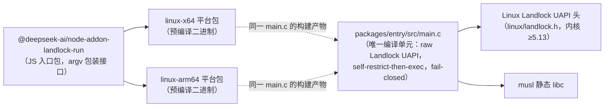

# 组件 ⑥ landlock-run 子进程（子进程）

模块 = `native/landlock-run`（C11，静态 musl）的编译/分发单元。边 A --> B 表示 A 依赖 B。

说明：由 ①③④ 的 `dsh-sandbox-local`（Linux 后端链 bwrap → landlock 的后备 rung）作为 argv 包装器 spawn；exec 后即成为被限制的 ⑦ 目标进程（PID 不变，权限已收窄）。
