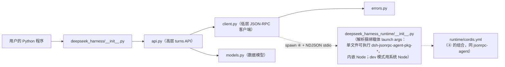

# 组件 ⑤ Python SDK 进程（主进程）

模块 = 用户 Python 程序进程内加载的 Python 模块（非 npm 插件）。边 A --> B 表示 A 依赖 B。

（6 模块 / 5 依赖边）

```mermaid
flowchart LR
  APP["用户的 Python 程序"]
  INIT["deepseek_harness/__init__.py"]
  API["api.py（高层 turns API）"]
  CLIENT["client.py（低层 JSON-RPC 客户端）"]
  MODELS["models.py（数据模型）"]
  ERRORS["errors.py"]
  RT["deepseek_harness_runtime/__init__.py<br/>（解析捆绑载体 launch args：<br/>单文件可执行 dsh-jsonrpc-agent-pkg-*，<br/>内嵌 Node；dev 模式用系统 Node）"]
  YML["runtime/cordis.yml<br/>（④ 的组合，同 jsonrpc-agent）"]
  APP --> INIT
  INIT --> API
  API --> CLIENT
  API --> MODELS
  CLIENT --> ERRORS
  CLIENT -.->|"spawn ④ + NDJSON stdio"| RT
  RT -.-> YML
```

说明：SDK 模块不直接触达 LLM/OS 等外部系统——一切经 spawn 出的 ④（SDK Server）间接获得（见 `sdk-server.md`）。
